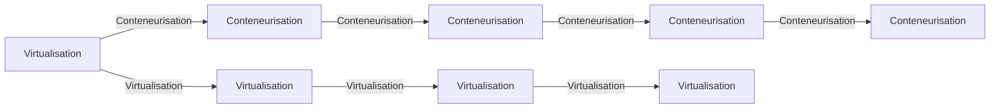
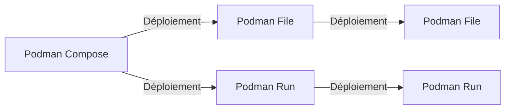
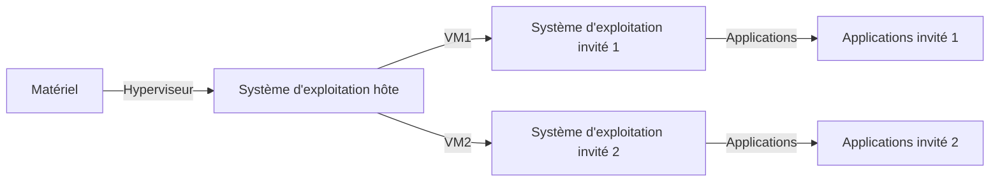
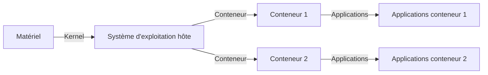

---

theme: ./

colorSchema: "auto"

layout: intro

# https://sli.dev/custom/highlighters.html

highlighter: shiki

title: Slidev Penguin Theme

themeConfig:

  logoHeader: "/avatar.png"

  eventLogo: "https://img2.storyblok.com/352x0/f/84560/2388x414/23d8eb4b8d/vue-amsterdam-with-name.png"

  eventUrl: "https://vuejs.amsterdam/"

  twitter: "@jimmylan"

  twitterUrl: "https://twitter.com/jimmylansrq"

---


# PODMAN X DOCKER


🐧 une formation présenté par Andromed.


<div class="pt-12">

  <span @click="next" class="px-2 p-1 rounded cursor-pointer hover:bg-white hover:bg-opacity-10">

    Appuyez sur espace pour la page suivante <carbon:arrow-right class="inline"/>

  </span>

</div>


---

layout: presenter

eventLogo: 'https://img2.storyblok.com/352x0/f/84560/2388x414/23d8eb4b8d/vue-amsterdam-with-name.png'

eventUrl: 'https://vuejs.amsterdam/'

twitter: '@jimmylansrq'


twitterUrl: 'https://twitter.com/jimmylansrq'

presenterImage: 'https://andromed.fr/assets/fondator-205054868b0195afbf807299ba4446169e2958fe902a5b5d036850ac8d4e06ee.jpg'

---


# Jimmylan Surquin


Fondateur <a  href="https://www.storyblok.com/"><logos-storyblok-icon  mr-1/>Andromed</a>


- Lille, France 🇫🇷

- J'écris souvent à <a href="https://dev.to/jimmylansrq"> dev.to/@jimmylansrq </a>

 - Création de contenu sur <a href="https://www.youtube.com/channel/alvarodevlabs"> <logos-youtube-icon mr-1 /> alvarodevlabs </a>

 - Blog & Portfolio <a href="https://jimmylansrq.dev"> jimmylansrq.dev </a>

 - Dites salut à <a href="https://twitter.com/jimmylansrq"> <logos-twitter mr-1 /> @ jimmylansrq </a>

---

layout: text-image

media: 'https://i.pinimg.com/originals/f5/5e/80/f55e8059ea945abfd6804b887dd4a0af.gif'

caption: 'DOCKER X PODMAN'

---


# DISCLAIMER 🐧


### Dans cette formation nous allons voir les commandes principales de Podman.


<span style="color: #FF5555;">


> Cependant les commandes sont similaires à celles de Docker.


</span>


<small>Je vais donc mixer les commandes de Podman et de Docker pour vous faire voir les différences mais aussi comment passer d'une commande à l'autre.</small>


---

layout: two-cols

---


# SOMMAIRE 📜


### Voici le sommaire de cette formation sur Podman:


<br>


- Introduction à Podman

- Comprendre le CI/CD

- Utiliser des pipelines CI/CD

- Comprendre les micro-services

- Pourquoi utiliser les micro-services?

- Virtualisation vs conteneurisation

- Quel est la différence entre Docker et Podman ?


::right::


- Des définitions avant tout

- Le CLI Docker

- Créer son premier conteneur

- Autres Commandes Docker

- Les images Podman

- Commandes Docker Avancées

- Les Pods et le réseau

- Les volumes persistants

- Encore des Commandes Docker Avancées

- Le rootless

---

layout: text-image

reverse: true

media: 'https://developers.redhat.com/sites/default/files/styles/share/public/blog/2019/08/podman.png?itok=rIuCQyMl'

---


# Introduction à Podman


Podman est un outil de gestion de conteneurs qui permet de créer, gérer et exécuter des conteneurs sans nécessiter de démon. Il est compatible avec les commandes Docker, ce qui facilite la transition pour les utilisateurs de Docker. Podman offre également des fonctionnalités supplémentaires telles que la gestion des pods et une meilleure sécurité grâce à son architecture sans démon.


---

layout: default

---


# Quel est la différence entre Docker et Podman ?


Podman est un outil de gestion de conteneurs qui permet de créer, gérer et exécuter des conteneurs sans nécessiter de démon.


Il est compatible avec les commandes Docker, ce qui facilite la transition pour les utilisateurs de Docker.


**Podman offre également des fonctionnalités supplémentaires telles que la gestion des pods et une meilleure sécurité grâce à son architecture sans démon.**


---


# Différences entre Docker et Podman


<small>


- 🐳 **Démon** - Podman n'a pas besoin de démon pour fonctionner, contrairement à Docker.

- 🐳 **Pods** - Podman offre une gestion des pods, ce qui permet de regrouper plusieurs conteneurs.

- 🐳 **Sécurité** - Podman est conçu pour une meilleure sécurité grâce à son architecture sans démon.

- 🐳 **Compatibilité** - Les commandes de Podman sont compatibles avec celles de Docker, facilitant la transition.

- 🐳 **Rootless** - Podman permet l'exécution de conteneurs en tant qu'utilisateur non root par défaut.

- 🐳 **Sécurité** - Podman peut fonctionner en mode rootless, offrant une sécurité accrue.

- 🐳 **Outils standards** - Podman utilise des outils standards de Linux pour la gestion des conteneurs, comme systemd.

- 🐳 **Images** - Podman permet de créer des images de conteneurs sans nécessiter de démon d'arrière-plan.


</small>


---


# Schéma de la Virtualisation et de la Conteneurisation


<small>

Voici un schéma en mermaid.js qui illustre les différences entre la virtualisation et la conteneurisation.


</small>

<div class="mermaid">




</div>


---


# SCHEMA DE PODMAN COMPOSE ET PODMAN FILE


Nous allons voir ici un schéma de Podman Compose et Podman File.

Comment nous pouvons faire pour déployer nos conteneurs avec des fichiers YAML.

Mais comment aussi pour déployer des conteneurs avec des fichiers JSON.


<div class="mermaid">





</div>


---


# Comment fonctionne la virtualisation ?


La virtualisation est un processus qui permet de créer une image d'un système d'exploitation ou d'un environnement logiciel dans un conteneur.





---


# Comment fonctionne la conteneurisation ?


La conteneurisation est un processus qui permet de créer un conteneur à partir d'un système d'exploitation ou d'un environnement logiciel.





<small>


> Le kernel est le cœur du système d'exploitation qui gère les ressources matérielles et les interactions entre le matériel et les logiciels. Les conteneurs sont des environnements isolés qui partagent le même kernel mais fonctionnent indépendamment les uns des autres.


</small>


---


# Le CLI Docker


Nous allons voir les commandes principales de Docker.


### Commandes principales Docker


| Commande                          | Description                           |

| --------------------------------- | ------------------------------------- |

| <kbd>docker run</kbd>             | Exécute une commande dans un nouveau conteneur |

| <kbd>docker ps</kbd>              | Liste les conteneurs en cours d'exécution |

| <kbd>docker stop</kbd>            | Arrête un conteneur en cours d'exécution |

| <kbd>docker rm</kbd>              | Supprime un conteneur arrêté          |


---


# Autres Commandes Docker


Voici d'autres commandes classiques de Docker.


### Commandes Docker supplémentaires


| Commande                          | Description                           |

| --------------------------------- | ------------------------------------- |

| <kbd>docker pull</kbd>            | Télécharge une image depuis un registre |

| <kbd>docker images</kbd>          | Liste les images disponibles localement |

| <kbd>docker rmi</kbd>             | Supprime une ou plusieurs images      |

| <kbd>docker exec</kbd>            | Exécute une commande dans un conteneur en cours d'exécution |


---


# Commandes Docker Avancées


Voici quelques commandes Docker avancées.


### Commandes Docker Avancées


| Commande                          | Description                           |

| --------------------------------- | ------------------------------------- |

| <kbd>docker network create</kbd>  | Crée un nouveau réseau Docker         |

| <kbd>docker volume create</kbd>   | Crée un nouveau volume Docker         |

| <kbd>docker inspect</kbd>         | Affiche les détails d'un conteneur ou d'une image |

| <kbd>docker logs</kbd>            | Affiche les logs d'un conteneur       |


---


# Encore des Commandes Docker Avancées


Voici quelques autres commandes Docker avancées.


### Commandes Docker Avancées supplémentaires


| Commande                          | Description                           |

| --------------------------------- | ------------------------------------- |

| <kbd>docker-compose up</kbd>      | Démarre et attache des conteneurs définis dans un fichier docker-compose |

| <kbd>docker-compose down</kbd>    | Arrête et supprime les conteneurs, réseaux, volumes définis dans un fichier docker-compose |

| <kbd>docker-compose logs</kbd>    | Affiche les logs des services définis dans un fichier docker-compose |

| <kbd>docker-compose exec</kbd>    | Exécute une commande dans un conteneur en cours d'exécution défini dans un fichier docker-compose |


---

layout: new-section

---


# Des définitions avant tout


---

eventLogo: 'https://img2.storyblok.com/352x0/f/84560/2388x414/23d8eb4b8d/vue-amsterdam-with-name.png'

eventUrl: 'https://vuejs.amsterdam/'

twitter: '@alvarosabu'

twitterUrl: 'https://twitter.com/alvarosabu'


---


# Définition de virtualisation


La virtualisation est un processus qui permet de créer une image d'un système d'exploitation ou d'un environnement logiciel dans un conteneur.

# Définition de conteneurisation


La conteneurisation est un processus qui permet de créer un conteneur à partir d'un système d'exploitation ou d'un environnement logiciel.

# Définition de conteneur


Un conteneur est un environnement logiciel qui permet de créer un conteneur à partir d'un système d'exploitation ou d'un environnement logiciel.


---


# Définition de machine virtuelle


Une machine virtuelle est un environnement logiciel qui permet de créer une machine virtuelle à partir d'un système d'exploitation ou d'un environnement logiciel.

# Définition de machine conteneurisée


Une machine conteneurisée est un environnement logiciel qui permet de créer une machine conteneurisée à partir d'un système d'exploitation ou d'un environnement logiciel.


---


# Un mauvais dockerfile


Voyons ici un mauvais Dockerfile.


```dockerfile

FROM ubuntu:latest

RUN apt-get update && apt-get install -y nginx

CMD ["nginx", "-g", "daemon off;"]

```


<br>


## Pouquoi est-ce un mauvais Dockerfile ?


Tout d'abord, il utilise une image de base officielle d'Ubuntu, ce qui est inutile dans notre cas.


De plus, il installe nginx, ce qui est inutile dans notre cas.


Enfin, il démarre nginx, ce qui est inutile dans notre cas.


---


# Un bon dockerfile


Voyons ici un bon Dockerfile.


```dockerfile

FROM node:14

WORKDIR /app

COPY package*.json ./

RUN npm install

COPY . .

EXPOSE 3000

CMD ["npm", "start"]

```


<br>


## Pouquoi est-ce un bon Dockerfile ?


Tout d'abord, il utilise une image de base officielle de Node.js, ce qui est utile dans notre cas.


De plus, il installe les dépendances du projet, ce qui est utile dans notre cas.


Enfin, il démarre l'application, ce qui est utile dans notre cas.


---


# Maintenant le podman-compose !


## Un mauvais podman-compose


```yaml

version: '3.8'

services:

  web:

    image: python:3.9

    command: ["python", "app.py"]

```


<br>


## Pouquoi est-ce un mauvais podman-compose ?


Tout d'abord, il utilise une image de base officielle de Python, ce qui est inutile dans notre cas.


De plus, il démarre l'application, ce qui est inutile dans notre cas.


---


# Un bon podman-compose


```yaml

version: '3.8'

services:

  web:

    image: python:3.9

    command: ["python", "app.py"]

```


<br>


## Pouquoi est-ce un bon podman-compose ?


Tout d'abord, il utilise une image de base officielle de Python, ce qui est utile dans notre cas.


De plus, il installe les dépendances du projet, ce qui est utile dans notre cas.


---


# Code


Use code snippets and get the highlighting directly!


```vue

<script setup>

import { TresCanvas } from '@tresjs/core'

</script>


<template>

  <TresCanvas

    clear-color="”#82DBC5”"

    window-size

  >

    <TresPerspectiveCamera />

    <TresMesh

      @click="onClick"

    >

      <TresBoxGeometry :args="[1, 1, 1]" />

      <TresMeshNormalMaterial />

    </TresMesh>

  </TresCanvas>

</template>

```

---


# Dockerfile , exemple avec Node.js

```dockerfile

# Utiliser une image de base officielle de Node.js

FROM node:14


# Définir le répertoire de travail dans le conteneur

WORKDIR /app


# Copier le fichier package.json et package-lock.json dans le répertoire de travail

COPY package*.json ./


# Installer les dépendances du projet

RUN npm install


# Copier le reste des fichiers de l'application dans le répertoire de travail

COPY . .


# Exposer le port sur lequel l'application va s'exécuter

EXPOSE 3000


# Démarrer l'application

CMD ["npm", "start"]

```

---


# Dockerfile , exemple avec React

```dockerfile

# Utiliser une image de base officielle de Node.js

FROM node:14


# Définir le répertoire de travail dans le conteneur

WORKDIR /app


# Copier le fichier package.json et package-lock.json dans le répertoire de travail

COPY package*.json ./


# Installer les dépendances du projet

RUN npm install


# Copier le reste des fichiers de l'application dans le répertoire de travail

COPY . .


# Exposer le port sur lequel l'application va s'exécuter

EXPOSE 3000


# Démarrer l'application

CMD ["npm", "start"]

```

---


# Dockerfile , exemple avec Python


```dockerfile

# Utiliser une image de base officielle de Python

FROM python:3.9


# Définir le répertoire de travail dans le conteneur

WORKDIR /app


# Copier le fichier requirements.txt dans le répertoire de travail

COPY requirements.txt ./


# Installer les dépendances du projet

RUN pip install -r requirements.txt


# Copier le reste des fichiers de l'application dans le répertoire de travail

COPY . .


# Exposer le port sur lequel l'application va s'exécuter

EXPOSE 8000


# Démarrer l'application

CMD ["python", "app.py"]

```

---


# Dockerfile , exemple avec Ruby

```dockerfile

# Utiliser une image de base officielle de Ruby

FROM ruby:2.7


# Définir le répertoire de travail dans le conteneur

WORKDIR /app


# Copier le fichier Gemfile et Gemfile.lock dans le répertoire de travail

COPY Gemfile Gemfile.lock ./


# Installer les dépendances du projet

RUN bundle install


# Copier le reste des fichiers de l'application dans le répertoire de travail

COPY . .


# Exposer le port sur lequel l'application va s'exécuter

EXPOSE 3000


# Démarrer l'application

CMD ["ruby", "app.rb"]

```

---


## Parlons maintenant du podman-compose

<small>

```yaml

# Utiliser une version spécifique de Podman Compose

version: '3.8'

# pourquoi 3.8 ? et pourquoi pas 4.0 ?

# parce que 4.0 n'est pas compatible avec les anciens fichiers docker-compose.yaml

# et parce que 3.8 est compatible avec les anciens fichiers docker-compose.yaml


# Définir les services (conteneurs) à exécuter

services:

  # Définir le service web (c'est son nom que vous verrez dans les logs)

  web:

    # Utiliser une image de base officielle de Python

    image: python:3.9

    # Définir le répertoire de travail dans le conteneur

    working_dir: /app

    # Copier le fichier requirements.txt dans le répertoire de travail

    volumes:

      - .:/app

    # Exposer le port sur lequel l'application va s'exécuter

    ports:

      - "8000:8000"

    # Démarrer l'application

    command: ["python", "app.py"]


  # Définir le service db

  db:

    # Utiliser une image de base officielle de PostgreSQL

    image: postgres:13

    # Définir les variables d'environnement pour la base de données

    environment:

      POSTGRES_USER: example

      POSTGRES_PASSWORD: example

      POSTGRES_DB: example

    # Exposer le port sur lequel la base de données va s'exécuter

    ports:

      - "5432:5432"

```

</small>

---

layout: default

---

# Le rootless


Le rootless est une fonctionnalité de Podman qui permet d'exécuter des conteneurs en tant qu'utilisateur non root par défaut.


Cela signifie que vous n'avez pas besoin d'être root pour exécuter des conteneurs.


Pour activer le rootless, vous pouvez utiliser la commande suivante :


```bash

podman machine init --rootless

```


Pour vérifier si le rootless est activé, vous pouvez utiliser la commande suivante :


```bash

podman info --debug | grep -i rootless

```


<br>


> Sachez que docker ne supporte pas le rootless. eh bien cela est faux.


Docker supporte le rootless depuis la version 20.10.0. (de 2010)

Et nous sommes actuellement à la version 24.0.5 (de 2024)


---

layout: default

---


# Le rootless


## Comment l'activer sur Docker ?


```bash

mkdir $HOME/.docker

echo '{ "experimental": "enabled" }' > $HOME/.docker/daemon.json

```


<br>


<blockquote class="bg-red-500 !text-red-500 rounded-md">


Attention cette commande va activer le rootless pour tous les utilisateurs du système.


</blockquote>


<br>


> Deuxième chose : cette commande va activer l'experimental et peut dépendre de la version de docker que vous avez installer et de votre système d'exploitation.


---

layout: two-cols

---

Un autre exemple de code


```vue

// Model.vue

<script setup lang="ts">

import { useAnimations, useGLTF } from "@tresjs/cientos";


const { scene: model, animations } = await useGLTF("models/ugly-bunny.gltf");


const { actions, mixer } = useAnimations(animations, model);

const currentAction = ref(actions.Greeting);

currentAction.value.play();

</script>


<template>

  <primitive :object="model" />

</template>

```


::right::


```vue

<template>

  <TresCanvas clear-color="”#82DBC5”" window-size>

    <TresPerspectiveCamera />

    <Suspense>

      <Model />

    </Suspense>

  </TresCanvas>

</template>

```


---

layout: text-window

---


# Consoles


Utilisez des extraits de code et obtenez la mise en évidence directement dans une belle fenêtre!


::window::


```ts

// main.ts


import { createApp } from "vue";

import { createDynamicForms } from "@asigloo/vue-dynamic-forms";


const VueDynamicForms = createDynamicForms({

  // Global Options go here

});


export const app = createApp(App);


app.use(VueDynamicForms);

```


---

layout: text-window

reverse: true

logoHeader: '/logo.svg'

eventLogo: 'https://img2.storyblok.com/352x0/f/84560/2388x414/23d8eb4b8d/vue-amsterdam-with-name.png'

eventUrl: 'https://vuejs.amsterdam/'

twitter: '@jimmylansrq'

twitterUrl: 'https://twitter.com/jimmylansrq'

---


# Un exemple de code


Voici un exemple en live qui permet de comprendre comment fonctionne le rootless.


::window::


<div class="overflow-hidden relative w-full aspect-16-9">

<iframe height="300" style="width: 100%;" scrolling="no" title="Text Clock" src="https://codepen.io/searleb/embed/pvQaJB?default-tab=html%2Cresult" frameborder="no" loading="lazy" allowtransparency="true" allowfullscreen="true">

  See the Pen <a href="https://codepen.io/searleb/pen/pvQaJB">

  Text Clock</a> by Bill Searle (<a href="https://codepen.io/searleb">@searleb</a>)

  on <a href="https://codepen.io">CodePen</a>.

</iframe>

</div>


---


# Quelques exercices


## Podman cli


<small>


1. Créer un conteneur à partir d'une image de base officielle de Node.js

2. Exécuter une commande dans le conteneur

3. Arrêter le conteneur

4. Supprimer le conteneur


</small>


## Podman-compose


<small>


1. Créer un fichier docker-compose.yaml

2. Définir le service web (c'est son nom que vous verrez dans les logs)

3. Utiliser une image de base officielle de Python

4. Définir le répertoire de travail dans le conteneur

5. Copier le fichier requirements.txt dans le répertoire de travail

6. Installer les dépendances du projet

7. Copier le reste des fichiers de l'application dans le répertoire de travail

8. Exposer le port sur lequel l'application va s'exécuter

9. Démarrer l'application


</small>


---


## Dockerfile


1. Créer un fichier Dockerfile

2. Utiliser une image de base officielle de Node.js

3. Définir le répertoire de travail dans le conteneur

4. Copier le fichier package.json et package-lock.json dans le répertoire de travail

5. Installer les dépendances du projet

6. Copier le reste des fichiers de l'application dans le répertoire de travail

7. Exposer le port sur lequel l'application va s'exécuter

8. Démarrer l'application


---


# Exercices supplémentaires


## Podman cli avancé


<small>


1. Créer un réseau personnalisé pour les conteneurs

2. Créer plusieurs conteneurs et les connecter au réseau

3. Tester la communication entre les conteneurs

4. Supprimer les conteneurs et le réseau


</small>


## Podman-compose avancé


<small>


1. Ajouter un service de base de données au fichier docker-compose.yaml

2. Configurer les variables d'environnement pour le service de base de données

3. Lier le service web au service de base de données

4. Tester la connexion entre le service web et le service de base de données

5. Arrêter et supprimer les services


</small>


---


## Dockerfile avancé


<br>


1. Ajouter une étape de build pour optimiser la taille de l'image

2. Utiliser une image de base alpine pour réduire la taille de l'image

3. Ajouter des tests unitaires et les exécuter pendant la construction de l'image

4. Configurer des variables d'environnement pour l'application

5. Utiliser un multi-stage build pour séparer les étapes de build et de runtime


---


# Exercices bonus


## Podman cli bonus


<small>


1. Créer un volume pour persister les données d'un conteneur

2. Monter le volume dans le conteneur

3. Tester la persistance des données après la suppression et la recréation du conteneur

4. Supprimer le volume


</small>


## Podman-compose bonus


<small>


1. Ajouter un service de cache (comme Redis) au fichier docker-compose.yaml

2. Configurer les variables d'environnement pour le service de cache

3. Lier le service web au service de cache

4. Tester la connexion entre le service web et le service de cache

5. Arrêter et supprimer les services


</small>


---


## Dockerfile bonus


<br>


1. Ajouter des labels pour documenter l'image

2. Configurer un utilisateur non-root pour exécuter l'application

3. Ajouter des scripts de démarrage pour initialiser l'application

4. Utiliser des secrets pour gérer les informations sensibles pendant la construction de l'image

5. Optimiser les couches de l'image pour réduire la taille et améliorer les performances


---


## Questionnaire - Partie 1


<small>


1. Quelle est la différence entre Docker et Podman ?


2. Comment Podman gère-t-il les conteneurs sans démon ?


3. Qu'est-ce qu'un pod dans Podman et comment est-il utilisé ?


4. Comment activer le mode rootless dans Podman ?


5. Quelles sont les commandes principales de Docker pour gérer les conteneurs ?


6. Comment créer et gérer un réseau Docker ?


7. Quelles sont les étapes pour créer une image Docker optimisée ?


8. Comment utiliser docker-compose pour orchestrer plusieurs conteneurs ?


9. Quelles sont les différences de sécurité entre Docker et Podman ?


10. Comment Podman permet-il une meilleure gestion des pods ?


</small>


---


## Questionnaire - Partie 2


<small>


11. Quelles sont les commandes pour gérer les volumes dans Docker ?


12. Comment vérifier les logs d'un conteneur Docker ?


13. Quelles sont les meilleures pratiques pour écrire un Dockerfile ?


14. Comment utiliser les secrets dans un Dockerfile ?


15. Qu'est-ce qu'un multi-stage build dans Docker ?


16. Comment configurer un utilisateur non-root dans un Dockerfile ?


17. Quelles sont les commandes pour gérer les images Docker ?


18. Comment fonctionne le réseau par défaut dans Docker ?


19. Quelles sont les options pour persister les données dans Docker ?


20. Comment fonctionne le rootless mode dans Docker ?


</small>


---


## Questionnaire - Partie 3


<small>


21. Quelles sont les différences de performance entre Docker et Podman ?


22. Comment utiliser les labels dans un Dockerfile ?


23. Quelles sont les étapes pour déboguer un conteneur Docker ?


24. Comment fonctionne le système de cache dans Docker ?


25. Quelles sont les commandes pour gérer les conteneurs arrêtés dans Docker ?


26. Comment configurer des variables d'environnement dans un Dockerfile ?


27. Quelles sont les meilleures pratiques pour sécuriser un conteneur Docker ?


28. Comment fonctionne le système de build dans Docker ?


29. Quelles sont les différences entre les réseaux bridge et overlay dans Docker ?


30. Comment utiliser les volumes pour partager des données entre conteneurs ?


</small>


---


## Questionnaire - Partie 4


<small>


31. Quelles sont les commandes pour inspecter un conteneur Docker ?


32. Comment fonctionne le système de stockage des images dans Docker ?


33. Quelles sont les options pour limiter les ressources d'un conteneur Docker ?


34. Comment utiliser les hooks dans un Dockerfile ?


35. Quelles sont les différences entre Docker Swarm et Kubernetes ?


36. Comment fonctionne le système de plugins dans Docker ?


37. Quelles sont les commandes pour gérer les réseaux dans Docker ?


38. Comment utiliser les health checks dans un Dockerfile ?


39. Quelles sont les options pour monitorer les conteneurs Docker ?


40. Comment fonctionne le système de logs dans Docker ?


</small>


---


## Questionnaire - Partie 5


<small>


41. Quelles sont les commandes pour gérer les secrets dans Docker ?


42. Comment utiliser les configurations dans Docker Swarm ?


43. Quelles sont les différences entre les images Docker et les conteneurs Docker ?


44. Comment fonctionne le système de build cache dans Docker ?


45. Quelles sont les options pour gérer les dépendances dans un Dockerfile ?


46. Comment utiliser les multi-architecture builds dans Docker ?


47. Quelles sont les commandes pour gérer les services dans Docker Swarm ?


48. Comment fonctionne le système de versioning des images dans Docker ?


49. Quelles sont les options pour gérer les réseaux multi-hosts dans Docker ?


50. Comment utiliser les outils de CI/CD avec Docker ?


</small>

---


## Réponses - Partie 1


<small>


1. Docker utilise un démon pour gérer les conteneurs, tandis que Podman n'en a pas besoin.


2. Podman utilise des processus indépendants pour chaque conteneur, éliminant le besoin d'un démon central.


3. Un pod dans Podman est un groupe de conteneurs qui partagent le même réseau et espace de noms.


4. Pour activer le mode rootless dans Podman, utilisez la commande `podman machine init --rootless`.


5. Les commandes principales de Docker pour gérer les conteneurs sont `docker run`, `docker ps`, `docker stop`, et `docker rm`.


</small>


---


## Réponses - Partie 2


<small>


6. Pour créer et gérer un réseau Docker, utilisez les commandes `docker network create` et `docker network connect`.


7. Les étapes pour créer une image Docker optimisée incluent l'utilisation d'une image de base légère, la réduction du nombre de couches, et l'utilisation de multi-stage builds.


8. Pour orchestrer plusieurs conteneurs avec docker-compose, définissez les services dans un fichier `docker-compose.yml` et utilisez la commande `docker-compose up`.


9. Les différences de sécurité entre Docker et Podman incluent l'absence de démon dans Podman, ce qui réduit la surface d'attaque, et la possibilité d'exécuter des conteneurs en mode rootless.


10. Podman permet une meilleure gestion des pods en regroupant plusieurs conteneurs dans un même pod, facilitant ainsi leur gestion et communication.


</small>


---


## Réponses - Partie 3


<small>


11. Les commandes pour gérer les volumes dans Docker incluent `docker volume create`, `docker volume ls`, et `docker volume rm`.


12. Pour vérifier les logs d'un conteneur Docker, utilisez la commande `docker logs`.


13. Les meilleures pratiques pour écrire un Dockerfile incluent l'utilisation d'images de base légères, la réduction du nombre de couches, et l'utilisation de multi-stage builds.


14. Pour utiliser les secrets dans un Dockerfile, utilisez la directive `--secret` lors de la construction de l'image.


15. Un multi-stage build dans Docker permet de séparer les étapes de build et de runtime, réduisant ainsi la taille de l'image finale.


</small>


---


## Réponses - Partie 4


<small>


16. Pour configurer un utilisateur non-root dans un Dockerfile, utilisez les directives `USER` et `RUN adduser`.


17. Les commandes pour gérer les images Docker incluent `docker pull`, `docker images`, et `docker rmi`.


18. Le réseau par défaut dans Docker est le réseau bridge, qui permet aux conteneurs de communiquer entre eux sur le même hôte.


19. Les options pour persister les données dans Docker incluent l'utilisation de volumes et de bind mounts.


20. Le rootless mode dans Docker permet d'exécuter des conteneurs en tant qu'utilisateur non-root, améliorant ainsi la sécurité.


</small>


---


## Réponses - Partie 5


<small>


21. Les différences de performance entre Docker et Podman sont généralement minimes, mais Podman peut offrir de meilleures performances en raison de l'absence de démon.


22. Pour utiliser les labels dans un Dockerfile, utilisez la directive `LABEL`.


23. Les étapes pour déboguer un conteneur Docker incluent l'utilisation des commandes `docker logs`, `docker exec`, et `docker inspect`.


24. Le système de cache dans Docker permet de réutiliser les couches d'image précédemment construites pour accélérer les builds.


25. Les commandes pour gérer les conteneurs arrêtés dans Docker incluent `docker ps -a` et `docker rm`.


</small>


---


## Réponses - Partie 6


<small>


26. Pour configurer des variables d'environnement dans un Dockerfile, utilisez la directive `ENV`.


27. Les meilleures pratiques pour sécuriser un conteneur Docker incluent l'utilisation d'images de base légères, la réduction des privilèges, et l'utilisation de secrets pour les informations sensibles.


28. Le système de build dans Docker utilise un fichier Dockerfile pour définir les étapes de construction de l'image.


29. Les différences entre les réseaux bridge et overlay dans Docker incluent la portée du réseau (local pour bridge, multi-host pour overlay) et les cas d'utilisation (développement pour bridge, production pour overlay).


30. Pour utiliser les volumes pour partager des données entre conteneurs, utilisez la directive `volumes` dans un fichier `docker-compose.yml`.


</small>


---


## Réponses - Partie 7


<small>


31. Les commandes pour inspecter un conteneur Docker incluent `docker inspect` et `docker ps`.


32. Le système de stockage des images dans Docker utilise un registre pour stocker et distribuer les images.


33. Les options pour limiter les ressources d'un conteneur Docker incluent les directives `--memory` et `--cpus` lors de l'exécution du conteneur.


34. Pour utiliser les hooks dans un Dockerfile, utilisez les directives `ONBUILD` et `HEALTHCHECK`.

35. Les différences entre Docker Swarm et Kubernetes incluent la complexité (Swarm est plus simple), les fonctionnalités (Kubernetes offre plus de fonctionnalités), et l'adoption (Kubernetes est plus largement adopté).


</small>


---


## Réponses - Partie 8


<small>


36. Le système de plugins dans Docker permet d'étendre les fonctionnalités de Docker en ajoutant des plugins pour le stockage, le réseau, et d'autres fonctionnalités.


37. Les commandes pour gérer les réseaux dans Docker incluent `docker network create`, `docker network ls`, et `docker network rm`.


38. Pour utiliser les health checks dans un Dockerfile, utilisez la directive `HEALTHCHECK`.


39. Les options pour monitorer les conteneurs Docker incluent l'utilisation de Docker stats, Prometheus, et Grafana.


40. Le système de logs dans Docker permet de collecter et de visualiser les logs des conteneurs en utilisant des commandes comme `docker logs` et des outils comme ELK stack.


</small>


---


## Réponses - Partie 9


<small>


41. Les commandes pour gérer les secrets dans Docker incluent `docker secret create`, `docker secret ls`, et `docker secret rm`.


42. Pour utiliser les configurations dans Docker Swarm, utilisez les commandes `docker config create`, `docker config ls`, et `docker config rm`.


43. Les différences entre les images Docker et les conteneurs Docker incluent le fait que les images sont des modèles statiques, tandis que les conteneurs sont des instances en cours d'exécution de ces images.


44. Le système de build cache dans Docker permet de réutiliser les couches d'image précédemment construites pour accélérer les builds.


45. Les options pour gérer les dépendances dans un Dockerfile incluent l'utilisation de fichiers de configuration comme `requirements.txt` pour Python ou `package.json` pour Node.js.


</small>


---


## Réponses - Partie 10


<small>


46. Pour utiliser les multi-architecture builds dans Docker, utilisez la commande `docker buildx` et configurez les plateformes cibles.


47. Les commandes pour gérer les services dans Docker Swarm incluent `docker service create`, `docker service ls`, et `docker service rm`.


48. Le système de versioning des images dans Docker permet de taguer les images avec des versions spécifiques en utilisant la commande `docker tag`.


49. Les options pour gérer les réseaux multi-hosts dans Docker incluent l'utilisation de réseaux overlay et de Docker Swarm.


50. Pour utiliser les outils de CI/CD avec Docker, intégrez Docker dans des pipelines CI/CD en utilisant des outils comme Jenkins, GitLab CI, et GitHub Actions.


</small>


---


# Quelques liens


[Podman](https://podman.io/)


[Docker](https://www.docker.com/)


[Quel est la différence entre Docker et Podman ?](https://www.redhat.com/fr/topics/containers/docker-vs-podman)


[Podman vs Docker](https://www.redhat.com/fr/topics/containers/docker-vs-podman)


[Podman et Docker, quelle différence ?](https://www.ibm.com/docs/fr/power8?topic=processors-podman-docker)


---

class: 'grid text-center align-self-center justify-self-center'

---


# Merci à vous pour votre attention.


[Documentations](https://andromed.fr) / [GitHub Repo](https://github.com/jimmylansrq/podman-formation)


---

layout: default

---


````md magic-move

```js

console.log(`Step ${1}`)

```

```js

console.log(`Step ${1 + 1}`)

```

```ts

console.log(`Step ${3}` as string)

```

````


````md magic-move {at:4, lines: true}

```js {*|1|2-5}

let count = 1

function add() {

  count++

}

```


Non-code blocks in between as ignored, you can put some comments.


```js {*}{lines: false}

// le remplacement

let count = 1

const add = () => count += 1

// comme nous le voyons ici nous avons remplacé le code par un commentaire

```

```js {*|3-4}

let x = 10;

let y = 20;

function multiply() {

  return x * y;

}

```

````

---

layout: new-section

---


# Container is the new black


<div class="grid grid-cols-2 gap-4 z-10">

  <div class="bg-blue-500 p-4 rounded-md">

    <h2 class="text-lg font-semibold text-white">Container 1</h2>

    <p class="text-sm text-white">This is the first container.</p>

  </div>

  <div class="bg-green-500 p-4 rounded-md">

    <h2 class="text-lg font-semibold text-white">Container 2</h2>

    <p class="text-sm text-white">This is the second container.</p>

  </div>

</div>


---

layout: new-section

---


# LE MODE ROOTLESS


---

layout: new-section

---


# PODMAN COMPOSE


---

layout: new-section

---


# PODMAN FILE / DOCKERFILE


---

layout: new-section

---


# DOCKER BUILD X


---


# Qu'est ce que le multi-architecture build ?


le multi-architecture build permet de builder des images pour des architectures différentes de l'hôte.


Cela permet de builder des images pour des architectures différentes de l'hôte.


Il faut activer le plugin `buildx` avec la commande `docker buildx create --use`


Puis `docker buildx ls` pour vérifier que le plugin est actif.


Enfin `docker buildx build --platform linux/amd64,linux/arm64 -t jimmylansrq/my-image:latest .` pour builder l'image.


---


# Comment l'installer si on la pas ?


### Debian/Ubuntu


`sudo apt-get install docker-ce docker-ce-cli containerd.io docker-buildx-plugin docker-compose-plugin`


### Fedora


`sudo dnf install docker-ce docker-ce-cli containerd.io docker-buildx-plugin docker-compose-plugin`


### MacOS (attention il faut exporter la variable BUILDX_EXPERIMENTAL=enabled)


`brew install --cask docker`


### Arch Linux


`sudo pacman -S docker`


---


# Qu'est ce que le build cache ?


Le build cache permet de réutiliser les couches d'images précédemment construites pour accélérer les builds.


### Comment l'activer ?


`docker buildx use default`


`docker buildx inspect`


`docker buildx ls`


`docker buildx install`


`docker buildx create --use`


---


# Optimisation des Podmanfile et Podman-compose


## Introduction


L'optimisation des Podmanfile et des Podman-compose est essentielle pour améliorer les performances et l'efficacité des conteneurs.


---


## Meilleures pratiques pour les Podmanfile


<br>


1. **Utiliser des images de base légères** : Choisissez des images de base minimalistes pour réduire la taille de l'image finale.

2. **Minimiser le nombre de couches** : Combinez les commandes RUN pour réduire le nombre de couches dans l'image.

3. **Utiliser le cache de construction** : Profitez du cache de construction pour éviter de reconstruire des couches inchangées.

4. **Nettoyer après l'installation** : Supprimez les fichiers temporaires et les dépendances inutiles après l'installation pour réduire la taille de l'image.

5. **Spécifier les versions des dépendances** : Utilisez des versions spécifiques pour garantir la reproductibilité des builds.


---


## Meilleures pratiques pour les Podman-compose


<br>


1. **Utiliser des réseaux personnalisés** : Configurez des réseaux personnalisés pour isoler les services et améliorer la sécurité.

2. **Définir des volumes** : Utilisez des volumes pour persister les données et partager les fichiers entre les conteneurs.

3. **Optimiser les ressources** : Limitez l'utilisation des ressources (CPU, mémoire) pour chaque service afin d'éviter la contention des ressources.

4. **Utiliser des variables d'environnement** : Centralisez les configurations sensibles et spécifiques à l'environnement dans des fichiers d'environnement.

5. **Automatiser les déploiements** : Intégrez Podman-compose dans vos pipelines CI/CD pour automatiser les déploiements et les tests.


---


## Conclusion


En suivant ces meilleures pratiques, vous pouvez optimiser vos Podmanfile et Podman-compose pour obtenir des conteneurs plus performants, sécurisés et faciles à gérer.


---


# Réseaux Podman et Podman-compose


## Introduction aux réseaux Podman


Les réseaux dans Podman permettent aux conteneurs de communiquer entre eux et avec le monde extérieur. Ils jouent un rôle crucial dans l'isolation, la sécurité et la performance des conteneurs.


---


## Types de réseaux dans Podman


1. **Bridge Network** : Le réseau par défaut qui permet aux conteneurs de communiquer entre eux sur le même hôte.

Exemple : `podman network create my-bridge-network`

Métaphore : Un pont qui relie tous les bateaux dans un port.


2. **Host Network** : Utilise le réseau de l'hôte, ce qui peut améliorer les performances mais réduit l'isolation.

Exemple : `podman network create my-host-network`

Métaphore : Un bateau qui vient d'un port et se connecte directement à l'hôte.


3. **None Network** : Désactive le réseau pour le conteneur, utile pour des tâches spécifiques où l'isolation est primordiale.

Exemple : `podman network create my-none-network`

Métaphore : Un bateau qui est en pleine mer et ne se connecte à rien.


4. **Macvlan Network** : Attribue une adresse MAC unique à chaque conteneur, permettant une meilleure intégration avec les réseaux physiques.

Exemple : `podman network create my-macvlan-network`

Métaphore : Un bateau qui a une adresse MAC unique et se connecte à un réseau physique.


---


## Comparaison avec Docker


Podman et Docker offrent des fonctionnalités similaires en termes de réseaux, mais Podman se distingue par son architecture sans démon, ce qui peut offrir des avantages en termes de sécurité et de performance.


---


## Exemple de configuration de réseau dans Podman


1. **Bridge Network** :


```bash

podman network create my-bridge-network

```


2. **Host Network** :


```bash

podman network create my-host-network

```


3. **None Network** :


```bash

podman network create my-none-network

```


4. **Macvlan Network** :


```bash

podman network create my-macvlan-network

```


---


# Les pods dans Podman


## Introduction aux pods dans Podman


Les pods sont des groupes de conteneurs partageant le même réseau et l'espace de noms. Ils permettent une meilleure isolation et communication entre les conteneurs.


> Une métaphore : Un bateau qui contient plusieurs conteneurs.


**Une comparaison avec Docker** : Un pod est similaire à un groupe de conteneurs dans Docker (et le groupe de conteneurs s'appelle un service dans Docker).


**Une comparaison avec Kubernetes** : Un pod est similaire à un groupe de conteneurs dans Kubernetes (et le groupe de conteneurs s'appelle un pod dans Kubernetes).


---


## Utilisation des pods dans Podman


1. **Création d'un pod** :


```bash

podman pod create my-pod

```


2. **Ajout de conteneurs au pod** :


```bash

podman run --pod my-pod my-container

```


3. **Inspection du pod** :


```bash

podman inspect my-pod

```


4. **Suppression du pod** :


```bash

podman pod rm my-pod

```


## Conclusion


Les pods dans Podman offrent une meilleure isolation et communication entre les conteneurs, facilitant la gestion des applications conteneurisées.


---


# Les secrets dans Podman


## Introduction aux secrets dans Podman


Les secrets sont des données sensibles stockées dans Podman, telles que les identifiants de base de données ou les clés API. Ils permettent une gestion sécurisée des informations sensibles.


## Création et gestion des secrets dans Podman


1. **Création d'un secret** :


```bash

podman secret create my-secret my-secret-value

```


2. **Ajout de secrets à un conteneur** :


```bash

podman run --secret my-secret my-container

```


---


3. **Inspection du secret** :


```bash

podman secret inspect my-secret

```


4. **Suppression du secret** :


```bash

podman secret rm my-secret

```


## Conclusion


Les secrets dans Podman permettent une gestion sécurisée des informations sensibles, facilitant la sécurisation des applications conteneurisées.


---


# Les configurations dans Podman


## Introduction aux configurations dans Podman


Les configurations sont des données structurées stockées dans Podman, telles que les fichiers de configuration d'application. Ils permettent une gestion simplifiée des données structurées.


## Création et gestion des configurations dans Podman


1. **Création d'une configuration** :


```bash

podman config create my-config my-config-value

```


2. **Ajout de configurations à un conteneur** :


```bash

podman run --config my-config my-container

```


3. **Inspection de la configuration** :


```bash

podman config inspect my-config

```

---


# Exemple concret d'utilisation de Podman


## Introduction


Podman est un outil puissant pour la gestion de conteneurs. Voici un exemple concret d'utilisation de Podman pour une application simple.


## Exemple : Serveur Web


### Dockerfile


```dockerfile

FROM httpd:latest

COPY index.html /usr/local/apache2/htdocs/

```


---


### Podmanfile


```dockerfile

FROM docker.io/library/httpd:latest

COPY index.html /usr/local/apache2/htdocs/

```


---


### Podman-compose


```yaml

version: '3.8'

services:

  web:

    image: httpd:latest

    ports:

      - '80:80'

    volumes:

      - ./index.html:/usr/local/apache2/htdocs/index.html

```


---


### index.html


```html

<!DOCTYPE html>

<html>

<head>

    <title>My Web Page</title>

</html>

```


### Exécution de l'application


```bash

podman-compose up

```


---


## Conclusion


Podman offre une alternative puissante à Docker pour la gestion de conteneurs, avec des fonctionnalités similaires mais une architecture différente. Son utilisation peut améliorer la sécurité et les performances des applications conteneurisées.


---


# Une utilisation plus avancée de Podman avec un vrai projet concret


## Introduction


Podman est un outil puissant pour la gestion de conteneurs. Voici un exemple concret d'utilisation de Podman pour un projet réel.


## Exemple : Application Django


### Dockerfile


```dockerfile

FROM python:3.9-slim

COPY . /app

WORKDIR /app

RUN pip install -r requirements.txt

CMD ["python", "manage.py", "runserver", "0.0.0.0:8000"]

```


---


### Podmanfile


```dockerfile

FROM docker.io/library/python:3.9-slim

COPY . /app

WORKDIR /app

RUN pip install -r requirements.txt

CMD ["python", "manage.py", "runserver", "0.0.0.0:8000"]

```


---


### Podman-compose


```yaml

version: '3.8'

services:

  web:

    image: python:3.9-slim

    ports:

      - '8000:8000'

    volumes:

      - ./:/app

```


---


### Exécution de l'application


```bash

podman-compose up

```


## Conclusion


Podman offre une alternative puissante à Docker pour la gestion de conteneurs, avec des fonctionnalités similaires mais une architecture différente. Son utilisation peut améliorer la sécurité et les performances des applications conteneurisées.

---

# Différences principales entre Podman et Docker


### Podman et Docker sont très similaires, mais certaines commandes et fonctionnalités diffèrent. Voici les différences majeures entre les deux outils.


---


# Gestion des Pods


- **Podman** : Possède une gestion native des pods. 

  ```bash

  podman pod create

  podman pod start <pod_id>

  ```

- **Docker** : Pas de gestion native des pods. Il utilise plutôt des réseaux ou des outils comme **Docker Compose**.


---


# Démon (Daemon)


- **Docker** : Nécessite un démon en arrière-plan (`dockerd`) pour fonctionner.

- **Podman** : Fonctionne sans démon (daemonless), chaque commande s'exécute indépendamment.

  ```bash

  podman run --detach

  ```


---


# Conteneurs Rootless


- **Podman** : Supporte nativement les conteneurs rootless (sans privilèges root).

  ```bash

  podman run --user 1000:1000

  ```

- **Docker** : Nécessite une configuration spécifique pour activer les conteneurs rootless.

  ```bash

  docker run --user 1000:1000

  ```


---


# Création d'unités systemd


- **Podman** : Peut générer des unités systemd pour gérer les conteneurs avec `systemctl`.

  ```bash

  podman generate systemd --name <container_name>

  ```

- **Docker** : Pas de commande native pour générer des unités systemd.


---


# Gestion des Volumes


- **Podman** et **Docker** gèrent les volumes de manière similaire, mais Podman a des différences en mode rootless.

  ```bash

  podman volume create

  docker volume create

  ```


---


# Exécution rootless vs rootfull


- **Podman** : Permet d'exécuter des conteneurs en mode rootfull ou rootless selon l'utilisateur.

  ```bash

  podman --rootless run

  podman --rootfull run

  ```

- **Docker** : Ne distingue pas rootless/rootfull sans configuration.


---


# Gestion des réseaux


- **Podman** : Utilise **CNI** (Container Network Interface) pour la gestion du réseau.

  ```bash

  podman network create

  ```

- **Docker** : Utilise **CNM** (Container Network Model) pour le réseau.

  ```bash

  docker network create

  ```


---


# Support des images et des registries


- **Podman** : Offre des commandes supplémentaires pour signer et gérer les images.

  ```bash

  podman image sign

  podman image trust

  ```

- **Docker** : Pas d'équivalents pour ces commandes.


---


# Logs et événements


- **Podman** et **Docker** ont des commandes similaires pour les logs, mais la syntaxe peut légèrement différer.

  ```bash

  podman events

  docker events

  ```


---


# Checkpoint/Restore


- **Podman** : Peut sauvegarder et restaurer l'état d'un conteneur.

  ```bash

  podman container checkpoint

  podman container restore

  ```

- **Docker** : Pas de fonctionnalité native pour cela.


---

---

# Conteneurs éphémères vs persistants


- Les conteneurs éphémères ne conservent pas leur état entre les redémarrages.

- Les conteneurs persistants utilisent des volumes ou des systèmes de fichiers montés pour conserver des données.

  

  **Exemple : conteneur éphémère**

  ```bash

  docker run --rm nginx

  podman run --rm nginx

  ```

  Le conteneur se supprime automatiquement après arrêt.


---


# Différences dans la gestion des noms de conteneurs


- **Docker** : Recycle les noms de conteneurs.

- **Podman** : Refuse de réutiliser un nom de conteneur déjà utilisé sans le supprimer d'abord.

  

  **Exemple : réutilisation de nom avec Docker**

  ```bash

  docker run --name web nginx

  docker rm web

  docker run --name web nginx

  ```


---


# Volumes secrets


- Docker et Podman permettent de gérer des secrets via des volumes montés.

  

  **Exemple : Créer un secret avec Docker**

  ```bash

  echo "my_secret" | docker secret create my_secret -

  docker service create --name app --secret my_secret nginx

  ```


- **Podman** : Gère les secrets de manière similaire avec des volumes.

  ```bash

  podman secret create my_secret secretfile

  podman run --secret my_secret nginx

  ```


---


# Compatibilité OCI (Open Container Initiative)


- Docker et Podman suivent les standards **OCI** pour les images et les runtime des conteneurs.

  

  **Exemple : Exporter une image conforme à OCI**

  ```bash

  docker save --output=myimage.tar myapp:latest

  podman save --format oci-archive --output=myimage.tar myapp:latest

  ```


---


# Rootless Networking Challenges


- Les conteneurs rootless dans Podman peuvent poser des défis de gestion réseau, car ils ne peuvent pas créer d’interfaces réseau sans privilèges root.

- Docker gère le rootless networking via une configuration spécifique avec `dockerd`.


  **Exemple : Démarrer un conteneur rootless avec Podman**

  ```bash

  podman --rootless run -p 8080:80 nginx

  ```


---


# Différences dans la gestion des logs et événements


- Docker stocke les logs dans un format JSON sur disque.

- Podman peut stocker les logs dans des fichiers journaux et être compatible avec journald sur Linux.

  

  **Exemple : Gestion des logs Docker**

  ```bash

  docker logs mycontainer

  ```


  **Exemple : Gestion des logs avec journald sous Podman**

  ```bash

  podman logs mycontainer

  podman run --log-driver=journald nginx

  ```


---


# Intégration avec Kubernetes


- Docker était historiquement utilisé comme runtime dans Kubernetes, mais est maintenant remplacé par **containerd**.

- **Podman** a une compatibilité directe avec Kubernetes en exportant des pods au format YAML.


  **Exemple : Exporter un pod vers Kubernetes avec Podman**

  ```bash

  podman generate kube mypod > mypod.yaml

  kubectl apply -f mypod.yaml

  ```


---


# Support des images signées et sécurité


- Podman offre des fonctionnalités avancées pour signer et vérifier les images à l’aide de **sigstore** et **GPG**.


  **Exemple : Signer une image avec Podman**

  ```bash

  podman push --sign-by user@example.com myapp:latest

  podman image trust set --pubkeyfile mykey.pub --type signed

  ```


---


# Mode détaché avec rétentions spécifiques


- Docker et Podman permettent de configurer des conteneurs en mode détaché tout en imposant des politiques de redémarrage spécifiques.

  

  **Exemple : Docker restart policy**

  ```bash

  docker run --restart=always -d nginx

  ```


  **Exemple : Podman restart policy**

  ```bash

  podman run --restart=on-failure -d nginx

  ```


---


# Extensions des conteneurs avec CRIU (Checkpoint/Restore)


- **Podman** supporte nativement **CRIU** pour la sauvegarde/restauration de l'état d'un conteneur.

  Cela permet de migrer des conteneurs en cours d'exécution d'un hôte à un autre.


  **Exemple : Checkpoint d'un conteneur**

  ```bash

  podman container checkpoint --export=mycontainer.tar mycontainer

  ```


---


# Gestion des conteneurs en mode headless


- Docker et Podman peuvent gérer des conteneurs sans interface graphique (headless), idéal pour les environnements serveurs.


  **Exemple : Démarrer un conteneur headless avec Docker**

  ```bash

  docker run -d --name headless_container ubuntu sleep 1000

  ```


  **Exemple : Démarrer un conteneur headless avec Podman**

  ```bash

  podman run -d --name headless_container ubuntu sleep 1000

  ```


---


# Podman Compose et Docker Compose complexes


### Créer et orchestrer des conteneurs avec Podman Compose et Docker Compose dans un environnement de production.

### Inclut des Dockerfile/Podmanfile avancés.


---


# Architecture du projet


- L'architecture comprend :

  - Un **API Backend** en Python Flask.

  - Un **Frontend** en React.

  - Une base de données **PostgreSQL**.

  - Un service **Redis** pour la mise en cache.


  L'objectif est d'orchestrer l'ensemble de ces conteneurs via un fichier `docker-compose.yml` ou `podman-compose.yml`.


---


# Dockerfile pour l'API Backend


### Explication : Construction d'une image Flask en production avec gestion des dépendances, sans garder de fichiers temporaires.

```dockerfile

# Utiliser une image Python officielle

FROM python:3.9-slim as build


# Installer les dépendances nécessaires pour l'API Flask

RUN apt-get update && apt-get install -y build-essential libpq-dev


# Créer un répertoire de travail

WORKDIR /app


# Copier les fichiers de l'application

COPY requirements.txt .


# Installer les dépendances en évitant les fichiers cache pour un conteneur plus léger

RUN pip install --no-cache-dir -r requirements.txt


# Copier le code source

COPY . .


# Exposer le port 5000 pour Flask

EXPOSE 5000


# Commande pour lancer l'API Flask

CMD ["flask", "run", "--host=0.0.0.0"]

```


### Explication :

- On utilise une image **slim** pour réduire la taille.

- Les dépendances sont installées via `pip` avec l'option `--no-cache-dir` pour éviter la persistance de fichiers temporaires.


---


# Dockerfile pour le Frontend en React


```dockerfile

# Étape 1 : Construction du frontend

FROM node:16 as build


# Créer un répertoire de travail

WORKDIR /app


# Copier les fichiers package.json et package-lock.json pour installer les dépendances

COPY package*.json ./


# Installer les dépendances

RUN npm install


# Copier le reste de l'application

COPY . .


# Construire l'application React

RUN npm run build


# Étape 2 : Serveur Nginx pour héberger l'application

FROM nginx:alpine


# Copier les fichiers de build de React vers Nginx

COPY --from=build /app/build /usr/share/nginx/html


# Exposer le port 80

EXPOSE 80


# Commande par défaut pour démarrer Nginx

CMD ["nginx", "-g", "daemon off;"]

```


### Explication :

- Le **multi-stage build** est utilisé pour construire l'application dans une première étape, puis héberger le frontend avec **Nginx** dans une image plus légère.


---


# Docker Compose


```yaml

version: '3.8'

services:

  db:

    image: postgres:13

    environment:

      POSTGRES_USER: myuser

      POSTGRES_PASSWORD: mypassword

      POSTGRES_DB: mydatabase

    volumes:

      - pgdata:/var/lib/postgresql/data

    networks:

      - backend


  redis:

    image: redis:alpine

    networks:

      - backend


  backend:

    build:

      context: ./backend

    depends_on:

      - db

      - redis

    environment:

      DATABASE_URL: postgres://myuser:mypassword@db:5432/mydatabase

      REDIS_URL: redis://redis:6379

    networks:

      - backend

    ports:

      - "5000:5000"


  frontend:

    build:

      context: ./frontend

    depends_on:

      - backend

    networks:

      - frontendnet

    ports:

      - "80:80"


networks:

  backend:

  frontendnet:


volumes:

  pgdata:

```


### Explication :

- **depends_on** assure que le **Backend** attend que la base de données et **Redis** soient prêts avant de démarrer.

- Des volumes sont utilisés pour persister les données de PostgreSQL.

- Deux réseaux (`backend` et `frontendnet`) sont définis pour séparer les communications internes.


---


# Podman Compose


- La configuration de **Podman Compose** est identique à Docker Compose en termes de syntaxe, mais la gestion des pods diffère légèrement.

- Les mêmes Dockerfile et `compose.yml` peuvent être utilisés avec **Podman**.

- **Podman Compose** utilise par défaut **rootless** pour une sécurité accrue.


```bash

# Démarrer avec Podman Compose

podman-compose up

```


- **Astuce** : Avec Podman, chaque conteneur peut être isolé dans des pods pour améliorer les performances et la gestion des ressources.


---


# Docker Compose : Cas d'usage avec scaling


### Cas pratique : Scaler l'application backend pour plusieurs instances

```yaml

version: '3.8'

services:

  backend:

    build: ./backend

    environment:

      DATABASE_URL: postgres://myuser:mypassword@db:5432/mydatabase

    ports:

      - "5000:5000"

    deploy:

      replicas: 3

      resources:

        limits:

          cpus: "0.5"

          memory: "256M"

    networks:

      - backend

```


### Explication :

- Le service backend est scalé en trois réplicas pour gérer plus de trafic.

- Les ressources sont limitées pour chaque conteneur avec un maximum de **0.5 CPU** et **256MB de RAM**.


---


# Gestion avancée des volumes avec Docker Compose


- Parfois, vous devez utiliser des volumes nommés pour des besoins spécifiques en termes de performance ou de persistance.


```yaml

services:

  db:

    image: postgres:13

    volumes:

      - db-data:/var/lib/postgresql/data


volumes:

  db-data:

    driver: local

    driver_opts:

      type: "tmpfs"

      o: "size=100m"

```


### Explication :

- Ici, on utilise un volume **tmpfs** pour stocker les données en mémoire, ce qui peut améliorer les performances, mais ne permet pas la persistance après un redémarrage.


---


# Conclusion


- Avec **Docker Compose** et **Podman Compose**, il est possible d'orchestrer des conteneurs complexes de manière efficace.

- Les fichiers **Dockerfile**/**Podmanfile** peuvent être optimisés pour la production en utilisant des techniques avancées comme les **multi-stage builds**.

- **Podman** offre une alternative rootless et compatible avec Kubernetes, ce qui en fait un excellent choix pour les environnements où la sécurité est primordiale.
