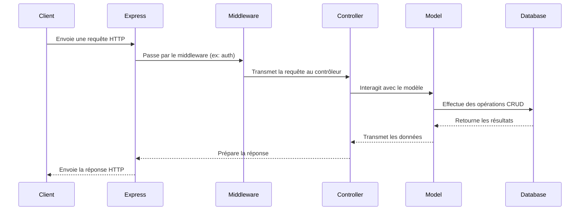

# Création d'API REST avec Node.js

- **Principes REST**
  - Méthodes HTTP (GET, POST, PUT, DELETE)
  - Statuts HTTP

- **Express.js pour les API**
  - Routing
  - Middleware pour la validation et l'authentification

- **Connexion à une base de données**
  - MongoDB avec Mongoose
  - SQL avec Sequelize

- **Authentification et sécurité**
  - JSON Web Tokens (JWT)
  - CORS (Cross-Origin Resource Sharing)

---
routeAlias: 'schema-api-rest-nodejs'
---

# Schéma d'une API REST avec Node.js



Ce schéma illustre le flux typique d'une requête dans une API REST construite avec Node.js et Express :

1. Le client envoie une requête HTTP.
2. Express reçoit la requête et la passe à travers les middleware configurés.
3. Le middleware approprié (ex: authentification) traite la requête.
4. Le contrôleur gère la logique métier.
5. Le modèle interagit avec la base de données.
6. Les données sont renvoyées au client via Express.

---
routeAlias: 'exercice-creation-api-rest-nodejs'
---

## Exercice : Création d'une API REST avec Node.js et Express

1. Créez une API REST pour gérer une collection de livres.
2. Implémentez les opérations CRUD (Create, Read, Update, Delete).
3. Ajoutez une authentification JWT pour sécuriser certaines routes.
4. Utilisez MongoDB avec Mongoose pour la persistance des données.
5. Testez votre API avec Postman ou curl.

---
routeAlias: 'correction-exercice-creation-api-rest-nodejs'
---

## Correction de l'exercice

```javascript
const express = require('express')
const mongoose = require('mongoose')
const jwt = require('jsonwebtoken')
const bcrypt = require('bcrypt')

const app = express()
app.use(express.json())

// Connexion à MongoDB
mongoose.connect('mongodb://localhost/bibliotheque', { useNewUrlParser: true, useUnifiedTopology: true })

// Modèle de livre
const Livre = mongoose.model('Livre', {
  titre: String,
  auteur: String,
  annee: Number
})

// Middleware d'authentification
function authenticateToken(req, res, next) {
  const authHeader = req.headers.authorization
  const token = authHeader && authHeader.split(' ')[1]

  if (token == null) {
    return res.sendStatus(401)
  }

  jwt.verify(token, process.env.JWT_SECRET, (err, user) => {
    if (err) {
      return res.sendStatus(403)
    }
    req.user = user
    next()
  })
}

// Routes CRUD
app.get('/livres', async (req, res) => {
  const livres = await Livre.find()
  res.json(livres)
})

app.post('/livres', authenticateToken, async (req, res) => {
  const livre = new Livre(req.body)
  await livre.save()
  res.status(201).json(livre)
})

app.put('/livres/:id', authenticateToken, async (req, res) => {
  const livre = await Livre.findByIdAndUpdate(req.params.id, req.body, { new: true })
  res.json(livre)
})

app.delete('/livres/:id', authenticateToken, async (req, res) => {
  await Livre.findByIdAndDelete(req.params.id)
  res.sendStatus(204)
})

// Route d'authentification
app.post('/login', async (req, res) => {
  // Ici, vous devriez vérifier les identifiants de l'utilisateur
  // et générer un token JWT si les identifiants sont valides
  const token = jwt.sign({ userId: 'user123' }, process.env.JWT_SECRET)
  res.json({ token })
})

app.listen(3000, () => console.log('Serveur démarré sur le port 3000'))
```