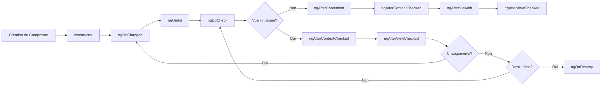
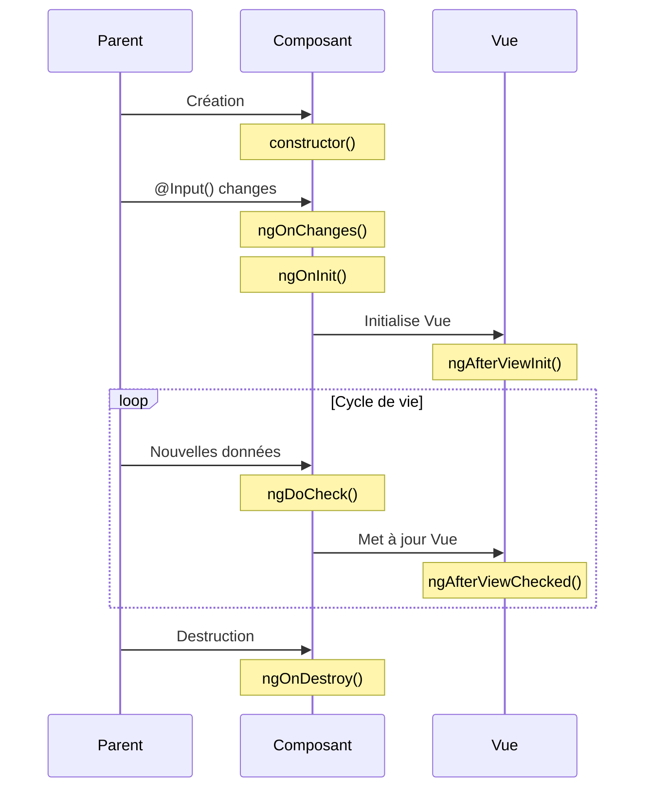

# Cycle de Vie des Composants

## Vue d'ensemble des hooks de cycle de vie

- **ngOnChanges**: Appelé quand une propriété liée aux données change
- **ngOnInit**: Après la première initialisation des propriétés
- **ngDoCheck**: Pendant chaque détection de changement
- **ngAfterViewInit**: Après l'initialisation de la vue
- **ngOnDestroy**: Juste avant que le composant soit détruit

---

## Flux du cycle de vie



---

## Flux de données entre composants



---

## Explication des phases

### Phase d'initialisation
1. **constructor** : Création de l'instance
2. **ngOnChanges** : Quand une @Input() change
3. **ngOnInit** : Une fois le composant initialisé
4. **ngDoCheck** : Vérification manuelle

### Phase de rendu
5. **ngAfterContentInit** : Après projection du contenu
6. **ngAfterContentChecked** : Après vérification du contenu
7. **ngAfterViewInit** : Après initialisation de la vue
8. **ngAfterViewChecked** : Après vérification de la vue

### Phase de destruction
9. **ngOnDestroy** : Nettoyage avant destruction

---

## Exemple d'implémentation

```typescript
@Component({
  selector: 'app-lifecycle',
  template: `
    <h1>{{ title }}</h1>
    <p>{{ message }}</p>
  `
})
export class LifecycleComponent implements OnInit, OnDestroy {
  @Input() title: string;
  message: string;

  ngOnInit() {
    console.log('Component initialized');
    this.message = 'Component is ready!';
  }

  ngOnDestroy() {
    console.log('Component will be destroyed');
  }
}
```

---

## Détection des changements d'Input

```typescript
@Component({
  selector: 'app-child',
  template: `
    <div>Data: {{ data }}</div>
  `
})
export class ChildComponent implements OnChanges {
  @Input() data: any;
  
  ngOnChanges(changes: SimpleChanges) {
    if (changes['data']) {
      console.log(
        'Previous:', changes['data'].previousValue,
        'Current:', changes['data'].currentValue
      );
    }
  }
}
```

---

## AfterView et AfterContent

```typescript
@Component({
  selector: 'app-view-child',
  template: `
    <div #contentDiv>
      <ng-content></ng-content>
    </div>
  `
})
export class ViewChildComponent implements AfterViewInit, AfterContentInit {
  @ViewChild('contentDiv') contentDiv: ElementRef;
  
  ngAfterViewInit() {
    console.log('View initialized:', this.contentDiv.nativeElement);
  }
  
  ngAfterContentInit() {
    console.log('Content initialized');
  }
}
```

---

## Bonnes pratiques et optimisation

```typescript
@Component({
  selector: 'app-optimized',
  template: `
    <div>{{ computedValue }}</div>
  `
})
export class OptimizedComponent implements DoCheck {
  private _data: any;
  private _computedValue: string;
  
  @Input() 
  set data(value: any) {
    if (this._data !== value) {
      this._data = value;
      this.compute();
    }
  }
  
  get computedValue(): string {
    return this._computedValue;
  }
  
  ngDoCheck() {
    // Utiliser avec précaution
    console.log('Change detection running');
  }
  
  private compute() {
    this._computedValue = `Computed: ${this._data}`;
  }
}
```

Cet exercice vous permettra de comprendre :
- Le cycle de vie complet des composants
- L'ordre d'exécution des hooks
- L'optimisation des performances
- La gestion des ressources 