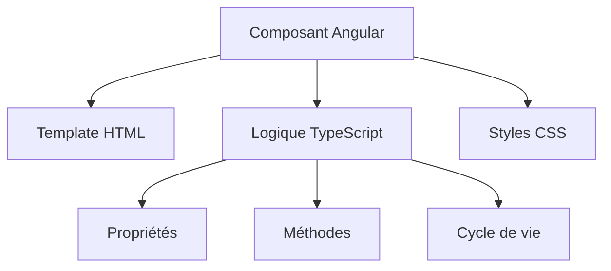

# Les Composants dans Angular

---

## Qu'est-ce qu'un composant ?

Un composant est comme une brique LEGO® de votre application :
- Une partie de l'interface utilisateur (UI)
- Autonome et réutilisable
- Avec sa propre logique et son propre template

---

## Création d'un composant avec le CLI

```bash
# Générer un composant standalone
ng generate component features/user/user-profile
# ou version courte
ng g c features/user/user-profile

# Générer un composant avec des tests
ng g c features/user/user-profile --spec

# Générer un composant sans fichier de style
ng g c features/user/user-profile --inline-style

# Générer un composant avec template inline
ng g c features/user/user-profile --inline-template

# Générer un composant dans un sous-dossier
ng g c features/user/components/user-profile

# Générer un composant sans créer un dossier
ng g c features/user/user-profile --flat
```

---

## Structure d'un composant



---

## Composants Standalone (Angular 18/19)

```typescript
@Component({
  selector: 'app-user-card',
  standalone: true, // Plus besoin de NgModule !
  imports: [CommonModule],
  template: `...`
})
export class UserCardComponent {}
```

---

## Le décorateur @Component - Partie 1

```typescript
@Component({
  // Nom de la balise HTML pour utiliser ce composant
  selector: 'app-user-profile',
  
  // Template HTML du composant
  template: `
    <div class="user-profile">
      <h2>{{ userName }}</h2>
    </div>
  `
})
```

---

## Le décorateur @Component - Partie 2

```typescript
@Component({
  // Styles spécifiques au composant
  styles: [`
    .user-profile {
      padding: 20px;
      border: 1px solid #ccc;
    }
  `]
})
```

---

## Styles des composants

```typescript
@Component({
  selector: 'app-styled-button',
  template: `
    <button class="custom-btn">
      <ng-content></ng-content>
    </button>
  `,
  styles: [`
    .custom-btn {
      padding: 10px 20px;
      border-radius: 4px;
      border: none;
      background: #007bff;
      color: white;
      cursor: pointer;
    }
  `],
  encapsulation: ViewEncapsulation.ShadowDom
})
```

---

## Projection de contenu - Structure

```typescript
@Component({
  selector: 'app-card',
  template: `
    <div class="card">
      <div class="header">
        <ng-content select="[header]"></ng-content>
      </div>
      <div class="content">
        <ng-content></ng-content>
      </div>
    </div>
  `
})
```

---

## Projection de contenu - Utilisation

```html
<app-card>
  <h2 header>Mon titre</h2>
  <p>Contenu principal</p>
  <button footer>Action</button>
</app-card>
```

---

## Bonnes pratiques - À faire ✅

- Un composant = une responsabilité unique
- Garder les composants petits et focalisés
- Utiliser des interfaces pour typer les inputs
- Documenter les inputs/outputs importants

---

## Bonnes pratiques - À éviter ❌

- Trop de logique dans les templates
- Composants trop complexes
- Duplication de code entre composants
- Couplage fort entre composants

---
layout: new-section
---

# Communication entre Composants

---

## Communication Parent → Enfant

### Entrées (@Input)

```typescript
@Component({
  selector: 'app-user-card',
  template: `
    <div class="card">
      <h3>{{ userName }}</h3>
      <p>{{ userRole }}</p>
    </div>
  `
})
export class UserCardComponent {
  @Input() userName: string;
  @Input() userRole: string;
}
```

---

## Utilisation des @Input

```html
<app-user-card
  userName="John Doe"
  userRole="Admin"
/>
```

---

## Communication Enfant → Parent

### Sorties (@Output)

```typescript
@Component({
  selector: 'app-counter',
  template: `
    <div>
      <h2>{{ count() }}</h2>
      <button (click)="increment()">+</button>
    </div>
  `
})
export class CounterComponent {
  count = signal(0);
  @Output() countChange = new EventEmitter<number>();

  increment() {
    this.count.update(n => n + 1);
    this.countChange.emit(this.count());
  }
}
```

---

## Gestion des événements @Output

Utilisation :
```html
<app-counter
  (countChange)="handleCountChange($event)"
/>
```

---
layout: exercices
routeAlias: 'exercice-post-list'
---

## Exercice : Composants du Blog

---

1. Créez le composant PostList :
```typescript
// features/posts/post-list.component.ts
@Component({
  selector: 'app-post-list',
  standalone: true,
  template: `
    <div class="posts">
      @for (post of posts; track post.id) {
        <article class="post-card">
          <h2>{{ post.title }}</h2>
          <p>{{ post.excerpt }}</p>
        </article>
      }
    </div>
  `,
  styles: [`
    .posts {
      display: grid;
      gap: 1rem;
    }
    .post-card {
      padding: 1rem;
      border: 1px solid #ddd;
      border-radius: 4px;
    }
  `]
})
export class PostListComponent {
  posts = [
    { id: 1, title: 'Premier article', excerpt: 'Un extrait du premier article...' },
    { id: 2, title: 'Deuxième article', excerpt: 'Un extrait du deuxième article...' }
  ];
}
```

---

## Exercice : Création des composants du Mini-Blog

### Structure des composants

```typescript
// Liste des articles
@Component({
  selector: 'app-post-list',
  standalone: true,
  template: `
    <div class="posts-grid">
      @for (post of posts; track post.id) {
        <app-post-card [post]="post" />
      }
    </div>
  `
})
export class PostListComponent {
  posts = signal<Post[]>([]);
}

// Détail d'un article
@Component({
  selector: 'app-post-detail',
  standalone: true,
  template: `
    <article class="post-detail">
      <h1>{{ post()?.title }}</h1>
      <div class="content">{{ post()?.content }}</div>
      <app-comment-list [postId]="post()?.id" />
    </article>
  `
})
export class PostDetailComponent {
  post = signal<Post | null>(null);
}
```

---

### Composant de formulaire

```typescript
@Component({
  selector: 'app-post-form',
  standalone: true,
  template: `
    <form class="post-form" (ngSubmit)="onSubmit()">
      <input [(ngModel)]="title" placeholder="Titre" />
      <textarea [(ngModel)]="content" placeholder="Contenu"></textarea>
      <button type="submit">Publier</button>
    </form>
  `
})
export class PostFormComponent {
  @Output() submitted = new EventEmitter<Post>();
}
```

---

### Dashboard Admin

```typescript
@Component({
  selector: 'app-admin-dashboard',
  standalone: true,
  template: `
    <div class="admin-dashboard">
      <h2>Tableau de bord</h2>
      <div class="stats">
        <div class="stat-card">
          <h3>Articles</h3>
          <p>{{ postCount() }}</p>
        </div>
        <div class="stat-card">
          <h3>Commentaires</h3>
          <p>{{ commentCount() }}</p>
        </div>
      </div>
    </div>
  `
})
export class AdminDashboardComponent {
  postCount = signal(0);
  commentCount = signal(0);
}
``` 