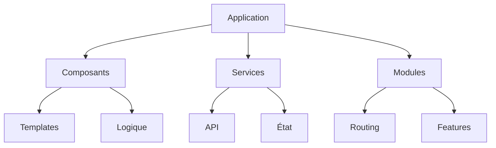
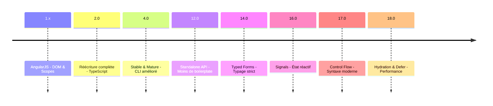
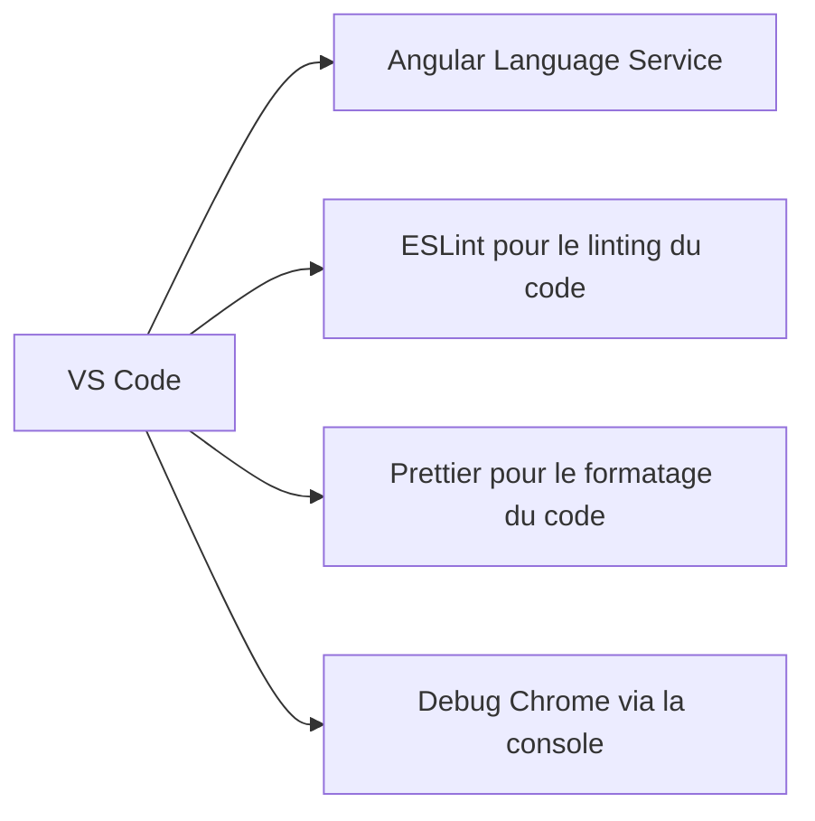

# Introduction à Angular

---

## Qu'est-ce qu'Angular ?

Imaginez Angular comme un kit complet pour construire une maison moderne :
- Les **fondations** (le framework core)
- Les **outils** (CLI, DevTools)
- Les **plans** (architecture)
- Les **matériaux** (composants)

---

### Exemple concret de ces termes :

- **Fondations** :
  - Framework core
  - TypeScript
  - RxJS
  - CLI
  - DevTools

- **Plans** :
  - Architecture orientée composants
  - Routage / Routing
  - State management avec RxJS / NgRx etc

- **Matériaux** :
  - Composants : boutons, formulaires, tables, etc.
  - Services : API, authentification, notifications, etc.

---

## Architecture d'une application Angular

Structure typique d'un projet :



---

## Les piliers d'Angular

<br>

### 1. Composants
Comme les LEGO® de votre application :
- Réutilisables
- Autonomes
- Combinables

### 2. Services
Comme les employés d'une entreprise :
- Spécialisés
- Partagés
- Indépendants

---

### 3. Dependency Injection
Comme un système de livraison automatique :
- Efficace
- Flexible
- Testable

Un exemple concret :

```typescript
@Injectable({
  providedIn: 'root'
})
export class UserService {
  constructor(private http: HttpClient) {}
}
```

Ce qui veut dire que le service `UserService` est injectable dans n'importe quel composant

Et que c'est un service singleton

C'est à dire que toutes les instances de `UserService` sont la même instance.

---

## Évolution d'Angular

### De AngularJS à Angular Moderne
- **AngularJS (1.x)**
  - Basé sur le DOM et les scopes
  - Directives comme composants
  - JavaScript vanilla

- **Angular 2+ : La révolution**
  - Réécriture complète en TypeScript
  - Architecture orientée composants
  - Performance améliorée
  - Injection de dépendances repensée

---

# Historique d'évolution de Angular en timeline



---

## Évolutions majeures

### Angular 12-14 : Simplification
- Introduction des Standalone Components
- Suppression progressive des NgModules
- Amélioration du CLI
- Formulaires typés

### Angular 15-16 : Réactivité
- Signals pour la gestion d'état
- Meilleure détection des changements
- SSR amélioré
- Hydration intelligente

### Angular 17-18 : Modernisation
- Nouveau Control Flow (@if, @for)
- Defer Loading intégré
- Build system avec Vite & ESBuild
- Developer experience améliorée

---

## Comparaison avec d'autres frameworks

| Caractéristique | Angular | React | Vue |
|----------------|---------|-------|-----|
| Architecture   | Full-framework | Bibliothèque | Progressive |
| Courbe d'apprentissage | Plus raide | Modérée | Douce |
| Tooling | Complet | Flexible | Intermédiaire |
| TypeScript | Natif | Optionnel | Optionnel |

---

## Outils essentiels



---

### Extensions indispensables
- Angular Language Service pour la complétion de code
- Angular Snippets pour les snippets de code
- ESLint pour le linting du code
- Prettier pour le formatage du code

---

## Prérequis techniques

Pour bien démarrer avec Angular, vous devez connaître :

✅ **Fondamentaux**
- HTML/CSS
- JavaScript moderne
- TypeScript basique
- Programmation orientée objet

❌ **Pas nécessaire**
- Backend development
- Mobile development
- WebAssembly
