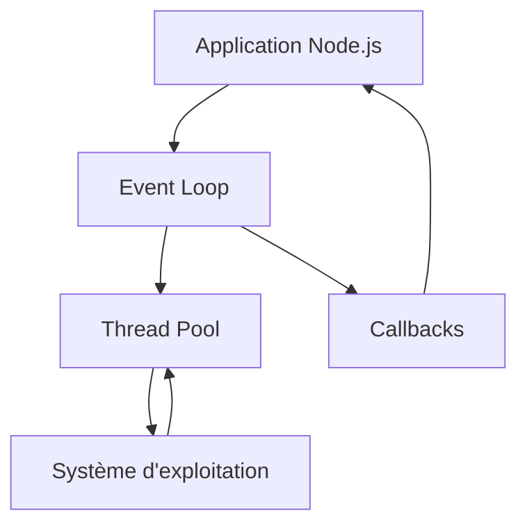

# Introduction à Node.js

- **Qu'est-ce que Node.js ?**
  - Environnement d'exécution JavaScript côté serveur
  - Basé sur le moteur V8 de Chrome

- **Caractéristiques de Node.js**
  - Non-bloquant et orienté événements
  - Écosystème npm riche

- **Installation de Node.js**
  - Via le site officiel ou gestionnaires de versions (nvm)

- **REPL Node.js**
  - Read-Eval-Print Loop pour tester rapidement du code

---
routeAlias: 'schema-fonctionnement-nodejs'
---

# Schéma de fonctionnement de Node.js



En résumé :

- L'application Node.js envoie des tâches à l'Event Loop
- L'Event Loop gère les opérations asynchrones
- Les opérations intensives sont déléguées au Thread Pool
- Le Thread Pool interagit avec le système d'exploitation
- Les résultats sont renvoyés via des callbacks

---
routeAlias: 'exercice-creation-serveur-http-nodejs'
---

## Exercice : Création d'un serveur HTTP simple avec Node.js

1. Créez un fichier `server.js`.
2. Utilisez le module `http` de Node.js pour créer un serveur simple.
3. Faites en sorte que le serveur réponde "Hello, Node.js!" à toutes les requêtes.
4. Démarrez le serveur sur le port 3000.

---
routeAlias: 'correction-exercice-creation-serveur-http-nodejs'
---

## Correction de l'exercice

```javascript
const http = require('node:http')

const server = http.createServer((req, res) => {
  res.statusCode = 200
  res.setHeader('Content-Type', 'text/plain')
  res.end('Hello, Node.js!')
})

const port = 3000
server.listen(port, () => {
  console.log(`Serveur en cours d'exécution sur http://localhost:${port}/`)
})
```

Pour exécuter le serveur, sauvegardez ce code dans un fichier `server.js` et exécutez-le avec Node.js :

```bash
node server.js
```

Vous pouvez maintenant accéder à votre serveur en ouvrant un navigateur et en allant à `http://localhost:3000`.
