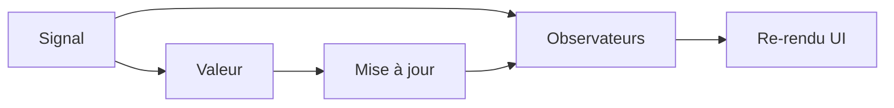
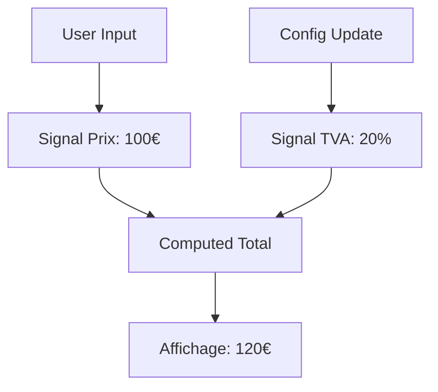

# Signals

---

## Commandes CLI pour les Signals

```bash
# Générer un composant avec support des signals
ng generate component features/counter --signals

# Générer un service avec signals
ng generate service shared/services/state --signals

# Générer un store avec signals
ng generate store features/todo/todo-store --signals

# Générer un composant avec état signal
ng generate component features/user-profile --signals --state

# Générer un service d'état global
ng generate service core/services/app-state --signals --global

# Générer un composant avec computed signals
ng generate component features/dashboard --signals --computed

# Générer un service de cache avec signals
ng generate service shared/services/cache --signals --storage

# Générer un store avec effets
ng generate store features/auth/auth-store --signals --effects
```

---

## Introduction aux Signals

Un Signal est comme une "boîte réactive" qui :
- Contient une valeur
- Notifie automatiquement quand cette valeur change
- Permet un suivi précis des dépendances



---

## Comparaison avec les variables classiques

Imaginons un thermomètre :

**Sans Signal :**
```typescript
// La température change mais personne n'est notifié
class Thermometer {
  temperature = 20;
  
  update() {
    this.temperature++; // L'affichage ne sait pas qu'il doit se mettre à jour
  }
}
```

**Avec Signal :**
```typescript
class Thermometer {
  temperature = signal(20);
  
  update() {
    this.temperature.update(t => t + 1); // Notification automatique !
  }
}
```

---

## Les différents types de Signals

### 1. Signal Writeable
```typescript
// Comme une variable qu'on peut lire et modifier
const counter = signal(0);

// Lecture
console.log(counter()); // 0

// Écriture
counter.set(5);        // Remplacement direct
counter.update(n => n + 1); // Mise à jour basée sur valeur précédente
```

### 2. Signal Computed
```typescript
// Comme une formule Excel qui se recalcule automatiquement
const price = signal(100);
const taxRate = signal(0.2);

const total = computed(() => {
  const basePrice = price();
  const tax = basePrice * taxRate();
  return basePrice + tax;
});
```

---

## Visualisation du flux de données



---

## Exemple concret : Panier d'achat

```typescript
@Component({
  template: `
    <div class="cart-summary">
      <h2>Votre panier</h2>
      
      <!-- Affichage réactif des totaux -->
      <div class="totals">
        <p>Sous-total: {{ subtotal() }}€</p>
        <p>TVA ({{ vatRate() * 100 }}%): {{ vatAmount() }}€</p>
        <p class="grand-total">Total: {{ total() }}€</p>
      </div>
      
      <!-- La mise à jour d'un produit recalcule automatiquement tous les totaux -->
      @for (item of cartItems(); track item.id) {
        <cart-item 
          [item]="item"
          (quantityChange)="updateQuantity(item.id, $event)"
        />
      }
    </div>
  `
})
export class CartComponent {
  // Signals de base
  cartItems = signal<CartItem[]>([]);
  vatRate = signal(0.20);

  // Computed signals - Se recalculent automatiquement
  subtotal = computed(() => {
    return this.cartItems().reduce(
      (sum, item) => sum + (item.price * item.quantity), 
      0
    );
  });

  vatAmount = computed(() => this.subtotal() * this.vatRate());
  total = computed(() => this.subtotal() + this.vatAmount());
}
```

---

## Bonnes pratiques avec les Signals

✅ **À faire**
- Utiliser computed() pour les valeurs dérivées
- Préférer .update() à .set() pour les modifications basées sur l'état précédent
- Garder les signals privés quand possible

❌ **À éviter**
- Créer des signals dans des boucles
- Appeler des signals dans des setters
- Modifier plusieurs signals de manière non atomique

## Computed Signals

```typescript
const count = signal(0);
const doubled = computed(() => count() * 2);
const isEven = computed(() => count() % 2 === 0);
```

---

## Effects

```typescript
@Component({
  template: `
    <button (click)="increment()">
      Compteur: {{ count() }}
    </button>
  `
})
export class CounterComponent {
  count = signal(0);
  
  constructor() {
    // L'effet se déclenche à chaque changement de count
    effect(() => {
      console.log(`Nouvelle valeur: ${this.count()}`);
      localStorage.setItem('count', this.count().toString());
    });
  }
  
  increment() {
    this.count.update(n => n + 1);
  }
}
```

---

## Signals avec objets et tableaux

```typescript
interface User {
  id: number;
  name: string;
  email: string;
}

@Component({
  template: `
    <div>
      <h2>{{ user().name }}</h2>
      @for (friend of friends(); track friend.id) {
        <div>{{ friend.name }}</div>
      }
    </div>
  `
})
export class UserComponent {
  user = signal<User>({
    id: 1,
    name: 'John',
    email: 'john@example.com'
  });
  
  friends = signal<User[]>([]);
  
  updateUser(newData: Partial<User>) {
    this.user.update(user => ({
      ...user,
      ...newData
    }));
  }
  
  addFriend(friend: User) {
    this.friends.update(friends => [...friends, friend]);
  }
}
```

---

## Signals avec async data

```typescript
@Component({
  template: `
    @if (loading()) {
      <spinner />
    } @else if (error()) {
      <error-message [message]="error()" />
    } @else if (data(); as users) {
      @for (user of users; track user.id) {
        <user-card [user]="user" />
      }
    }
  `
})
export class UsersComponent {
  private userService = inject(UserService);
  
  data = signal<User[] | null>(null);
  loading = signal(true);
  error = signal<string | null>(null);
  
  constructor() {
    this.loadUsers();
  }
  
  async loadUsers() {
    try {
      this.loading.set(true);
      this.error.set(null);
      const users = await this.userService.getUsers();
      this.data.set(users);
    } catch (err) {
      this.error.set(err.message);
    } finally {
      this.loading.set(false);
    }
  }
}
```

---

## Signal Inputs

```typescript
@Component({
  selector: 'app-user-profile',
  template: `
    <div>
      <h2>{{ name() }}</h2>
      <p>Age: {{ age() }}</p>
      <p>Score: {{ score() }}</p>
    </div>
  `
})
export class UserProfileComponent {
  name = input.required<string>();
  age = input<number>(18); // Valeur par défaut
  score = input<number>(); // Optionnel
}

// Utilisation
@Component({
  template: `
    <app-user-profile
      [name]="user.name"
      [age]="user.age"
      [score]="user.score"
    />
  `
})
```

---

## Signals avec formulaires

```typescript
@Component({
  template: `
    <form [formGroup]="form" (ngSubmit)="onSubmit()">
      <input formControlName="name">
      <input formControlName="email">
      
      <div>Form Value: {{ formValue() | json }}</div>
      <div>Valid: {{ isValid() }}</div>
      
      <button type="submit" [disabled]="!isValid()">
        Envoyer
      </button>
    </form>
  `
})
export class SignupFormComponent {
  form = new FormGroup({
    name: new FormControl('', Validators.required),
    email: new FormControl('', [Validators.required, Validators.email])
  });
  
  // Conversion des valeurs du formulaire en signals
  formValue = toSignal(this.form.valueChanges, {
    initialValue: this.form.value
  });
  
  isValid = computed(() => this.form.valid);
  
  onSubmit() {
    if (this.isValid()) {
      console.log('Envoi:', this.formValue());
    }
  }
}
```

---

# Gestion de l'État avec Signals

## Avant les Signals
```typescript
@Component({
  template: `
    <h1>{{ count }}</h1>
    <button (click)="increment()">+1</button>
  `
})
class CounterComponent {
  count = 0
  
  increment() {
    this.count++ // Déclenche détection globale
  }
}
```

---

## Avec les Signals
```typescript
@Component({
  template: `
    <h1>{{ count() }}</h1>
    <button (click)="increment()">+1</button>
  `
})
class CounterComponent {
  count = signal(0)
  
  increment() {
    this.count.update(n => n + 1) // Mise à jour granulaire
  }
}
```

---
layout: exercices
routeAlias: 'exercice-blog-state'
---

## Exercice : État Global du Blog

---

1. Créez le service d'état :
```typescript
// core/state/blog.state.ts
interface BlogState {
  posts: Post[]
  selectedPost: Post | null
  filters: {
    search: string
    category: string
  }
  loading: boolean
  error: string | null
}

@Injectable({ providedIn: 'root' })
export class BlogStateService {
  // État privé
  private state = signal<BlogState>({
    posts: [],
    selectedPost: null,
    filters: {
      search: '',
      category: 'all'
    },
    loading: false,
    error: null
  })

  // Sélecteurs publics en lecture seule
  readonly posts = computed(() => this.state().posts)
  readonly selectedPost = computed(() => this.state().selectedPost)
  readonly loading = computed(() => this.state().loading)
  readonly error = computed(() => this.state().error)

  // Sélecteur filtré
  readonly filteredPosts = computed(() => {
    const { posts, filters } = this.state()
    return posts.filter(post => {
      const matchesSearch = post.title
        .toLowerCase()
        .includes(filters.search.toLowerCase())
      const matchesCategory = filters.category === 'all' 
        || post.category === filters.category
      return matchesSearch && matchesCategory
    })
  })

  // Actions
  setSearch(search: string) {
    this.state.update(state => ({
      ...state,
      filters: {
        ...state.filters,
        search
      }
    }))
  }

  setCategory(category: string) {
    this.state.update(state => ({
      ...state,
      filters: {
        ...state.filters,
        category
      }
    }))
  }

  selectPost(post: Post) {
    this.state.update(state => ({
      ...state,
      selectedPost: post
    }))
  }

  async loadPosts() {
    this.state.update(state => ({
      ...state,
      loading: true,
      error: null
    }))

    try {
      const posts = await firstValueFrom(this.postService.getPosts())
      this.state.update(state => ({
        ...state,
        posts,
        loading: false
      }))
    } catch (error) {
      this.state.update(state => ({
        ...state,
        error: 'Erreur lors du chargement des posts',
        loading: false
      }))
    }
  }
}
```

---

2. Utilisez l'état dans un composant :
```typescript
@Component({
  selector: 'app-post-list',
  template: `
    <div class="filters">
      <input 
        type="text" 
        [ngModel]="searchTerm()" 
        (ngModelChange)="onSearch($event)"
        placeholder="Rechercher..."
      >
      <select 
        [ngModel]="category()" 
        (ngModelChange)="onCategoryChange($event)"
      >
        <option value="all">Toutes catégories</option>
        <option value="tech">Tech</option>
        <option value="lifestyle">Lifestyle</option>
      </select>
    </div>

    @if (loading()) {
      <spinner />
    } @else if (error()) {
      <error-message [message]="error()" />
    } @else {
      <div class="posts">
        @for (post of filteredPosts(); track post.id) {
          <app-post-card 
            [post]="post"
            [selected]="isSelected(post)"
            (click)="onSelectPost(post)"
          />
        }
      </div>
    }
  `
})
export class PostListComponent {
  private blogState = inject(BlogStateService)

  // Sélecteurs
  posts = this.blogState.posts
  filteredPosts = this.blogState.filteredPosts
  loading = this.blogState.loading
  error = this.blogState.error
  
  // État local
  searchTerm = signal('')
  category = signal('all')

  // Computed
  isSelected = computed(() => (post: Post) => 
    this.blogState.selectedPost()?.id === post.id
  )

  // Actions
  onSearch(term: string) {
    this.searchTerm.set(term)
    this.blogState.setSearch(term)
  }

  onCategoryChange(category: string) {
    this.category.set(category)
    this.blogState.setCategory(category)
  }

  onSelectPost(post: Post) {
    this.blogState.selectPost(post)
  }
} 
```

---

## Exercice : Gestion d'État du Mini-Blog avec Signals

### État des Posts

```typescript
// stores/post.store.ts
interface PostState {
  posts: Post[];
  selectedPost: Post | null;
  loading: boolean;
  error: Error | null;
}

@Injectable({ providedIn: 'root' })
export class PostStore {
  // État privé
  private state = signal<PostState>({
    posts: [],
    selectedPost: null,
    loading: false,
    error: null
  });

  // Sélecteurs publics
  readonly posts = computed(() => this.state().posts);
  readonly selectedPost = computed(() => this.state().selectedPost);
  readonly loading = computed(() => this.state().loading);
  readonly error = computed(() => this.state().error);

  // Sélecteurs dérivés
  readonly sortedPosts = computed(() => 
    [...this.posts()].sort((a, b) => 
      new Date(b.date).getTime() - new Date(a.date).getTime()
    )
  );

  readonly postCount = computed(() => this.posts().length);

  constructor(private postService: PostService) {
    // Effet pour sauvegarder l'état dans le localStorage
    effect(() => {
      localStorage.setItem('posts', JSON.stringify(this.posts()));
    });
  }

  // Actions
  async loadPosts() {
    this.state.update(s => ({ ...s, loading: true, error: null }));
    try {
      const posts = await this.postService.getPosts();
      this.state.update(s => ({ ...s, posts, loading: false }));
    } catch (error) {
      this.state.update(s => ({ 
        ...s, 
        error: error as Error,
        loading: false 
      }));
    }
  }

  selectPost(id: number) {
    const post = this.posts().find(p => p.id === id);
    this.state.update(s => ({ ...s, selectedPost: post }));
  }

  async createPost(post: Omit<Post, 'id'>) {
    this.state.update(s => ({ ...s, loading: true, error: null }));
    try {
      const newPost = await this.postService.createPost(post);
      this.state.update(s => ({
        ...s,
        posts: [...s.posts, newPost],
        loading: false
      }));
    } catch (error) {
      this.state.update(s => ({
        ...s,
        error: error as Error,
        loading: false
      }));
    }
  }
}
```

### État de l'Authentification

```typescript
// stores/auth.store.ts
interface AuthState {
  user: User | null;
  token: string | null;
  loading: boolean;
  error: Error | null;
}

@Injectable({ providedIn: 'root' })
export class AuthStore {
  // État privé
  private state = signal<AuthState>({
    user: null,
    token: null,
    loading: false,
    error: null
  });

  // Sélecteurs publics
  readonly user = computed(() => this.state().user);
  readonly isAuthenticated = computed(() => !!this.state().token);
  readonly loading = computed(() => this.state().loading);
  readonly error = computed(() => this.state().error);

  // Sélecteurs dérivés
  readonly isAdmin = computed(() => 
    this.user()?.role === 'admin'
  );

  constructor(private authService: AuthService) {
    // Restauration de la session
    const token = localStorage.getItem('token');
    if (token) {
      this.state.update(s => ({ ...s, token }));
      this.loadUser();
    }
  }

  // Actions
  async login(credentials: { email: string; password: string }) {
    this.state.update(s => ({ ...s, loading: true, error: null }));
    try {
      const { user, token } = await this.authService.login(credentials);
      this.state.update(s => ({
        ...s,
        user,
        token,
        loading: false
      }));
      localStorage.setItem('token', token);
    } catch (error) {
      this.state.update(s => ({
        ...s,
        error: error as Error,
        loading: false
      }));
    }
  }

  logout() {
    localStorage.removeItem('token');
    this.state.update(s => ({
      ...s,
      user: null,
      token: null
    }));
  }

  private async loadUser() {
    if (!this.state().token) return;
    
    try {
      const user = await this.authService.getProfile();
      this.state.update(s => ({ ...s, user }));
    } catch {
      this.logout();
    }
  }
} 