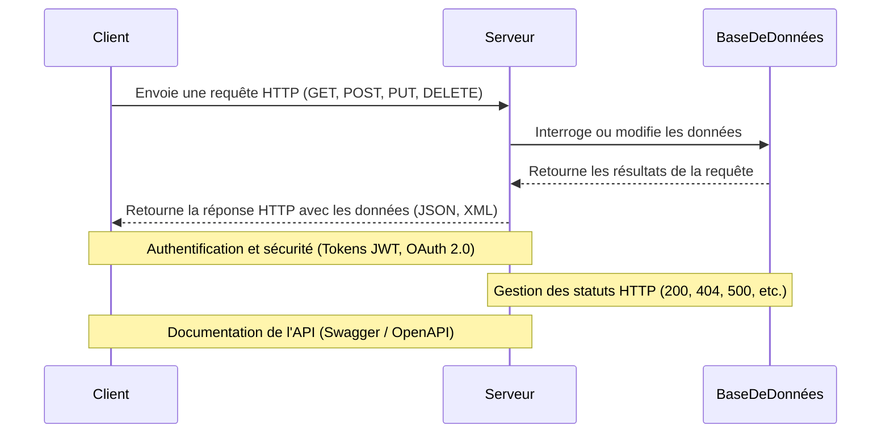

# PHP, Laravel et Symfony

Une formation complète sur le développement web moderne avec PHP.

<div class="pt-12">
  <span @click="next" class="px-2 p-1 rounded cursor-pointer hover:bg-white hover:bg-opacity-10">
    Appuyez sur espace pour la page suivante <carbon:arrow-right class="inline"/>
  </span>
</div>

---
layout: two-cols
routeAlias: 'sommaire'
---

<a name="SOMMAIRE" id="sommaire"></a>

# SOMMAIRE 📜

### Voici le sommaire de cette formation sur PHP, Laravel et Symfony:

<br>

<div class="flex flex-col gap-2">
<Link to="introduction-php">🚀 Introduction à PHP</Link>
<Link to="installation-php">💻 Installation de PHP</Link>
<Link to="syntaxe-base-php">🔧 Syntaxe de base de PHP</Link>
<Link to="variables-types">📊 Variables et types de données</Link>
<Link to="structures-controle">🔀 Structures de contrôle</Link>
<Link to="fonctions-php">🧰 Fonctions en PHP</Link>
<Link to="poo-php">🔍 Programmation Orientée Objet en PHP</Link>
<Link to="namespaces-php">🏷️ Namespaces en PHP</Link>
<Link to="gestion-erreurs">🚨 Gestion des erreurs et exceptions</Link>
<Link to="bases-donnees-php">💾 Bases de données avec PHP</Link>
</div>

::right::

<div class="flex flex-col gap-2">
<Link to="composer">📦 Composer et gestion des dépendances</Link>
<Link to="introduction-laravel">🛠️ Introduction à Laravel</Link>
<Link to="fonctionnalites-laravel">🔥 Fonctionnalités avancées de Laravel</Link>
<Link to="eloquent-orm">🗃️ Eloquent ORM</Link>
<Link to="blade-templating">🎨 Blade Templating</Link>
<Link to="introduction-symfony">🎭 Introduction à Symfony</Link>
<Link to="fonctionnalites-symfony">🌟 Fonctionnalités avancées de Symfony</Link>
<Link to="doctrine-orm">🗄️ Doctrine ORM</Link>
<Link to="twig-templating">🖌️ Twig Templating</Link>
<Link to="api-rest">🌐 Création d'API REST</Link>
<Link to="tests-unitaires">🧪 Tests unitaires en PHP</Link>
<Link to="bonnes-pratiques">📚 Bonnes pratiques de développement PHP</Link>
<Link to="securite-php">🔒 Sécurité en PHP</Link>
<Link to="performance-php">⚡ Performance en PHP</Link>
<Link to="deploiement-php">🚀 Déploiement d'applications PHP</Link>
<Link to="tendances-futures">🔮 Tendances futures en PHP</Link>
<Link to="ressources-apprentissage">📖 Ressources pour continuer l'apprentissage</Link>
<Link to="questions-discussion">💬 Questions et discussion</Link>
</div>

---
routeAlias: 'introduction-php'
---

# Introduction à PHP

- **Qu'est-ce que PHP ?**
  - Langage de script côté serveur
  - Utilisé pour le développement web dynamique
  - Intégré dans le HTML

- **Histoire de PHP**
  - Créé en 1994 par Rasmus Lerdorf
  - Évolution majeure avec PHP 3, 4, 5, 7 et 8

- **Pourquoi utiliser PHP ?**
  - Large communauté et écosystème
  - Facile à apprendre et à utiliser
  - Compatible avec la plupart des systèmes d'exploitation et serveurs web

---
routeAlias: 'installation-php'
---

# Installation de PHP

- **Sur Windows**
  - Utilisation de XAMPP ou WampServer
  - Installation via le site officiel de PHP

- **Sur macOS**
  - Utilisation de Homebrew
  - Installation via le site officiel de PHP

- **Sur Linux**
  - Utilisation du gestionnaire de paquets (apt, yum, etc.)
  - Compilation depuis les sources

---
routeAlias: 'exercice-configuration-environnement-php'
---

## Exercice : Configuration de l'environnement PHP

1. Installez PHP sur votre machine (si ce n'est pas déjà fait).
2. Créez un fichier `info.php` avec le contenu suivant :
   ```php
   <?php
   phpinfo();
   ?>
   ```
3. Placez ce fichier dans le répertoire approprié de votre serveur web.
4. Accédez à ce fichier via votre navigateur et vérifiez les informations affichées.

---
routeAlias: 'correction-exercice-configuration-environnement-php'
---

## Correction de l'exercice : Configuration de l'environnement PHP

```php
<?php
phpinfo();
?>
```

---
routeAlias: 'syntaxe-base-php'
---

# Syntaxe de base de PHP

- **Structure d'un script PHP**
  - Balises PHP : `<?php ... ?>`
  - Instruction de fin de ligne : `;`

- **Commentaires**
  - Sur une ligne : `// commentaire` ou `# commentaire`
  - Sur plusieurs lignes : `/* commentaire */`

- **Affichage**
  - `echo` et `print`
  - Différence entre guillemets simples et doubles

---
routeAlias: 'exercice-votre-premier-script-php'
---

## Exercice : Votre premier script PHP

Créez un script PHP qui :
1. Affiche "Bonjour, monde !" à l'écran.
2. Utilise des commentaires pour expliquer chaque ligne de code.
3. Utilise à la fois `echo` et `print` pour comparer leur utilisation.

---
routeAlias: 'correction-exercice-votre-premier-script-php'
---

## Correction de l'exercice : Votre premier script PHP

```php
<?php
// Affichage avec echo
echo "Bonjour, monde !<br>";

// Affichage avec print
print "Ceci est mon premier script PHP.<br>";

// Comparaison entre echo et print
echo "Echo est généralement plus rapide que print.<br>";
print "Print retourne toujours 1.<br>";
?>
```

---
routeAlias: 'variables-types'
layout: two-cols
---

# Variables et types de données en PHP

- **Déclaration de variables**
  - Utilisation du symbole `$`
  - Nommage des variables

- **Types de données de base**
  - Integer, Float, String, Boolean
  - NULL

::right::

- **Types composés**
  - Array
  - Object

- **Typage en PHP 7+**
  - Déclarations de type
  - Types de retour

---
routeAlias: 'exercice-manipulation-types-donnees'
---

## Exercice : Manipulation des types de données

Créez un script PHP qui :
1. Déclare des variables de différents types (int, float, string, boolean, array).
2. Effectue des opérations de base sur ces variables (addition, concaténation, etc.).
3. Utilise la fonction `var_dump()` pour afficher le type et la valeur de chaque variable.

---
routeAlias: 'correction-exercice-manipulation-types-donnees'
---

## Correction de l'exercice : Manipulation des types de données

```php
<?php
// Déclaration des variables
$entier = 42;
$flottant = 3.14;
$chaine = "Hello, PHP!";
$booleen = true;
$tableau = [1, 2, 3, 4, 5];

// Opérations de base
$somme = $entier + $flottant;
$concatenation = $chaine . " J'aime les nombres comme " . $entier;

// Affichage des types et valeurs
var_dump($entier);
var_dump($flottant);
var_dump($chaine);
var_dump($booleen);
var_dump($tableau);
var_dump($somme);
var_dump($concatenation);
?>
```

---
routeAlias: 'structures-controle'
---

# Structures de contrôle en PHP

- **Conditions**
  - `if`, `else`, `elseif`
  - `switch`
  - Opérateur ternaire

- **Boucles**
  - `for`
  - `while`
  - `do-while`
  - `foreach` (pour les tableaux)

- **Contrôle de flux**
  - `break`
  - `continue`

---
routeAlias: 'exercice-utilisation-structures-controle'
---

## Exercice : Utilisation des structures de contrôle

Créez un script PHP qui :
1. Utilise une boucle `for` pour afficher les nombres de 1 à 10.
2. Utilise une structure `if-else` pour déterminer si chaque nombre est pair ou impair.
3. Utilise `foreach` pour parcourir un tableau de fruits et afficher chaque fruit.

---

# Correction de l'exercice

```php
<?php
for ($i = 1; $i <= 10; $i++) {
    if ($i % 2 == 0) {
        echo "$i est pair.\n";
    } else {
        echo "$i est impair.\n";
    }
}

$fruits = ['pomme', 'banane', 'cerise', 'fraise'];
foreach ($fruits as $fruit) {
    echo "J'aime le $fruit.\n";
}
?>
```

---
routeAlias: 'fonctions-php'
layout: two-cols
---

# Fonctions en PHP

- **Définition de fonctions**
  - Syntaxe de base
  - Paramètres et valeurs par défaut

- **Portée des variables**
  - Variables globales et locales
  - Utilisation de `global` et `static`

::right::

- **Fonctions anonymes et closures**
  - Utilisation de `function() {}`
  - Capture de variables avec `use`

- **Fonctions natives importantes**
  - Manipulation de chaînes : `strlen()`, `str_replace()`
  - Manipulation de tableaux : `array_push()`, `array_map()`

---
routeAlias: 'exercice-creation-utilisation-fonctions'
---

## Exercice : Création et utilisation de fonctions

1. Créez une fonction qui calcule le factoriel d'un nombre.
2. Créez une fonction anonyme qui trie un tableau de nombres.
3. Utilisez `array_map()` avec une fonction anonyme pour doubler tous les éléments d'un tableau.

---
routeAlias: 'correction-exercice-creation-utilisation-fonctions'
---

## Correction de l'exercice

```php
<?php
function factorielle($n) {
    if ($n == 0) {
        return 1;
    } else {
        return $n * factorielle($n - 1);
    }
}

$factorielle = function($n) {
    if ($n == 0) {
        return 1;
    } else {
        return $n * $factorielle($n - 1);
    }
};

$tableau = [1, 2, 3, 4, 5];
$double = function($x) {
    return $x * 2;
};

$resultats = array_map($double, $tableau);

foreach ($resultats as $resultat) {
    echo $resultat . "\n";
}
?>
```

---
routeAlias: 'poo-php'
---

# Programmation Orientée Objet en PHP

<small>

- **Classes et objets**
  - Définition de classes
  - Instanciation d'objets

- **Propriétés et méthodes**
  - Visibilité : public, protected, private
  - Méthodes magiques : `__construct()`, `__toString()`

- **Héritage**
  - Mot-clé `extends`
  - Surcharge de méthodes

- **Interfaces et traits**
  - Définition et implémentation d'interfaces
  - Utilisation de traits pour la réutilisation de code

</small>

---
routeAlias: 'exercice-creation-classe-interface'
---

## Exercice : Création d'une hiérarchie de classes

1. Créez une classe `Vehicule` avec des propriétés comme `marque` et `modele`.
2. Créez des sous-classes `Voiture` et `Moto` qui héritent de `Vehicule`.
3. Ajoutez des méthodes spécifiques à chaque sous-classe.
4. Créez une interface `Demarrable` et implémentez-la dans vos classes.

---

# Correction de l'exercice

```php
<?php
class Vehicule {
    public $marque;
    public $modele;

    public function __construct($marque, $modele) {
        $this->marque = $marque;
        $this->modele = $modele;
    }
}

class Voiture extends Vehicule {
    public $nombreDePortes;

    public function __construct($marque, $modele, $nombreDePortes) {
        parent::__construct($marque, $modele);
        $this->nombreDePortes = $nombreDePortes;
    }
}

interface Demarrable {
    public function demarrer();
}

class Moto extends Vehicule implements Demarrable {
    public function demarrer() {
        echo "La moto démarre.\n";
    }
}

$voiture = new Voiture("Toyota", "Corolla", 4);
$moto = new Moto("Honda", "CBR", 2);

$voiture->demarrer();
$moto->demarrer();
?>
```

---
routeAlias: 'namespaces-php'
---

# Namespaces en PHP

- **Définition et utilisation des namespaces**
  - Mot-clé `namespace`
  - Importation avec `use`

- **Avantages des namespaces**
  - Organisation du code
  - Éviter les conflits de noms

- **Autoloading avec PSR-4**
  - Configuration de Composer pour l'autoloading
  - Utilisation de l'autoloader

---
routeAlias: 'exercice-organisation-code-namespaces'
---

## Exercice : Organisation du code avec namespaces

1. Créez une structure de dossiers pour un petit projet.
2. Définissez des namespaces pour chaque partie de votre application (ex: `App\Controllers`, `App\Models`).
3. Créez quelques classes dans ces namespaces.
4. Utilisez Composer pour configurer l'autoloading PSR-4.

---
routeAlias: 'correction-exercice-organisation-code-namespaces'
---

## Correction de l'exercice

```php
<?php
// Fichier: src/Controllers/UserController.php
namespace App\Controllers;

class UserController {
    public function index() {
        echo "Liste des utilisateurs";
    }
}

// Fichier: src/Models/User.php
namespace App\Models;

class User {
    public $name;
    public $email;

    public function __construct($name, $email) {
        $this->name = $name;
        $this->email = $email;
    }
}

// Fichier: composer.json
{
    "autoload": {
        "psr-4": {
            "App\\": "src/"
        }
    }
}

// Fichier: index.php
require_once 'vendor/autoload.php';

use App\Controllers\UserController;
use App\Models\User;

$controller = new UserController();
$controller->index();

$user = new User("John Doe", "john@example.com");
var_dump($user);
?>
```

---
routeAlias: 'gestion-erreurs'
---

# Gestion des erreurs et exceptions en PHP

- **Types d'erreurs en PHP**
  - Erreurs fatales, avertissements, notices

- **Configuration de la gestion d'erreurs**
  - `error_reporting()`
  - `set_error_handler()`

- **Exceptions**
  - Lancer des exceptions avec `throw`
  - Capturer des exceptions avec `try`-`catch`
  - Bloc `finally`

- **Création d'exceptions personnalisées**
  - Étendre la classe `Exception`

---
routeAlias: 'exercice-gestion-erreurs-exceptions'
---

## Exercice : Gestion d'erreurs et d'exceptions

1. Créez une fonction qui lance une exception si un paramètre invalide est passé.
2. Utilisez un bloc try-catch pour gérer cette exception.
3. Créez une classe d'exception personnalisée pour votre application.
4. Configurez un gestionnaire d'erreurs personnalisé qui convertit les erreurs PHP en exceptions.

---
routeAlias: 'correction-exercice-gestion-erreurs-exceptions'
---

## Correction de l'exercice

```php
<?php
class AgeInvalideException extends Exception {}

function verifierAge($age) {
    if ($age < 0 || $age > 120) {
        throw new AgeInvalideException("L'âge doit être compris entre 0 et 120 ans.");
    }
    return true;
}

set_error_handler(function($errno, $errstr, $errfile, $errline) {
    throw new ErrorException($errstr, 0, $errno, $errfile, $errline);
});

try {
    verifierAge(150);
} catch (AgeInvalideException $e) {
    echo "Erreur : " . $e->getMessage() . "\n";
}

try {
    // Provoque une erreur PHP
    echo $variableInexistante;
} catch (ErrorException $e) {
    echo "Erreur PHP convertie en exception : " . $e->getMessage() . "\n";
}
?>
```

---
routeAlias: 'bases-donnees-php'
---

# Bases de données avec PHP

- **PDO (PHP Data Objects)**
  - Connexion à différents types de bases de données
  - Requêtes préparées pour la sécurité

- **MySQLi**
  - Spécifique à MySQL
  - Support des procédures stockées

- **Requêtes SQL de base**
  - SELECT, INSERT, UPDATE, DELETE

- **Transactions**
  - Début, validation et annulation de transactions

---
routeAlias: 'exercice-creation-crud-simple'
---

## Exercice : Création d'un CRUD simple

1. Créez une base de données MySQL avec une table `utilisateurs`.
2. Écrivez des fonctions PHP pour :
   - Insérer un nouvel utilisateur
   - Récupérer tous les utilisateurs
   - Mettre à jour les informations d'un utilisateur
   - Supprimer un utilisateur
3. Utilisez PDO et des requêtes préparées pour toutes les opérations.

---
routeAlias: 'correction-exercice-creation-crud-simple'
---

## Correction de l'exercice

```php
<?php
$dsn = 'mysql:host=localhost;dbname=nom_de_votre_base_de_donnees';
$username = 'votre_utilisateur';
$password = 'votre_mot_de_passe';

try {
    $pdo = new PDO($dsn, $username, $password);
    $pdo->setAttribute(PDO::ATTR_ERRMODE, PDO::ERRMODE_EXCEPTION);

    // Insertion d'un nouvel utilisateur
    $sql = "INSERT INTO utilisateurs (nom, email) VALUES (:nom, :email)";
    $stmt = $pdo->prepare($sql);
    $stmt->execute(['nom' => 'Nom de l\'utilisateur', 'email' => 'email@example.com']);

    // Récupération de tous les utilisateurs
    $sql = "SELECT * FROM utilisateurs";
    $stmt = $pdo->query($sql);
    $utilisateurs = $stmt->fetchAll(PDO::FETCH_ASSOC);

    // Mise à jour des informations d'un utilisateur
    $sql = "UPDATE utilisateurs SET email = :email WHERE id = :id";
    $stmt = $pdo->prepare($sql);
    $stmt->execute(['email' => 'nouveau_email@example.com', 'id' => 1]);

    // Suppression d'un utilisateur
    $sql = "DELETE FROM utilisateurs WHERE id = :id";
    $stmt = $pdo->prepare($sql);
    $stmt->execute(['id' => 1]);
} catch (PDOException $e) {
    echo "Erreur de base de données : " . $e->getMessage();
}
?>
```

---
routeAlias: 'composer'
---

# Composer et gestion des dépendances

<small>

- **Qu'est-ce que Composer ?**
  - Gestionnaire de dépendances pour PHP
  - Gestion des versions des bibliothèques

- **Installation et configuration**
  - Installation globale vs locale
  - Fichier `composer.json`

- **Commandes de base**
  - `composer install`
  - `composer update`
  - `composer require`

- **Autoloading avec Composer**
  - Configuration de l'autoloading dans `composer.json`
  - Utilisation de `vendor/autoload.php`

</small>

---
routeAlias: 'exercice-mise-en-place-projet-composer'
---

## Exercice : Mise en place d'un projet avec Composer

1. Initialisez un nouveau projet avec Composer.
2. Ajoutez quelques dépendances populaires (ex: monolog pour le logging).
3. Configurez l'autoloading pour votre propre code.
4. Créez un script simple qui utilise une de vos dépendances.

---
routeAlias: 'introduction-laravel'
---

# Introduction à Laravel

<small>

- **Qu'est-ce que Laravel ?**
  - Framework PHP pour le développement web
  - Basé sur le modèle MVC (Modèle-Vue-Contrôleur)

- **Philosophie de Laravel**
  - Convention over Configuration
  - Expressivité du code

- **Installation de Laravel**
  - Utilisation de Composer : `composer create-project laravel/laravel nom_du_projet`
  - Structure des répertoires

- **Artisan CLI**
  - Outil en ligne de commande pour les tâches courantes

</small>

---
routeAlias: 'exercice-mise-en-place-projet-laravel'
---

## Exercice : Création d'un projet Laravel

1. Installez Laravel via Composer.
2. Explorez la structure du projet créé.
3. Utilisez Artisan pour créer un contrôleur et un modèle.
4. Lancez le serveur de développement et accédez à la page d'accueil.

---
routeAlias: 'fonctionnalites-laravel'
---

# Fonctionnalités avancées de Laravel

<small>

- **Routing**
  - Définition des routes dans `routes/web.php`
  - Routes avec paramètres et contraintes

- **Middleware**
  - Filtrage des requêtes HTTP
  - Middleware d'authentification et d'autorisation

- **Validation des données**
  - Règles de validation
  - Messages d'erreur personnalisés

- **Gestion des sessions et cookies**
  - Configuration des sessions
  - Utilisation des cookies

</small>

---
routeAlias: 'exercice-creation-route-securisee'
---

## Exercice : Création d'une route sécurisée

1. Créez une route qui nécessite une authentification.
2. Implémentez un middleware personnalisé pour vérifier l'âge de l'utilisateur.
3. Ajoutez un formulaire avec validation des données.
4. Utilisez les sessions pour stocker des informations temporaires de l'utilisateur.

---
routeAlias: 'eloquent-orm'
---

# Eloquent ORM dans Laravel

<small>

- **Modèles Eloquent**
  - Création de modèles
  - Relations entre modèles (hasMany, belongsTo, etc.)

- **Migrations**
  - Création et exécution de migrations
  - Modification de la structure de la base de données

- **Query Builder**
  - Construction de requêtes complexes
  - Méthodes de récupération de données

- **Factories et Seeders**
  - Génération de données de test
  - Remplissage de la base de données pour le développement

</small>

---
routeAlias: 'exercice-modelisation-application-blog'
---

## Exercice : Modélisation d'une application de blog

1. Créez des modèles pour `Article`, `Categorie`, et `Utilisateur`.
2. Définissez les relations entre ces modèles.
3. Créez des migrations pour chaque modèle.
4. Utilisez Eloquent pour effectuer des requêtes complexes (ex: articles par catégorie).
5. Créez des factories et des seeders pour générer des données de test.

---
routeAlias: 'blade-templating'
---

<small>

# Blade Templating dans Laravel

- **Syntaxe de base de Blade**
  - Affichage de variables : `{{ $variable }}`
  - Structures de contrôle : `@if`, `@foreach`, etc.

- **Layouts et sections**
  - Création de layouts réutilisables
  - Définition et remplissage de sections

- **Composants Blade**
  - Création de composants réutilisables
  - Passage de données aux composants

- **Directives personnalisées**
  - Création de directives Blade personnalisées

</small>

---
routeAlias: 'exercice-creation-layout-blog'
---

## Exercice : Création d'un layout de blog

1. Créez un layout principal avec en-tête, pied de page et zone de contenu.
2. Créez des vues pour la liste des articles et le détail d'un article.
3. Utilisez des composants Blade pour les éléments répétitifs (ex: carte d'article).
4. Créez une directive personnalisée pour formater les dates.

---
routeAlias: 'introduction-symfony'
---

# Introduction à Symfony

<small>

- **Qu'est-ce que Symfony ?**
  - Framework PHP pour le développement web
  - Architecture modulaire et flexible

- **Philosophie de Symfony**
  - Réutilisation des composants
  - Découplage et injection de dépendances

- **Installation de Symfony**
  - Utilisation de Composer : `composer create-project symfony/skeleton nom_du_projet`
  - Structure des répertoires

- **Console Symfony**
  - Outil en ligne de commande pour les tâches courantes

</small>

---
routeAlias: 'exercice-mise-en-place-projet-symfony'
---

## Exercice : Création d'un projet Symfony

1. Installez Symfony via Composer.
2. Explorez la structure du projet créé.
3. Utilisez la console Symfony pour créer un contrôleur.
4. Configurez une route simple et affichez une page de bienvenue.

---
routeAlias: 'fonctionnalites-symfony'
---

# Fonctionnalités avancées de Symfony

<small>

- **Routing**
  - Configuration des routes dans YAML, XML ou annotations
  - Génération d'URLs

- **Services et injection de dépendances**
  - Définition de services
  - Autowiring

- **EventDispatcher**
  - Création et écoute d'événements personnalisés

- **Forms**
  - Création de formulaires
  - Validation des données

</small>

---
routeAlias: 'exercice-creation-service-formulaire'
---

## Exercice : Création d'un service et d'un formulaire

1. Créez un service simple (ex: générateur de slugs).
2. Utilisez l'injection de dépendances pour utiliser ce service dans un contrôleur.
3. Créez un formulaire pour ajouter un nouvel article.
4. Implémentez la validation des données du formulaire.

---
routeAlias: 'doctrine-orm'
---

# Doctrine ORM dans Symfony

<small>

- **Configuration de Doctrine**
  - Connexion à la base de données
  - Mapping des entités

- **Entités et repositories**
  - Création d'entités
  - Utilisation des repositories pour les requêtes

- **Associations entre entités**
  - OneToMany, ManyToOne, ManyToMany

- **Migrations avec Doctrine**
  - Création et exécution de migrations

</small>

---
routeAlias: 'exercice-modelisation-application-ecommerce'
---

## Exercice : Modélisation d'une application e-commerce

1. Créez des entités pour `Produit`, `Categorie`, et `Commande`.
2. Définissez les associations entre ces entités.
3. Générez les migrations pour créer le schéma de la base de données.
4. Créez des méthodes dans les repositories pour des requêtes spécifiques.
5. Utilisez les entités et repositories dans un contrôleur.

---
routeAlias: 'twig-templating'
---

# Twig Templating dans Symfony

<small>

- **Syntaxe de base de Twig**
  - Affichage de variables : `{{ variable }}`
  - Structures de contrôle : ``, ``, etc.

- **Héritage de templates**
  - Création de layouts de base
  - Extension et surcharge de blocs

- **Fonctions et filtres Twig**
  - Utilisation de fonctions et filtres intégrés
  - Création de fonctions et filtres personnalisés

- **Inclusion et macros**
  - Inclusion de templates partiels
  - Création et utilisation de macros

</small>

---
routeAlias: 'exercice-creation-theme-ecommerce'
---

## Exercice : Création d'un thème pour une application e-commerce

1. Créez un layout de base avec en-tête, pied de page et zone de contenu.
2. Créez des templates pour la liste des produits et le détail d'un produit.
3. Utilisez l'héritage de templates pour maintenir une cohérence visuelle.
4. Créez une macro pour afficher un produit de manière consistante.

---
routeAlias: 'api-rest'
---

# Création d'API REST avec PHP

<small>

- **Principes REST**
  - Méthodes HTTP (GET, POST, PUT, DELETE)
  - Statuts HTTP

- **Formats de données**
  - JSON
  - XML

- **Authentification et sécurité**
  - Tokens JWT
  - OAuth 2.0

- **Documentation d'API**
  - Swagger / OpenAPI

</small>

---

# Schéma d'une API REST



---
routeAlias: 'exercice-creation-api-rest-simple'
---

## Exercice : Création d'une API REST simple

1. Créez une API REST pour gérer une liste de tâches (TODO list).
2. Implémentez les opérations CRUD (Create, Read, Update, Delete).
3. Utilisez JSON pour le format des données.
4. Ajoutez une authentification simple par token.
5. Documentez votre API avec Swagger.

---
routeAlias: 'tests-unitaires'
---

# Tests unitaires en PHP

<small>

- **PHPUnit**
  - Installation et configuration
  - Écriture de tests de base

- **Mocking et stubbing**
  - Création de mocks pour isoler les tests
  - Utilisation de stubs pour simuler des comportements

- **Tests d'intégration**
  - Tests avec la base de données
  - Tests de l'API

- **Couverture de code**
  - Mesure de la couverture de tests
  - Génération de rapports de couverture

</small>

---
routeAlias: 'exercice-tests-unitaires-classe-calcul'
---

## Exercice : Tests unitaires pour une classe de calcul

1. Créez une classe `Calculator` avec des méthodes pour l'addition, la soustraction, etc.
2. Écrivez des tests unitaires pour chaque méthode de la classe.
3. Utilisez des data providers pour tester plusieurs cas.
4. Ajoutez des tests pour les cas d'erreur (ex: division par zéro).
5. Générez un rapport de couverture de code.

---

# Correction de l'exercice

```php
<?php

namespace App\Tests;

use PHPUnit\Framework\TestCase;

class CalculatorTest extends TestCase
{
    public function testAddition()
    {
        $calculator = new Calculator();
        $this->assertEquals(5, $calculator->add(2, 3));
    }

    public function testSubtraction()
    {
        $calculator = new Calculator();
        $this->assertEquals(1, $calculator->subtract(3, 2));
    }

    public function testMultiplication()
    {
        $calculator = new Calculator();
        $this->assertEquals(6, $calculator->multiply(2, 3));
    }

    public function testDivision()
    {
        $calculator = new Calculator();
        $this->assertEquals(2, $calculator->divide(6, 3));
    }

    public function testDivisionByZero()
    {
        $calculator = new Calculator();
        $this->expectException(DivisionByZeroError::class);
        $calculator->divide(6, 0);
    }
}
```

---
routeAlias: 'bonnes-pratiques'
---

# Bonnes pratiques de développement PHP

- **PSR (PHP Standard Recommendations)**
  - PSR-1 : Style de codage de base
  - PSR-4 : Autoloading
  - PSR-12 : Style de codage étendu

- **Design Patterns**
  - Singleton, Factory, Observer, etc.
  - Quand et comment les utiliser

- **SOLID Principles**
  - Single Responsibility, Open-Closed, Liskov Substitution, etc.

- **Clean Code**
  - Nommage significatif
  - Fonctions courtes et focalisées

---

# Parlons du PSR-12

- **Structure du projet**
  - Un seul fichier par classe
  - Utilisation de namespaces
  - Utilisation de use

- **Conventions de codage**
  - Utilisation de la convention de camelCase pour les noms de classes, de méthodes et de variables
  - Utilisation de la convention de snake_case pour les noms de fichiers et de dossiers

---

# Parlons du SOLID


<small>

- **Single Responsibility Principle (SRP)**
  - Une classe ne doit avoir qu'une seule responsabilité
  - Une classe ne doit avoir qu'un seul raison d'être

- **Open/Closed Principle (OCP)**
  - Les classes doivent être ouvertes pour l'extension mais fermées pour la modification

- **Liskov Substitution Principle (LSP)**
  - Les classes dérivées doivent être substituables par leurs classes parentes

- **Interface Segregation Principle (ISP)**
  - Les classes ne doivent pas être obligées d'implémenter des interfaces qu'elles ne peuvent pas utiliser

- **Dependency Inversion Principle (DIP)**
  - Les classes ne doivent pas dépendre des détails de leurs implémentations

</small>

---
routeAlias: 'exercice-refactoring-code-existant'
---

## Exercice : Refactoring d'un code existant

1. Prenez un morceau de code PHP existant (peut être fourni ou de votre propre projet).
2. Identifiez les violations des principes SOLID et des bonnes pratiques.
3. Refactorisez le code pour le rendre plus propre et maintenable.
4. Appliquez un ou deux design patterns appropriés.

---
routeAlias: 'securite-php'
---

# Sécurité en PHP

<small>

- **Injection SQL**
  - Utilisation de requêtes préparées
  - Échappement des entrées utilisateur

- **Cross-Site Scripting (XSS)**
  - Échappement des sorties
  - Content Security Policy (CSP)

- **Cross-Site Request Forgery (CSRF)**
  - Tokens CSRF
  - SameSite cookies

- **Gestion sécurisée des mots de passe**
  - Hachage avec `password_hash()`
  - Vérification avec `password_verify()`

</small>

---
routeAlias: 'exercice-securisation-application-web'
---

## Exercice : Sécurisation d'une application web

1. Créez un formulaire de connexion simple.
2. Implémentez la protection contre les injections SQL.
3. Ajoutez une protection CSRF au formulaire.
4. Mettez en place un système de hachage sécurisé pour les mots de passe.
5. Configurez des en-têtes de sécurité HTTP (ex: CSP).

---
routeAlias: 'performance-php'
---

# Performance en PHP

<small>

- **Optimisation du code**
  - Profilage avec Xdebug
  - Identification des goulots d'étranglement

- **Mise en cache**
  - Memcached, Redis
  - OPcache pour l'optimisation du bytecode

- **Optimisation des requêtes de base de données**
  - Indexation
  - Requêtes N+1

- **Mise à l'échelle horizontale**
  - Load balancing
  - Sessions distribuées

</small>

---
routeAlias: 'exercice-optimisation-application-existante'
---

## Exercice : Optimisation d'une application existante

1. Utilisez un outil de profilage pour identifier les parties lentes d'une application.
2. Implémentez un système de cache pour les requêtes fréquentes.
3. Optimisez les requêtes de base de données identifiées comme lentes.
4. Mesurez les améliorations de performance avant et après optimisation.

---
routeAlias: 'deploiement-php'
---

# Déploiement d'applications PHP

<small>

- **Environnements de production**
  - Apache vs Nginx
  - PHP-FPM

- **Gestion des dépendances en production**
  - Composer en production
  - Optimisation de l'autoloader

- **Conteneurisation**
  - Docker pour PHP
  - Docker Compose pour les environnements multi-conteneurs

- **Intégration continue et déploiement continu (CI/CD)**
  - GitLab CI, Jenkins, GitHub Actions

</small>

---
routeAlias: 'exercice-mise-en-place-pipeline-deploiement'
---

## Exercice : Mise en place d'un pipeline de déploiement

1. Créez un Dockerfile pour votre application PHP.
2. Configurez un fichier docker-compose.yml pour l'application et ses dépendances (ex: base de données).
3. Mettez en place un script de déploiement automatique.
4. Configurez un pipeline CI/CD simple (ex: avec GitHub Actions) pour tester et déployer automatiquement.

---
routeAlias: 'tendances-futures'
---

# Tendances futures en PHP

<small>

- **PHP 8.x et au-delà**
  - JIT (Just-In-Time) Compilation
  - Typage strict
  - Nouvelles fonctionnalités de langage

- **Serverless PHP**
  - AWS Lambda
  - Google Cloud Functions

- **Microservices en PHP**
  - Architecture de microservices
  - Outils et frameworks pour les microservices

- **PHP et WebAssembly**
  - Possibilités futures d'exécution de PHP dans le navigateur

</small>

---
routeAlias: 'exercice-exploration-nouvelles-fonctionnalites'
---

## Exercice : Exploration des nouvelles fonctionnalités

1. Installez la dernière version de PHP sur votre machine.
2. Testez quelques-unes des nouvelles fonctionnalités (ex: les types d'union ou les attributs).
3. Créez une petite fonction serverless PHP et déployez-la sur AWS Lambda ou Google Cloud Functions.
4. Discutez de l'impact potentiel de ces nouvelles technologies sur vos projets actuels ou futurs.

---
routeAlias: 'ressources-apprentissage'
---

# Ressources pour continuer l'apprentissage

<small>

- **Sites web**
  - PHP.net pour la documentation officielle
  - Laracasts pour des tutoriels vidéo sur Laravel
  - SymfonyCasts pour des tutoriels sur Symfony

- **Livres**
  - "Modern PHP" par Josh Lockhart
  - "Laravel: Up & Running" par Matt Stauffer
  - "Symfony 5: The Fast Track" par Fabien Potencier

- **Conférences et meetups**
  - PHP[tek]
  - Laracon
  - SymfonyCon

- **Blogs et newsletters**
  - PHP Weekly
  - Laravel News
  - Symfony Blog

</small>

---
routeAlias: 'exercice-plan-apprentissage-personnel'
---

## Exercice : Plan d'apprentissage personnel

1. Identifiez trois domaines dans lesquels vous souhaitez vous améliorer en PHP.
2. Trouvez des ressources (tutoriels, livres, cours en ligne) pour chacun de ces domaines.
3. Créez un plan d'apprentissage sur 3 mois avec des objectifs spécifiques.
4. Partagez votre plan avec le groupe et discutez des stratégies d'apprentissage efficaces.

---
routeAlias: 'questions-discussion'
---

# Questions et discussion

<small>

- Avez-vous des questions sur PHP, Laravel ou Symfony ?
- Quelles sont vos expériences avec ces technologies ?
- Quels défis avez-vous rencontrés dans vos projets PHP ?
- Comment voyez-vous l'évolution de PHP et de son écosystème ?

</small>

---

## Exercice final : Réflexion et partage

Cet exercice est à faire en binôme ou en groupe de 3.

1. Réfléchissez à un projet PHP que vous avez réalisé ou que vous aimeriez réaliser.
2. Identifiez les défis techniques que vous avez rencontrés ou que vous anticipez.
3. Partagez votre expérience ou vos idées avec le groupe et discutez des solutions possibles.
4. Proposez des améliorations ou des fonctionnalités supplémentaires pour votre projet.
5. Discutez de la façon dont vous pourriez appliquer les concepts avancés vus dans cette formation à votre projet.
