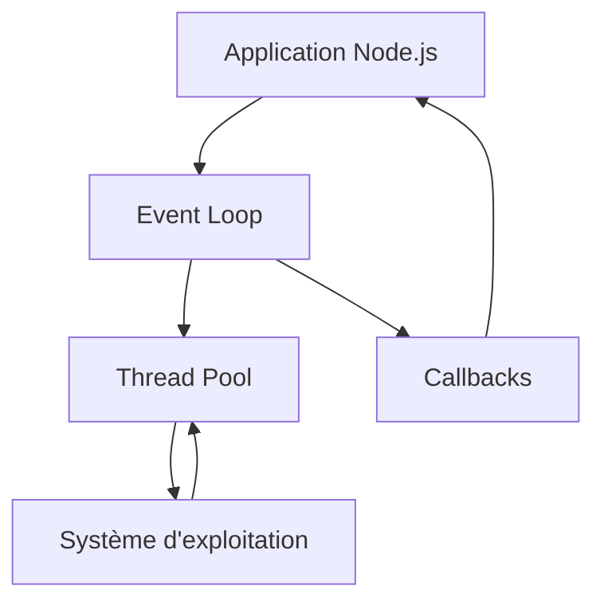
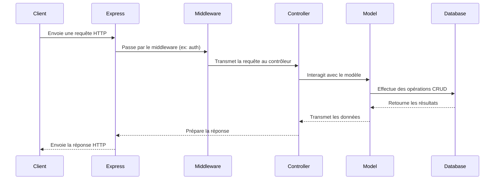

# JavaScript, Node.js et React

Une formation complète sur le développement web moderne avec JavaScript.

<div class="pt-12">
  <span @click="next" class="px-2 p-1 rounded cursor-pointer hover:bg-white hover:bg-opacity-10">
    Appuyez sur espace pour la page suivante <carbon:arrow-right class="inline"/>
  </span>
</div>

---
layout: two-cols
routeAlias: 'sommaire'
---

<a name="SOMMAIRE" id="sommaire"></a>

# SOMMAIRE 📜

Voici le sommaire de cette formation sur JavaScript, Node.js et React:

<small>

<div class="flex flex-col gap-2">
<Link to="introduction-javascript">🚀 Introduction à JavaScript</Link>
<Link to="installation-javascript">💻 Installation de l'environnement JavaScript</Link>
<Link to="syntaxe-base-javascript">🔧 Syntaxe de base de JavaScript</Link>
<Link to="variables-types">📊 Variables et types de données</Link>
<Link to="structures-controle">🔀 Structures de contrôle</Link>
<Link to="fonctions-javascript">🧰 Fonctions en JavaScript</Link>
<Link to="poo-javascript">🔍 Programmation Orientée Objet en JavaScript</Link>
<Link to="modules-javascript">🏷️ Modules en JavaScript</Link>
<Link to="gestion-erreurs">🚨 Gestion des erreurs et exceptions</Link>
<Link to="asynchrone-javascript">⏱️ Programmation asynchrone en JavaScript</Link>
</div>

</small>

::right::

<small>

<div class="flex flex-col gap-2">
<Link to="npm">📦 npm et gestion des dépendances</Link>
<Link to="introduction-nodejs">🛠️ Introduction à Node.js</Link>
<Link to="fonctionnalites-nodejs">🔥 Fonctionnalités avancées de Node.js</Link>
<Link to="express-framework">🚂 Express.js Framework</Link>
<Link to="introduction-react">⚛️ Introduction à React</Link>
<Link to="fonctionnalites-react">🌟 Fonctionnalités avancées de React</Link>
<Link to="hooks-react">🎣 React Hooks</Link>
<Link to="state-management">🗃️ Gestion d'état avec Redux</Link>
<Link to="api-rest">🌐 Création d'API REST avec Node.js</Link>
<Link to="tests-unitaires">🧪 Tests unitaires en JavaScript</Link>
<Link to="bonnes-pratiques">📚 Bonnes pratiques de développement JavaScript</Link>
<Link to="securite-javascript">🔒 Sécurité en JavaScript</Link>
<Link to="performance-javascript">⚡ Performance en JavaScript</Link>
<Link to="deploiement-javascript">🚀 Déploiement d'applications JavaScript</Link>
<Link to="tendances-futures">🔮 Tendances futures en JavaScript</Link>
<Link to="ressources-apprentissage">📖 Ressources pour continuer l'apprentissage</Link>
<Link to="questions-discussion">💬 Questions et discussion</Link>
</div>

</small>

---
routeAlias: 'introduction-javascript'
---

# Introduction à JavaScript

- **Qu'est-ce que JavaScript ?**
  - Langage de programmation côté client et côté serveur
  - Utilisé pour le développement web dynamique
  - Exécuté dans le navigateur et sur le serveur (Node.js)

- **Histoire de JavaScript**
  - Créé en 1995 par Brendan Eich
  - Évolution majeure avec ES6 (ECMAScript 2015) et versions ultérieures

- **Pourquoi utiliser JavaScript ?**
  - Omniprésent dans le développement web
  - Grande communauté et écosystème riche
  - Polyvalent : front-end, back-end, mobile, desktop

---
routeAlias: 'installation-javascript'
---

# Installation de l'environnement JavaScript

- **Navigateurs web**
  - JavaScript est intégré dans tous les navigateurs modernes
  - Outils de développement pour le débogage

- **Node.js**
  - Installation via le site officiel de Node.js
  - Gestion des versions avec nvm (Node Version Manager)

- **Éditeurs de code**
  - Visual Studio Code
  - WebStorm
  - Sublime Text

---
routeAlias: 'exercice-configuration-environnement-javascript'
---

## Exercice : Configuration de l'environnement JavaScript

1. Installez Node.js sur votre machine (si ce n'est pas déjà fait).
2. Créez un fichier `hello.js` avec le contenu suivant :
   ```javascript
   console.log("Hello, JavaScript!");
   ```
3. Exécutez ce fichier avec Node.js dans votre terminal.
4. Ouvrez la console de votre navigateur et exécutez le même code.

---
routeAlias: 'correction-exercice-configuration-environnement-javascript'
---

## Correction de l'exercice : Configuration de l'environnement JavaScript

```javascript
console.log("Hello, JavaScript!");
```

Exécution avec Node.js :
```bash
node hello.js
```

Dans la console du navigateur, vous pouvez simplement copier-coller le code et appuyer sur Entrée.

---
routeAlias: 'syntaxe-base-javascript'
---

# Syntaxe de base de JavaScript

- **Structure d'un script JavaScript**
  - Peut être intégré dans HTML ou dans un fichier .js séparé
  - Instruction de fin de ligne : `;` (optionnel mais recommandé)

- **Commentaires**
  - Sur une ligne : `// commentaire`
  - Sur plusieurs lignes : `/* commentaire */`

- **Affichage**
  - `console.log()` pour le débogage
  - `alert()` pour les messages dans le navigateur

---
routeAlias: 'exercice-votre-premier-script-javascript'
---

## Exercice : Votre premier script JavaScript

Créez un script JavaScript qui :
1. Affiche "Bonjour, monde !" dans la console.
2. Utilise des commentaires pour expliquer chaque ligne de code.
3. Utilise à la fois `console.log()` et `alert()` pour comparer leur utilisation.

---
routeAlias: 'correction-exercice-votre-premier-script-javascript'
---

## Correction de l'exercice : Votre premier script JavaScript

```javascript
// Affichage dans la console
console.log("Bonjour, monde !");

// Affichage dans une boîte de dialogue du navigateur
alert("Ceci est mon premier script JavaScript.");

// Comparaison entre console.log et alert
console.log("console.log est utilisé pour le débogage.");
alert("alert est utilisé pour interagir avec l'utilisateur.");
```

---
routeAlias: 'variables-types'
layout: two-cols
---

# Variables et types de données en JavaScript

- **Déclaration de variables**
  - `let` pour les variables qui peuvent changer
  - `const` pour les constantes
  - `var` (déconseillé dans le code moderne)

- **Types de données de base**
  - Number, String, Boolean
  - undefined, null

::right::

- **Types composés**
  - Object
  - Array

- **Typage dynamique**
  - Les variables peuvent changer de type
  - Utilisation de TypeScript pour un typage statique

---
routeAlias: 'exercice-manipulation-types-donnees'
---

## Exercice : Manipulation des types de données

Créez un script JavaScript qui :
1. Déclare des variables de différents types (number, string, boolean, array, object).
2. Effectue des opérations de base sur ces variables (addition, concaténation, etc.).
3. Utilise `console.log()` et `typeof` pour afficher le type et la valeur de chaque variable.

---
routeAlias: 'correction-exercice-manipulation-types-donnees'
---

## Correction de l'exercice : Manipulation des types de données

```javascript
// Déclaration des variables
const nombre = 42;
let chaine = "Hello, JavaScript!";
const booleen = true;
const tableau = [1, 2, 3, 4, 5];
const objet = { nom: "John", age: 30 };

// Opérations de base
const somme = nombre + 10;
chaine += " J'aime les nombres comme " + nombre;

// Affichage des types et valeurs
console.log(nombre, typeof nombre);
console.log(chaine, typeof chaine);
console.log(booleen, typeof booleen);
console.log(tableau, typeof tableau);
console.log(objet, typeof objet);
console.log(somme, typeof somme);
```

---
routeAlias: 'structures-controle'
---

# Structures de contrôle en JavaScript

- **Conditions**
  - `if`, `else`, `else if`
  - `switch`
  - Opérateur ternaire

- **Boucles**
  - `for`
  - `while`
  - `do-while`
  - `for...of` (pour les itérables)
  - `for...in` (pour les propriétés d'objets)

- **Contrôle de flux**
  - `break`
  - `continue`

---
routeAlias: 'exercice-utilisation-structures-controle'
---

## Exercice : Utilisation des structures de contrôle

Créez un script JavaScript qui :
1. Utilise une boucle `for` pour afficher les nombres de 1 à 10.
2. Utilise une structure `if-else` pour déterminer si chaque nombre est pair ou impair.
3. Utilise `for...of` pour parcourir un tableau de fruits et afficher chaque fruit.

---

# Correction de l'exercice

```javascript
// Boucle for et structure if-else
for (let i = 1; i <= 10; i++) {
    if (i % 2 === 0) {
        console.log(`${i} est pair.`);
    } else {
        console.log(`${i} est impair.`);
    }
}

// Utilisation de for...of
const fruits = ['pomme', 'banane', 'cerise', 'fraise'];
for (const fruit of fruits) {
    console.log(`J'aime les ${fruit}s.`);
}
```

---
routeAlias: 'fonctions-javascript'
layout: two-cols
---

# Fonctions en JavaScript

- **Définition de fonctions**
  - Déclaration de fonction
  - Expression de fonction
  - Fonctions fléchées

- **Portée des variables**
  - Portée globale et locale
  - Closure

::right::

- **Fonctions de première classe**
  - Passage de fonctions comme arguments
  - Retour de fonctions

- **Méthodes natives importantes**
  - Manipulation de chaînes : `split()`, `replace()`
  - Manipulation de tableaux : `push()`, `map()`, `filter()`

---
routeAlias: 'exercice-creation-utilisation-fonctions'
---

## Exercice : Création et utilisation de fonctions

1. Créez une fonction qui calcule le factoriel d'un nombre.
2. Créez une fonction fléchée qui trie un tableau de nombres.
3. Utilisez `map()` avec une fonction fléchée pour doubler tous les éléments d'un tableau.

---
routeAlias: 'correction-exercice-creation-utilisation-fonctions'
---

## Correction de l'exercice

```javascript
// Fonction factorielle
function factorielle(n) {
    if (n === 0 || n === 1) {
        return 1;
    } else {
        return n * factorielle(n - 1);
    }
}

// Fonction fléchée pour trier un tableau
const trierTableau = (arr) => arr.sort((a, b) => a - b);

// Utilisation de map() avec une fonction fléchée
const tableau = [1, 2, 3, 4, 5];
const doubler = (x) => x * 2;
const resultats = tableau.map(doubler);

console.log(factorielle(5));
console.log(trierTableau([3, 1, 4, 1, 5]));
console.log(resultats);
```

---
routeAlias: 'poo-javascript'
---

# Programmation Orientée Objet en JavaScript

<small>

- **Classes et objets**
  - Définition de classes (ES6+)
  - Création d'instances

- **Propriétés et méthodes**
  - Constructeur
  - Méthodes de classe et d'instance

- **Héritage**
  - Mot-clé `extends`
  - Surcharge de méthodes avec `super`

- **Prototypes**
  - Chaîne de prototypes
  - Modification de prototypes

</small>

---
routeAlias: 'exercice-creation-classe-heritage'
---

## Exercice : Création d'une hiérarchie de classes

1. Créez une classe `Vehicule` avec des propriétés comme `marque` et `modele`.
2. Créez des sous-classes `Voiture` et `Moto` qui héritent de `Vehicule`.
3. Ajoutez des méthodes spécifiques à chaque sous-classe.
4. Créez des instances et appelez leurs méthodes.

---

# Correction de l'exercice

```javascript
class Vehicule {
    constructor(marque, modele) {
        this.marque = marque;
        this.modele = modele;
    }

    afficherInfo() {
        console.log(`${this.marque} ${this.modele}`);
    }
}

class Voiture extends Vehicule {
    constructor(marque, modele, nombreDePortes) {
        super(marque, modele);
        this.nombreDePortes = nombreDePortes;
    }

    demarrer() {
        console.log(`La voiture ${this.marque} démarre.`);
    }
}

class Moto extends Vehicule {
    demarrer() {
        console.log(`La moto ${this.marque} démarre.`);
    }
}

const voiture = new Voiture("Toyota", "Corolla", 4);
const moto = new Moto("Honda", "CBR");

voiture.afficherInfo();
voiture.demarrer();
moto.afficherInfo();
moto.demarrer();
```

---
routeAlias: 'modules-javascript'
---

# Modules en JavaScript

- **Définition et utilisation des modules**
  - Mot-clé `export`
  - Mot-clé `import`

- **Types d'exports**
  - Export nommé
  - Export par défaut

- **Avantages des modules**
  - Organisation du code
  - Encapsulation
  - Réutilisabilité

- **Utilisation avec Node.js et dans le navigateur**
  - CommonJS vs ES modules
  - Utilisation de bundlers (webpack, Rollup)

---
routeAlias: 'exercice-organisation-code-modules'
---

## Exercice : Organisation du code avec modules

1. Créez un module `mathUtils.js` avec des fonctions mathématiques de base.
2. Créez un module `stringUtils.js` avec des fonctions de manipulation de chaînes.
3. Importez et utilisez ces modules dans un fichier `main.js`.
4. Utilisez un bundler comme webpack pour regrouper ces modules pour le navigateur.

---
routeAlias: 'correction-exercice-organisation-code-modules'
---

## Correction de l'exercice

```javascript
// mathUtils.js
export const add = (a, b) => a + b;
export const subtract = (a, b) => a - b;

// stringUtils.js
export const capitalize = (str) => str.charAt(0).toUpperCase() + str.slice(1);
export const reverse = (str) => str.split('').reverse().join('');

// main.js
import { add, subtract } from './mathUtils.js';
import * as stringUtils from './stringUtils.js';

console.log(add(5, 3));
console.log(subtract(10, 4));
console.log(stringUtils.capitalize('hello'));
console.log(stringUtils.reverse('world'));
```

Pour utiliser avec webpack, vous devrez configurer un fichier `webpack.config.js` et installer les dépendances nécessaires.

---
routeAlias: 'gestion-erreurs'
---

# Gestion des erreurs et exceptions en JavaScript

- **Types d'erreurs en JavaScript**
  - SyntaxError, TypeError, ReferenceError, etc.

- **Gestion des erreurs**
  - Bloc `try-catch`
  - Clause `finally`

- **Lancer des erreurs**
  - Utilisation de `throw`

- **Création d'erreurs personnalisées**
  - Étendre la classe `Error`

---
routeAlias: 'exercice-gestion-erreurs-exceptions'
---

## Exercice : Gestion d'erreurs et d'exceptions

1. Créez une fonction qui lance une exception si un paramètre invalide est passé.
2. Utilisez un bloc try-catch pour gérer cette exception.
3. Créez une classe d'erreur personnalisée pour votre application.
4. Utilisez cette erreur personnalisée dans une fonction et gérez-la.

---
routeAlias: 'correction-exercice-gestion-erreurs-exceptions'
---

## Correction de l'exercice

```javascript
class AgeInvalideError extends Error {
    constructor(message) {
        super(message);
        this.name = "AgeInvalideError";
    }
}

function verifierAge(age) {
    if (age < 0 || age > 120) {
        throw new AgeInvalideError("L'âge doit être compris entre 0 et 120 ans.");
    }
    return true;
}

try {
    verifierAge(150);
} catch (error) {
    if (error instanceof AgeInvalideError) {
        console.log("Erreur d'âge :", error.message);
    } else {
        console.log("Une erreur inattendue s'est produite :", error.message);
    }
}
```

---
routeAlias: 'asynchrone-javascript'
---

# Programmation asynchrone en JavaScript

<small>

- **Callbacks**
  - Fonctions passées en argument et exécutées plus tard

- **Promesses**
  - Objet représentant la complétion ou l'échec d'une opération asynchrone
  - Méthodes `then()`, `catch()`, `finally()`

- **Async/Await**
  - Syntaxe plus lisible pour travailler avec les promesses
  - Mot-clé `async` pour les fonctions
  - Mot-clé `await` pour attendre la résolution d'une promesse

- **Event Loop**
  - Comprendre comment JavaScript gère les opérations asynchrones

</small>

---
routeAlias: 'exercice-programmation-asynchrone'
---

## Exercice : Programmation asynchrone

1. Créez une fonction qui simule une opération asynchrone avec `setTimeout`.
2. Utilisez cette fonction avec des callbacks, puis refactorisez-la pour utiliser des promesses.
3. Créez une fonction asynchrone qui utilise `await` pour attendre le résultat de plusieurs opérations asynchrones.

---
routeAlias: 'correction-exercice-programmation-asynchrone'
---

## Correction de l'exercice

```javascript
// Fonction avec callback
function operationAsynchrone(callback) {
    setTimeout(() => {
        callback("Opération terminée");
    }, 1000);
}

// Fonction avec promesse
function operationAsynchronePromise() {
    return new Promise((resolve) => {
        setTimeout(() => {
            resolve("Opération terminée");
        }, 1000);
    });
}

// Utilisation avec async/await
async function executerOperations() {
    try {
        const resultat1 = await operationAsynchronePromise();
        console.log(resultat1);
        const resultat2 = await operationAsynchronePromise();
        console.log(resultat2);
    } catch (error) {
        console.error("Une erreur s'est produite:", error);
    }
}

// Exécution
operationAsynchrone((resultat) => console.log(resultat));
operationAsynchronePromise().then(console.log);
executerOperations();
```

---
routeAlias: 'npm'
---

# npm et gestion des dépendances

<small>

- **Qu'est-ce que npm ?**
  - Gestionnaire de paquets pour JavaScript
  - Registre de paquets open-source

- **Installation et configuration**
  - Installation avec Node.js
  - Fichier `package.json`

- **Commandes de base**
  - `npm init`
  - `npm install`
  - `npm update`
  - `npm run`

- **Gestion des dépendances**
  - Dépendances de production vs de développement
  - Versions sémantiques

</small>

---

# Installation de npm

- npm est installé automatiquement avec Node.js
- Vérifier l'installation : `npm --version`

<small>

<br>

> Si npm n'est pas reconnu, assurez-vous que Node.js est correctement installé et que son répertoire est dans votre PATH.

</small>

<br>

- Mettre à jour npm : `npm install -g npm@latest`

---
routeAlias: 'exercice-mise-en-place-projet-npm'
---

## Exercice : Mise en place d'un projet avec npm

1. Initialisez un nouveau projet avec npm.
2. Ajoutez quelques dépendances populaires (ex: lodash pour les utilitaires).
3. Créez un script npm personnalisé dans `package.json`.
4. Installez une dépendance de développement (ex: Jest pour les tests).

---
routeAlias: 'introduction-nodejs'
---

# Introduction à Node.js

<small>

- **Qu'est-ce que Node.js ?**
  - Environnement d'exécution JavaScript côté serveur
  - Basé sur le moteur V8 de Chrome

- **Caractéristiques de Node.js**
  - Non-bloquant et orienté événements
  - Écosystème npm riche

- **Installation de Node.js**
  - Via le site officiel ou gestionnaires de versions (nvm)

- **REPL Node.js**
  - Read-Eval-Print Loop pour tester rapidement du code

</small>

---

# Schéma de fonctionnement de Node.js



<small>

En résumé :

- L'application Node.js envoie des tâches à l'Event Loop
- L'Event Loop gère les opérations asynchrones
- Les opérations intensives sont déléguées au Thread Pool
- Le Thread Pool interagit avec le système d'exploitation
- Les résultats sont renvoyés via des callbacks

</small>

---
routeAlias: 'exercice-creation-serveur-http-nodejs'
---

## Exercice : Création d'un serveur HTTP simple avec Node.js

1. Créez un fichier `server.js`.
2. Utilisez le module `http` de Node.js pour créer un serveur simple.
3. Faites en sorte que le serveur réponde "Hello, Node.js!" à toutes les requêtes.
4. Démarrez le serveur sur le port 3000.

---
routeAlias: 'fonctionnalites-nodejs'
---

# Fonctionnalités avancées de Node.js

<small>

- **Système de fichiers**
  - Module `fs` pour les opérations de fichiers
  - Opérations synchrones vs asynchrones

- **Streams**
  - Lecture et écriture efficaces de données
  - Types de streams : Readable, Writable, Duplex, Transform

- **Événements**
  - Module `events` et `EventEmitter`
  - Création et gestion d'événements personnalisés

- **Clusters**
  - Utilisation de plusieurs cœurs du processeur
  - Amélioration des performances des applications

</small>

---
routeAlias: 'exercice-manipulation-fichiers-streams'
---

## Exercice : Manipulation de fichiers et streams

1. Créez un script qui lit un fichier texte de manière asynchrone.
2. Utilisez un stream pour copier le contenu d'un fichier dans un autre.
3. Créez un `EventEmitter` personnalisé qui émet un événement lorsque la copie est terminée.

---
routeAlias: 'express-framework'
---

# Express.js Framework

<small>

- **Qu'est-ce qu'Express.js ?**
  - Framework web minimaliste pour Node.js
  - Facilite la création d'API et d'applications web

- **Routing**
  - Définition des routes et des méthodes HTTP
  - Paramètres de route et query strings

- **Middleware**
  - Fonctions intermédiaires pour traiter les requêtes/réponses
  - Middleware intégré et personnalisé

- **Templates**
  - Intégration avec des moteurs de templates (EJS, Pug, etc.)

</small>

---
routeAlias: 'exercice-creation-api-express'
---

## Exercice : Création d'une API simple avec Express

1. Initialisez un nouveau projet avec npm et installez Express.
2. Créez une API avec des routes pour lister, ajouter, mettre à jour et supprimer des éléments.
3. Utilisez un middleware pour logger les requêtes.
4. Implémentez la gestion des erreurs.

---
routeAlias: 'introduction-react'
---

# Introduction à React

<small>

- **Qu'est-ce que React ?**
  - Bibliothèque JavaScript pour construire des interfaces utilisateur
  - Basé sur le concept de composants réutilisables

- **JSX**
  - Syntaxe permettant d'écrire du HTML dans du JavaScript
  - Transpilé en JavaScript pur

- **Composants**
  - Fonctionnels vs Classe
  - Props et State

- **Virtual DOM**
  - Optimisation des performances de rendu

</small>

---
routeAlias: 'exercice-creation-composant-react'
---

## Exercice : Création d'un composant React simple

1. Utilisez Create React App pour initialiser un nouveau projet React.
2. Créez un composant fonctionnel qui affiche une liste d'éléments.
3. Utilisez les props pour passer des données au composant.
4. Ajoutez un état local au composant pour gérer une interaction utilisateur simple.

---
routeAlias: 'fonctionnalites-react'
---

# Fonctionnalités avancées de React

<small>

- **Gestion du state**
  - useState et useReducer hooks
  - Context API pour le state global

- **Cycle de vie des composants**
  - useEffect hook pour les effets de bord

- **Rendu conditionnel et listes**
  - Affichage conditionnel de composants
  - Rendu de listes avec la méthode map

- **Formulaires en React**
  - Composants contrôlés vs non contrôlés
  - Gestion des soumissions de formulaires

</small>

---
routeAlias: 'exercice-application-react-complexe'
---

## Exercice : Création d'une application React plus complexe

1. Créez une application de liste de tâches (todo list).
2. Implémentez l'ajout, la suppression et le marquage des tâches comme terminées.
3. Utilisez le Context API pour gérer l'état global de l'application.
4. Ajoutez des effets pour sauvegarder les tâches dans le localStorage.

---
routeAlias: 'hooks-react'
---

# React Hooks

<small>

- **useState**
  - Gestion de l'état local dans les composants fonctionnels

- **useEffect**
  - Gestion des effets de bord (ex: appels API, abonnements)

- **useContext**
  - Accès au contexte React dans les composants fonctionnels

- **useReducer**
  - Gestion d'états complexes avec un pattern Redux-like

- **Hooks personnalisés**
  - Création de hooks réutilisables pour la logique partagée

</small>

---
routeAlias: 'exercice-utilisation-hooks'
---

## Exercice : Utilisation des Hooks React

1. Créez un hook personnalisé `useLocalStorage` pour gérer le stockage local.
2. Utilisez `useEffect` pour charger des données depuis une API au montage du composant.
3. Implémentez un dark mode avec `useContext` et `useState`.
4. Créez un formulaire complexe en utilisant `useReducer` pour gérer son état.

---
routeAlias: 'state-management'
---

# Gestion d'état avec Redux

<small>

- **Principes de Redux**
  - Store unique
  - Actions pour décrire les changements d'état
  - Reducers pour spécifier comment l'état change

- **Actions**
  - Objets simples décrivant ce qui s'est passé

- **Reducers**
  - Fonctions pures qui prennent l'état précédent et une action, et retournent le nouvel état

- **Store**
  - Objet qui contient l'état de l'application
  - Permet l'accès à l'état via `getState()`
  - Permet la mise à jour de l'état via `dispatch(action)`

</small>

---
routeAlias: 'exercice-implementation-redux'
---

## Exercice : Implémentation de Redux dans une application React

1. Ajoutez Redux à votre application React.
2. Créez des actions et des reducers pour gérer l'état de votre application.
3. Utilisez `useSelector` et `useDispatch` pour connecter vos composants au store Redux.
4. Implémentez une fonctionnalité asynchrone avec Redux Thunk ou Redux Saga.

---
routeAlias: 'api-rest'
---

# Création d'API REST avec Node.js

<small>

- **Principes REST**
  - Méthodes HTTP (GET, POST, PUT, DELETE)
  - Statuts HTTP

- **Express.js pour les API**
  - Routing
  - Middleware pour la validation et l'authentification

- **Connexion à une base de données**
  - MongoDB avec Mongoose
  - SQL avec Sequelize

- **Authentification et sécurité**
  - JSON Web Tokens (JWT)
  - CORS (Cross-Origin Resource Sharing)

</small>

---

# Schéma d'une API REST avec Node.js




<small>

Ce schéma illustre le flux typique d'une requête dans une API REST construite avec Node.js et Express :

1. Le client envoie une requête HTTP.
2. Express reçoit la requête et la passe à travers les middleware configurés.
3. Le middleware approprié (ex: authentification) traite la requête.
4. Le contrôleur gère la logique métier.
5. Le modèle interagit avec la base de données.
6. Les données sont renvoyées au client via Express.

</small>

---
routeAlias: 'exercice-creation-api-rest-nodejs'
---

## Exercice : Création d'une API REST avec Node.js et Express

1. Créez une API REST pour gérer une collection de livres.
2. Implémentez les opérations CRUD (Create, Read, Update, Delete).
3. Ajoutez une authentification JWT pour sécuriser certaines routes.
4. Utilisez MongoDB avec Mongoose pour la persistance des données.
5. Testez votre API avec Postman ou curl.

---
routeAlias: 'tests-unitaires'
---

# Tests unitaires en JavaScript

<small>

- **Jest**
  - Framework de test pour JavaScript
  - Assertions, mocks, et couverture de code

- **React Testing Library**
  - Tests de composants React
  - Focus sur le comportement plutôt que l'implémentation

- **Mocha et Chai**
  - Mocha comme runner de tests
  - Chai pour les assertions

- **Sinon**
  - Création de stubs, mocks et spies

</small>

---
routeAlias: 'exercice-tests-unitaires-fonction-utilitaire'
---

## Exercice : Tests unitaires pour une fonction utilitaire

1. Créez une fonction utilitaire (par exemple, pour formater des dates).
2. Écrivez des tests unitaires pour cette fonction en utilisant Jest.
3. Utilisez des cas de test pour couvrir différents scénarios.
4. Ajoutez des tests pour les cas d'erreur.
5. Générez un rapport de couverture de code.

---

# Correction de l'exercice

```javascript
// dateUtils.js
export function formatDate(date) {
    if (!(date instanceof Date)) {
        throw new Error('Invalid date');
    }
    return date.toISOString().split('T')[0];
}

// dateUtils.test.js
import { formatDate } from './dateUtils';

describe('formatDate', () => {
    it('should format a valid date correctly', () => {
        const date = new Date('2023-05-15');
        expect(formatDate(date)).toBe('2023-05-15');
    });

    it('should throw an error for invalid input', () => {
        expect(() => formatDate('not a date')).toThrow('Invalid date');
    });

    it('should handle edge cases', () => {
        const date = new Date('1900-01-01');
        expect(formatDate(date)).toBe('1900-01-01');
    });
});
```


Pour générer un rapport de couverture, ajoutez `"test:coverage": "jest --coverage"` à vos scripts npm.

---
routeAlias: 'bonnes-pratiques'
---

# Bonnes pratiques de développement JavaScript

- **ESLint et Prettier**
  - Linting et formatage automatique du code

- **Design Patterns**
  - Module, Factory, Observer, etc.
  - Quand et comment les utiliser

- **Clean Code**
  - Nommage significatif
  - Fonctions courtes et focalisées

- **Principes SOLID**
  - Adaptés au contexte JavaScript/TypeScript

---

# Parlons des principes SOLID en JavaScript


<small>

- **Single Responsibility Principle (SRP)**
  - Une fonction ou classe ne doit avoir qu'une seule raison de changer

- **Open/Closed Principle (OCP)**
  - Les entités logicielles doivent être ouvertes à l'extension, mais fermées à la modification

- **Liskov Substitution Principle (LSP)**
  - Les objets d'une superclasse doivent pouvoir être remplacés par des objets de ses sous-classes sans altérer le fonctionnement du programme

- **Interface Segregation Principle (ISP)**
  - Préférer plusieurs interfaces spécifiques plutôt qu'une interface générale

- **Dependency Inversion Principle (DIP)**
  - Dépendre des abstractions, pas des implémentations concrètes

</small>

---
routeAlias: 'exercice-refactoring-code-existant'
---

## Exercice : Refactoring d'un code existant

1. Prenez un morceau de code JavaScript existant (peut être fourni ou de votre propre projet).
2. Identifiez les violations des principes SOLID et des bonnes pratiques.
3. Refactorisez le code pour le rendre plus propre et maintenable.
4. Appliquez un ou deux design patterns appropriés.

---
routeAlias: 'securite-javascript'
---

# Sécurité en JavaScript

<small>

- **Cross-Site Scripting (XSS)**
  - Échappement des sorties
  - Content Security Policy (CSP)

- **Cross-Site Request Forgery (CSRF)**
  - Tokens CSRF
  - SameSite cookies

- **Injection de code**
  - Éviter l'utilisation de `eval()`
  - Validation et assainissement des entrées utilisateur

- **Sécurité des dépendances**
  - Audit régulier des dépendances avec npm audit
  - Mise à jour des packages vulnérables

</small>

---
routeAlias: 'exercice-securisation-application-web'
---

## Exercice : Sécurisation d'une application web

1. Implémentez une protection contre les attaques XSS dans une application React.
2. Ajoutez des en-têtes de sécurité à une API Express (ex: helmet middleware).
3. Mettez en place une validation robuste des entrées utilisateur côté client et serveur.
4. Configurez CORS correctement pour votre API.

---
routeAlias: 'performance-javascript'
---

# Performance en JavaScript

<small>

- **Optimisation du code**
  - Profilage avec les outils de développement du navigateur
  - Identification des goulots d'étranglement

- **Lazy loading**
  - Chargement à la demande des modules et composants

- **Memoization**
  - Mise en cache des résultats de fonctions coûteuses

- **Optimisation des rendus React**
  - `useMemo` et `useCallback` hooks
  - `React.memo` pour les composants

</small>

---
routeAlias: 'exercice-optimisation-application-existante'
---

## Exercice : Optimisation d'une application existante

1. Utilisez les outils de profilage pour identifier les parties lentes d'une application React.
2. Implémentez le lazy loading pour les routes ou composants lourds.
3. Optimisez les rendus en utilisant `useMemo`, `useCallback`, et `React.memo`.
4. Mesurez les améliorations de performance avant et après optimisation.

---
routeAlias: 'deploiement-javascript'
---

# Déploiement d'applications JavaScript

<small>

- **Hébergement statique**
  - GitHub Pages, Netlify pour les applications React

- **Hébergement de serveurs Node.js**
  - Heroku, DigitalOcean, AWS

- **Conteneurisation**
  - Docker pour les applications Node.js
  - Docker Compose pour les environnements multi-conteneurs

- **Intégration continue et déploiement continu (CI/CD)**
  - GitHub Actions, GitLab CI, Jenkins

</small>

---
routeAlias: 'exercice-mise-en-place-pipeline-deploiement'
---

## Exercice : Mise en place d'un pipeline de déploiement

1. Créez un Dockerfile pour votre application Node.js.
2. Configurez un fichier docker-compose.yml pour l'application et ses dépendances (ex: base de données).
3. Mettez en place un script de déploiement automatique.
4. Configurez un pipeline CI/CD simple (ex: avec GitHub Actions) pour tester et déployer automatiquement.

---
routeAlias: 'tendances-futures'
---

# Tendances futures en JavaScript

<small>

- **ECMAScript proposals**
  - Nouvelles fonctionnalités de langage en cours de discussion

- **WebAssembly**
  - Exécution de code à haute performance dans le navigateur

- **Serverless JavaScript**
  - AWS Lambda, Azure Functions, Google Cloud Functions

- **JAMstack**
  - JavaScript, APIs, et Markup pour des sites web performants et sécurisés

- **Progressive Web Apps (PWA)**
  - Applications web qui offrent une expérience similaire aux applications natives

</small>

---
routeAlias: 'exercice-exploration-nouvelles-fonctionnalites'
---

## Exercice : Exploration des nouvelles fonctionnalités

1. Explorez une proposition ECMAScript récente et discutez de son impact potentiel.
2. Créez une petite fonction serverless et déployez-la sur AWS Lambda ou similaire.
3. Convertissez une application React existante en Progressive Web App.
4. Discutez de l'impact potentiel de ces nouvelles technologies sur vos projets actuels ou futurs.

---
routeAlias: 'ressources-apprentissage'
---

# Ressources pour continuer l'apprentissage

<small>

- **Sites web**
  - MDN Web Docs pour la documentation JavaScript
  - freeCodeCamp pour des tutoriels interactifs
  - Egghead.io pour des cours vidéo avancés

- **Livres**
  - "You Don't Know JS" par Kyle Simpson
  - "Eloquent JavaScript" par Marijn Haverbeke
  - "React Up and Running" par Stoyan Stefanov

- **Conférences et meetups**
  - JSConf
  - React Conf
  - Node.js Interactive

- **Blogs et newsletters**
  - JavaScript Weekly
  - React Newsletter
  - Node Weekly

</small>

---
routeAlias: 'exercice-plan-apprentissage-personnel'
---

## Exercice : Plan d'apprentissage personnel

1. Identifiez trois domaines dans lesquels vous souhaitez vous améliorer en JavaScript.
2. Trouvez des ressources (tutoriels, livres, cours en ligne) pour chacun de ces domaines.
3. Créez un plan d'apprentissage sur 3 mois avec des objectifs spécifiques.
4. Partagez votre plan avec le groupe et discutez des stratégies d'apprentissage efficaces.

---
routeAlias: 'questions-discussion'
---

# Questions et discussion

<small>

- Avez-vous des questions sur JavaScript, Node.js ou React ?
- Quelles sont vos expériences avec ces technologies ?
- Quels défis avez-vous rencontrés dans vos projets JavaScript ?
- Comment voyez-vous l'évolution de JavaScript et de son écosystème ?

</small>

---

## Exercice final : Réflexion et partage

Cet exercice est à faire en binôme ou en groupe de 3.

1. Réfléchissez à un projet JavaScript que vous avez réalisé ou que vous aimeriez réaliser.
2. Identifiez les défis techniques que vous avez rencontrés ou que vous anticipez.
3. Partagez votre expérience ou vos idées avec le groupe et discutez des solutions possibles.
  - Actions, Reducers, Middleware
  - Flux unidirectionnel

- **Installation et configuration**
  - Création d'un store
  - Utilisation de `createStore`
  - Utilisation de `combineReducers`
  - Utilisation de `applyMiddleware`
