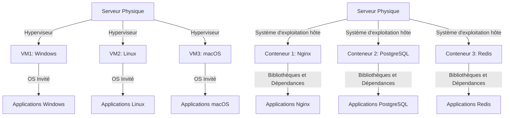
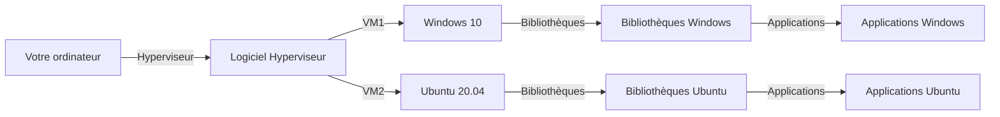
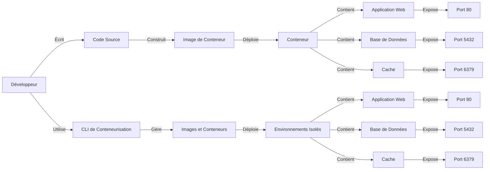
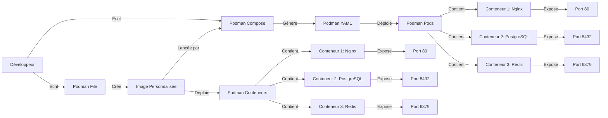
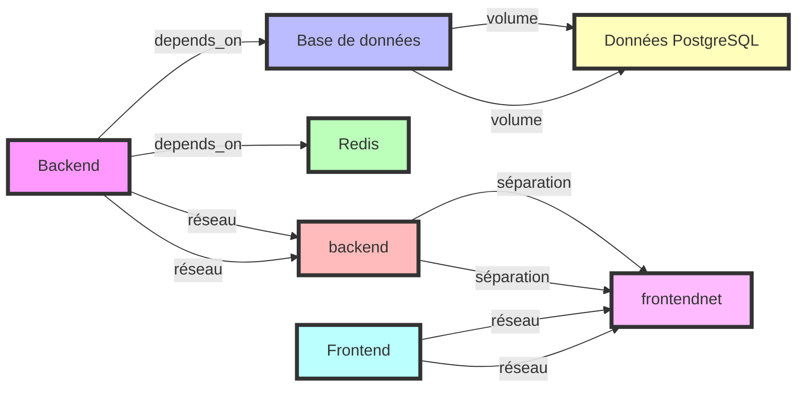

# PODMAN X DOCKER

🐧 une formation présenté par Andromed.

<div class="pt-12">
  <span @click="next" class="px-2 p-1 rounded cursor-pointer hover:bg-white hover:bg-opacity-10">
    Appuyez sur espace pour la page suivante <carbon:arrow-right class="inline"/>
  </span>
</div>

---
layout: presenter
eventLogo: 'https://img2.storyblok.com/352x0/f/84560/2388x414/23d8eb4b8d/vue-amsterdam-with-name.png'
eventUrl: 'https://vuejs.amsterdam/'
twitter: '@jimmylansrq'

twitterUrl: 'https://twitter.com/jimmylansrq'
presenterImage: 'https://andromed.fr/assets/fondator-205054868b0195afbf807299ba4446169e2958fe902a5b5d036850ac8d4e06ee.jpg'
---

# Jimmylan Surquin

Fondateur <a  href="https://www.andromed.fr/"><logos-storyblok-icon  mr-1/>Andromed</a>

- Lille, France 🇫🇷
- J'écris de temps en temps pour <a href="https://dev.to/jimmylansrq"> dev.to/@jimmylansrq </a>
- Création de contenu sur <a href="https://www.youtube.com/channel/jimmylansrq"> <logos-youtube-icon mr-1 /> jimmylansrq </a>
- Blog & Portfolio <a href="https://jimmylan.fr"> jimmylan.fr </a>

---
layout: text-image
media: 'https://i.pinimg.com/originals/f5/5e/80/f55e8059ea945abfd6804b887dd4a0af.gif'
caption: 'DOCKER X PODMAN'
---

# DISCLAIMER 🐧

### Dans cette formation nous allons voir les commandes principales de Podman.

<span style="color: #FF5555;">

> Cependant les commandes sont similaires à celles de Docker.

</span>

<small>
Je vais donc mixer les commandes de Podman et de Docker pour vous faire voir les différences mais aussi comment passer d'une commande à l'autre.
</small>

---
layout: two-cols
routeAlias: 'sommaire'
---

<a name="SOMMAIRE" id="sommaire"></a>

# SOMMAIRE 📜

### Voici le sommaire de cette formation sur Podman:

<br>

<div class="flex flex-col gap-2">
<Link to="comprendre-cicd">🔧 Comprendre le CI/CD</Link>
<Link to="utiliser-des-pipelines-cicd">🔄 Utiliser des pipelines CI/CD</Link>
<Link to="comprendre-les-microservices">🔍 Comprendre les micro-services</Link>
<Link to="pourquoi-utiliser-les-microservices">❓ Pourquoi utiliser les micro-services?</Link>
<Link to="des-definitions-avant-tout">🔧 Des définitions avant tout</Link>
<Link to="virtualisation-vs-conteneurisation">💻 Virtualisation vs conteneurisation</Link>
<Link to="intro-podman">🚀 Introduction à Podman</Link>
<Link to="quel-est-la-différence-entre-docker-et-podman">🐳 Quel est la différence entre Docker et Podman ?</Link>
</div>
::right::

<div class="flex flex-col gap-2">
<Link to="le-cli-docker">🔄 Le CLI Docker</Link>
<Link to="images-podman">🔍 Les images Podman</Link>
<Link to="creer-son-premier-conteneur">🚀 Créer son premier conteneur</Link>
<Link to="autres-commandes-docker">🔄 Autres Commandes Docker</Link>
<Link to="commandes-docker-avancees">🔍 Commandes Docker Avancées</Link>
<Link to="pods-et-reseau">🔍 Les Pods et le réseau</Link>
<Link to="volumes-persistants">🔍 Les volumes persistants</Link>
<Link to="encore-des-commandes-docker-avancees">🔍 Encore des Commandes Docker Avancées</Link>
<Link to="le-rootless">🔍 Le rootless</Link>
<Link to="kubernetes">🎉 Bonus : Introduction à Kubernetes</Link>
</div>

---
routeAlias: 'comprendre-cicd'
---

<a name="CI/CD" id="CI/CD"></a>

# Comprendre le CI/CD

> Mais avant tout ! nous devons comprendre ce qu'est le CI/CD ainsi que son utilité et nous verrons en suite les microservices.

Le CI/CD est un processus qui permet de créer, tester et déployer des applications de manière automatisée.

Une métaphore pour comprendre :

- **CI** : Imaginez que vous êtes un chef cuisinier. Vous avez une recette pour faire un gâteau. Le CI (Intégration Continue) consiste à vérifier chaque ingrédient et chaque étape de la recette au fur et à mesure que vous les ajoutez, pour s'assurer que tout est correct et que le gâteau sera réussi.

<br>

- **CD** : Une fois que tous les ingrédients sont vérifiés et que la recette est prête, le CD (Déploiement Continu) consiste à mettre le gâteau au four et à le cuire automatiquement sans intervention supplémentaire, garantissant ainsi que le gâteau sera prêt à être servi dès qu'il est cuit.

---
routeAlias: 'utiliser-des-pipelines-cicd'
---

<a name="PIPELINES" id="PIPELINES"></a>

# Utiliser des pipelines CI/CD

Un pipeline CI/CD est un processus qui permet de créer, tester et déployer des applications de manière automatisée.

Que veux dire pipeline ?

> Un pipeline est un processus qui permet de créer, tester et déployer des applications de manière automatisée.

<br>

> En clair : c'est tout la chaine de déploiement / le processus de déploiement.

---

# Pourquoi parler de CI/CD avec Docker et Podman ?

> Docker et Podman sont des outils de conteneurisation.

<small>

Donc il est important de comprendre le concept de CI/CD avec ces outils.

Imaginons que nous développons une application web.

Nous voulons déployer notre application.

Nous pourrions utiliser un pipeline CI/CD pour déployer notre application.

À chaque push sur le dépôt git, nous voulons déployer notre application.

<br>

Nous pourrions utiliser un pipeline CI/CD pour déployer notre application.

Donc lancer le docker-compose ou le dockerfile au besoin. (mais nous y reviendrons)

</small>

---
routeAlias: 'comprendre-les-microservices'
---

<a name="MICROSERVICES" id="MICROSERVICES"></a>

# Comprendre les micro-services

Un micro-service est une application indépendante qui peut être créée à partir d’un système d’exploitation ou d’un environnement logiciel spécifique.

Une métaphore pour comprendre :

- **Micro-service** : Imaginez que vous êtes dans un supermarché. Chaque rayon est un micro-service qui gère un type de produit spécifique. Par exemple, le rayon des fruits s'occupe uniquement des fruits, tandis que le rayon des produits laitiers s'occupe uniquement des produits laitiers. Chaque rayon fonctionne de manière indépendante mais contribue à l'ensemble du supermarché.

---
routeAlias: 'pourquoi-utiliser-les-microservices'
---

<a name="MICROSERVICES" id="MICROSERVICES"></a>

# Pourquoi utiliser les micro-services ?

Les micro-services permettent de découper une application en plusieurs services indépendants qui peuvent être développés, déployés et gérés de manière indépendante. Cela permet de rendre l'application plus modulaire, plus facile à maintenir et plus scalable.

---

# Exemple concret et ... à quoi ça sert ?

Imaginons que nous développons une application de e-commerce.

Nous pourrions avoir les micro-services suivants :

- **Microservice de gestion de produits** : Gère la gestion des produits, les stocks, les prix, etc.
- **Microservice de gestion de commandes** : Gère la gestion des commandes, la facturation, la livraison, etc.
- **Microservice de gestion de paiement** : Gère la gestion des paiements, les transactions, etc.
- **Microservice de gestion des utilisateurs** : Gère la gestion des utilisateurs, les comptes, les permissions, etc.

J'espère que vous avez compris le concept de micro-service.

Car à vrai dire quand vous utilisez podman/docker vous n'allez pas créer des micro-services.

Mais vous allez utiliser des containers qui eux même peuvent être des micro-services.

Et de toute façon cette architecture est utilisé dans la vie de tous les jours.

---

<small>

## QCM sur les micro-services et le CI/CD

<br>

### 1. Quel est l'avantage principal des micro-services ?

<br>

- [ ] Ils permettent de créer des applications monolithiques.
- [ ] Ils permettent de découper une application en plusieurs services indépendants.
- [ ] Ils nécessitent moins de ressources que les applications traditionnelles.
- [ ] Ils sont plus difficiles à maintenir.

<br>

### 2. Dans l'exemple d'une application de e-commerce, quel micro-service gère les transactions de paiement ?

<br>

- [ ] Microservice de gestion de produits
- [ ] Microservice de gestion de commandes
- [ ] Microservice de gestion de paiement
- [ ] Microservice de gestion des utilisateurs

</small>

---

<small>

### 3. Pourquoi utiliser les micro-services ?

<br>

- [ ] Pour rendre l'application plus modulaire, plus facile à maintenir et plus scalable.
- [ ] Pour augmenter la complexité de l'application.
- [ ] Pour réduire le nombre de développeurs nécessaires.
- [ ] Pour éviter l'utilisation de conteneurs.

<br>

</small>

---

<small>

### 4. Quel est l'objectif principal du CI/CD ?

<br>

- [ ] Augmenter la complexité du développement logiciel.
- [ ] Automatiser le processus de développement, de test et de déploiement.
- [ ] Réduire la qualité du code.
- [ ] Remplacer les développeurs par des machines.

<br>

### 5. Quel outil est couramment utilisé pour le CI/CD ?

<br>

- [ ] Docker Hub
- [ ] Jenkins
- [ ] GitHub Packages
- [ ] Quay.io

</small>

---

# Réponse(s)

<small>

1. Ils permettent de créer des applications modulaires et indépendantes.
2. Microservice de gestion de paiement
3. Pour rendre l'application plus modulaire, plus facile à maintenir et plus scalable.
4. Automatiser le processus de développement, de test et de déploiement.
5. GitHub Packages / Jenkins

</small>

---
layout: new-section
routeAlias: 'des-definitions-avant-tout'
---

# Des définitions avant tout


---

# Définition de virtualisation

La virtualisation est un processus qui permet de créer une image d'un système d'exploitation ou d'un environnement logiciel dans ce qu'on appelle une machine virtuelle.

# Définition de conteneur

Un conteneur est un environnement isolé qui permet de déployer des applications à partir d’un système d’exploitation ou d’un environnement logiciel.

# Définition de conteneurisation

La conteneurisation est un processus qui permet de créer un conteneur à partir d'un système d'exploitation ou d'un environnement logiciel.

---

<!-- pas a la bonne place -->

# Définition de machine virtuelle

Une machine virtuelle est un environnement logiciel qui permet d’exécuter des systèmes d’exploitation ou des applications de manière isolée, en simulant un matériel informatique.

---
routeAlias: 'virtualisation-vs-conteneurisation'
---

<a name="VIRTUALISATION" id="VIRTUALISATION"></a>

# Virtualisation vs conteneurisation

La virtualisation et la conteneurisation sont deux concepts liés à la gestion des ressources informatiques.

- **Virtualisation** : La virtualisation est un processus qui permet de créer une image d'un système d'exploitation ou d'un environnement logiciel dans un conteneur.
- **Conteneurisation** : La conteneurisation est un processus qui permet de créer un conteneur à partir d'un système d'exploitation ou d'un environnement logiciel.

---
routeAlias: 'schema-de-virtualisation-et-de-conteneurisation'
---

# Schéma de la Virtualisation et de la Conteneurisation

<small>
Voici un schéma qui illustre les différences entre la virtualisation et la conteneurisation.

</small>
<div class="mermaid">



</div>

---

# Comment fonctionne la virtualisation ?

La virtualisation est un processus qui permet de créer une image d'un système d'exploitation ou d'un environnement logiciel dans un conteneur.



---

# Comment fonctionne la conteneurisation ?

La conteneurisation est un processus qui permet de créer un conteneur à partir d'un système d'exploitation ou d'un environnement logiciel.



---

# Définition de Kernel

<small>

> Le kernel est le cœur du système d'exploitation qui gère les ressources matérielles et les interactions entre le matériel et les logiciels. Les conteneurs sont des environnements isolés qui partagent le même kernel mais fonctionnent indépendamment les uns des autres.

<br>

## Une petite façon simple de comprendre le kernel :

Le kernel est le cerveau du système d'exploitation.

C'est lui qui gère les ressources matérielles et les interactions entre le matériel et les logiciels.

</small>

---

# QCM sur les définitions

<small>

## Qu'est ce que la virtualisation ?

<br>

- [ ] La virtualisation est un processus qui permet de créer une image d'un système d'exploitation ou d'un environnement logiciel dans un conteneur.
- [ ] La virtualisation est un processus qui permet de créer une machine virtuelle à partir d'un système d'exploitation ou d'un environnement logiciel.
- [ ] La virtualisation est un processus qui permet de créer un conteneur à partir d'un système d'exploitation ou d'un environnement logiciel.
- [ ] La virtualisation est un processus qui permet de créer un conteneur à partir d'un système d'exploitation ou d'un environnement logiciel.

</small>

---

## Qu'est ce que la conteneurisation ?

<br>

<small>

- [ ] La conteneurisation est un processus qui permet de créer un conteneur à partir d'un système d'exploitation ou d'un environnement logiciel.
- [ ] La conteneurisation est un processus qui permet de créer une machine virtuelle à partir d'un système d'exploitation ou d'un environnement logiciel.
- [ ] La conteneurisation est un processus qui permet de créer une image d'un système d'exploitation ou d'un environnement logiciel dans un conteneur.
- [ ] La conteneurisation est un processus qui permet de créer un conteneur à partir d'un système d'exploitation ou d'un environnement logiciel.

</small>

---

<small>

## Quel est la différence entre la virtualisation et la conteneurisation ?

<br>

- [ ] La virtualisation est un processus qui permet de créer une image d'un système d'exploitation ou d'un environnement logiciel dans un conteneur alors que la conteneurisation est un processus qui permet de créer un conteneur à partir d'un système d'exploitation ou d'un environnement logiciel.

- [ ] La virtualisation est un processus qui permet de créer une machine virtuelle à partir d'un système d'exploitation ou d'un environnement logiciel alors que la conteneurisation est un processus qui permet de créer un conteneur à partir d'un système d'exploitation ou d'un environnement logiciel.

- [ ] La conteneurisation est un processus qui permet de créer un conteneur à partir d'un système d'exploitation ou d'un environnement logiciel alors que la virtualisation est un processus qui permet de créer une image d'un système d'exploitation ou d'un environnement logiciel dans un conteneur.

- [ ] La conteneurisation est un processus qui permet de créer une image d'un système d'exploitation ou d'un environnement logiciel dans un conteneur.

</small>

---
layout: text-image
reverse: true
routeAlias: 'intro-podman'
title: 'intro-podman'
anchor: 'intro-podman'
media: 'https://developers.redhat.com/sites/default/files/styles/share/public/blog/2019/08/podman.png?itok=rIuCQyMl'
---

<a name="DISCLAIMER" id="intro-podman"></a>

# Introduction à Podman

Podman est un outil de gestion de conteneurs qui permet de créer, gérer et exécuter des conteneurs sans nécessiter de démon.

Il est compatible avec les commandes Docker, ce qui facilite la transition pour les utilisateurs de Docker.

Podman offre également des fonctionnalités supplémentaires telles que la gestion des pods et une meilleure sécurité grâce à son architecture sans démon (mais nous en reparlerons plus tard dans cette formation).

---
routeAlias: 'differences-entre-docker-et-podman'
---

<a name="quel-est-la-différence-entre-docker-et-podman" id="quel-est-la-différence-entre-docker-et-podman"></a>

# Différences entre Docker et Podman

<div class="text-[8px]">

| Fonctionnalité       | Docker                                                                 | Podman                                                                 |
|----------------------|------------------------------------------------------------------------|-----------------------------------------------------------------------|
| **Démon**            | Nécessite un démon pour fonctionner                                    | N'a pas besoin de démon pour fonctionner                              |
| **Pods**             | Ne gère pas les pods                                                   | Offre une gestion des pods, permettant de regrouper plusieurs conteneurs |
| **Sécurité**         | Fonctionne avec un démon, ce qui peut poser des problèmes de sécurité  | Conçu pour une meilleure sécurité grâce à son architecture sans démon |
| **Compatibilité**    | -                                                                      | Commandes compatibles avec celles de Docker, facilitant la transition |
| **Rootless**         | Nécessite des privilèges root pour certaines opérations                | Permet l'exécution de conteneurs en tant qu'utilisateur non root par défaut |
| **Outils standards** | Utilise des outils spécifiques à Docker                                | Utilise des outils standards de Linux pour la gestion des conteneurs, comme systemd |
| **Images**           | Nécessite un démon d'arrière-plan pour créer des images                | Permet de créer des images de conteneurs sans nécessiter de démon d'arrière-plan |

</div>

---

## Explication et définition d'un démon

<br>

> Un démon est un programme qui s'exécute en arrière-plan et qui gère les ressources du système.

<br>

## Explication d'un pod

> Un pod est un groupe de conteneurs qui partagent le même espace de réseau et qui sont déployés ensemble.

<br>

## Qu'est ce que root / rootless ?

<br>

> - **Root** : Un utilisateur avec des privilèges root peut faire tout ce que bon lui semble dans le système.
> - **Rootless** : Un utilisateur non root ne peut pas faire des choses comme installer des paquets, modifier des fichiers systèmes, etc.

---
routeAlias: 'le-cli-docker'
---

<a name="le-cli-docker" id="le-cli-docker"></a>

# Le CLI Docker/Podman

Nous allons voir les commandes principales de Docker.

### Commandes principales Docker

| Commande               | Description                                    |
| ---------------------- | ---------------------------------------------- |
| <kbd>docker/podman run</kbd>  | Exécute une commande dans un nouveau conteneur |
| <kbd>docker/podman ps</kbd>   | Liste les conteneurs en cours d'exécution      |
| <kbd>docker/podman stop</kbd> | Arrête un conteneur en cours d'exécution       |
| <kbd>docker/podman rm</kbd>   | Supprime un conteneur arrêté                   |

---

<small>

| Commande                 | Description                                                 |
| ------------------------ | ----------------------------------------------------------- |
| <kbd>docker/podman pull</kbd>   | Télécharge une image depuis un registre                     |
| <kbd>docker/podman images</kbd> | Liste les images disponibles localement                     |
| <kbd>docker/podman rmi</kbd>    | Supprime une ou plusieurs images                            |
| <kbd>docker/podman exec</kbd>   | Exécute une commande dans un conteneur en cours d'exécution |
| <kbd>docker/podman build</kbd>  | Construit une image à partir d'un Dockerfile                  |
| <kbd>docker/podman push</kbd>   | Envoie une image à un registre                             |
| <kbd>docker/podman tag</kbd>    | Ajoute un tag à une image                                   |
| <kbd>docker/podman login</kbd>  | Connecte à un registre                                      |
| <kbd>docker/podman logout</kbd> | Déconnecte d'un registre                                    |

</small>

---

# Commandes avancées

Voici quelques commandes avancées.

### Commandes avancées

| Commande                         | Description                                       |
| -------------------------------- | ------------------------------------------------- |
| <kbd>docker/podman network create</kbd> | Crée un nouveau réseau Docker                     |
| <kbd>docker/podman volume create</kbd>  | Crée un nouveau volume Docker                     |
| <kbd>docker/podman inspect</kbd>        | Affiche les détails d'un conteneur ou d'une image |
| <kbd>docker/podman logs</kbd>           | Affiche les logs d'un conteneur                   |

---

# Encore des Commandes avancées

Voici quelques autres commandes Docker avancées.

### Commandes avancées supplémentaires

| Commande                       | Description                                                                                       |
| ------------------------------ | ------------------------------------------------------------------------------------------------- |
| <kbd>docker/podman-compose up</kbd>   | Démarre et attache des conteneurs définis dans un fichier docker-compose                          |
| <kbd>docker/podman-compose down</kbd> | Arrête et supprime les conteneurs, réseaux, volumes définis dans un fichier docker-compose        |
| <kbd>docker/podman-compose logs</kbd> | Affiche les logs des services définis dans un fichier docker-compose                              |
| <kbd>docker/podman-compose exec</kbd> | Exécute une commande dans un conteneur en cours d'exécution défini dans un fichier docker-compose |

---

> Petite astuce :

Depuis la version 2.0 de docker , vous n'êtes plus obligé d'écrire docker-compose avec le tiret du milieu mais vous pouvez faire :

```bash
docker compose up
```

<br>

## Directement !

---
layout: new-section
routeAlias: 'images-podman'
---

<a name="images-podman" id="images-podman"></a>

# Images Podman


---

> Déjà reprenons ce qu'est une image.

Une image est un fichier qui contient un système d'exploitation ou un environnement logiciel.

**<u>Exemple :</u>**

```bash
docker pull ubuntu:latest
```

<small>

Cela va nous donner une image de la distribution linux Ubuntu.

Je vais donc **À PARTIR DE CETTE IMAGE** créer un **CONTENEUR**.

> Je peux récuperer des images sur des registres comme :

- Docker Hub
- Quay.io
- GitHub Packages
- etc

Mais bien sur je peux aussi créer mes images.

<div class="-mt-6">

(sois à partir de rien, sois à partir d'une autre image dont je vais créer des surcouches)

</div>

</small>

---

## Astuce en plus, on peut directement chercher des images avec la commande :

<br>

```bash
docker search <image>
```

---
layout: new-section
---

<!-- ps podman -->

# Créer son premier conteneur


---

# Créer son premier conteneur

```bash
podman run -d --name my-container -p 8080:80 nginx
```

## Explications

- `podman run` : Commande pour créer et exécuter un conteneur.
- `-d` : Exécute le conteneur en arrière-plan.
- `--name my-container` : Nom du conteneur.
- `-p 8080:80` : Port du conteneur. (8080 sur l'host, 80 dans le conteneur)
- `nginx` : Image à utiliser.

---

# Petit exercice :

Créer un conteneur qui tourne une image nginx ou de votre choix et qui est accessible sur votre host.

Vous avez déjà tout ce qu'il faut dans la slide précédente.

---
layout: new-section
---

# PodmanFile


---

# En premier, définition d'un Dockerfile/PodmanFile.

Un Dockerfile est un fichier qui contient les instructions pour créer une image de conteneur.

Un podmanFile pareil, mais pour podman.

**L'idée, est de pouvoir créer des images de conteneurs de manière custom.** (car je le rappel, on peut aussi utiliser des images officielle comme ubuntu, debian, etc..., mais forcement, elle ne seront pas personnalisée à mon application mais juste une image de base)

Par exemple, si j'ai besoin d'une image avec une version de node spécifique, je peux créer une image avec la version de node et toutes les dépendances dont j'ai besoin.

---

# Pour l'utiliser, il faut faire :

```bash
podman build -t my-image .
```

Explications :

- `podman build` : Commande pour créer une image à partir d'un Dockerfile.
- `-t my-image` : Nom de l'image.
- `.` : Répertoire où se trouve le Dockerfile, ici à la racine du projet.

---

# Petit exercice :

Créer un Dockerfile/PodmanFile qui permet de créer une image avec une version de node spécifique et qui est accessible sur votre host.

---

# Un mauvais dockerfile

```dockerfile
# Utilisation d'une image de base lourde et non nécessaire pour l'application
FROM ubuntu:latest

# Ne pas spécifier de mainteneur - manque de clarté sur qui a créé cette image
MAINTAINER "someone@example.com"

# Exécution d'une seule commande apt-get sans update, peut conduire à des paquets obsolètes ou vulnérables
RUN apt-get install -y curl
```

> ps : suite sur la deuxieme slide
---

```dockerfile
# Le code de l'application est copié avant d'installer les dépendances, ce qui casse la mise en cache Docker
COPY . /app

# Exécution de plusieurs commandes RUN dans une seule instruction, rendant difficile le débogage et la maintenance
RUN cd /app && \
    mkdir temp && \
    touch temp/file.txt && \
    echo "Creating a temporary file"

# Mauvais usage de l'utilisateur root, les applications ne devraient pas tourner avec ces privilèges par sécurité
USER root

# Utilisation d'un port non nécessaire pour l'application
EXPOSE 1234

# Commande CMD incorrecte et inutile, l'application ne se lance pas réellement ici
CMD ["echo", "Hello World"]
```

---

### Explication des erreurs :

<small>

1. **FROM ubuntu:latest** : L'image Ubuntu est lourde pour la plupart des applications, préférer une image plus légère comme Alpine ou une image spécifique à l'environnement d'exécution (par exemple, `node:alpine`, `python:slim`). De plus, utiliser `:latest` peut introduire des problèmes de version instable, mieux vaut utiliser une version spécifique.
   
2. **MAINTAINER** : Cette instruction est obsolète dans les versions récentes de Docker. Utilisez `LABEL maintainer="someone@example.com"` à la place.

3. **RUN apt-get install -y curl** : Il manque une commande `apt-get update` avant l’installation des paquets, ce qui peut entraîner des paquets obsolètes. De plus, l'installation de `curl` pourrait ne pas être nécessaire, cela ajoute du poids à l'image inutilement.

4. **COPY . /app** : Le code est copié avant d'installer les dépendances, ce qui casse la mise en cache de Docker. Pour une meilleure optimisation, les dépendances doivent être installées avant de copier l'ensemble du code source, surtout si elles sont rarement modifiées.

</small>

---

<small>

5. **RUN cd /app && \ mkdir temp && \ touch temp/file.txt** : Il y a plusieurs commandes dans une seule instruction `RUN`, ce qui rend le débogage difficile. Si une seule partie échoue, il sera compliqué d’identifier laquelle. En plus, la création d'un fichier temporaire dans une étape de build n'a aucun sens si l'application ne l'utilise pas directement.

6. **USER root** : Utiliser l'utilisateur root pour exécuter des applications n'est pas recommandé pour des raisons de sécurité. Il vaut mieux créer un utilisateur non privilégié et l'utiliser pour exécuter l'application.

7. **EXPOSE 1234** : Exposer un port qui n'est pas utilisé par l'application est inutile et peut prêter à confusion.

8. **CMD ["echo", "Hello World"]** : Cette commande ne démarre pas réellement une application. Elle ne fait qu'afficher un message, ce qui ne reflète pas le comportement attendu pour une application Docker.

</small>

---

# Un bon dockerfile

Voyons ici un bon Dockerfile.

```dockerfile
# Utilisation d'une image de base légère et adaptée à l'application
FROM alpine:3.16

# Déclaration du mainteneur via l'instruction LABEL (plus moderne que MAINTAINER)
LABEL maintainer="someone@example.com"

# Mise à jour des paquets et installation de curl proprement
# Combine apt-get update et install pour réduire les couches et garder l'image à jour
RUN apk update && apk add --no-cache curl

# Installation des dépendances avant de copier le code source pour optimiser le cache Docker
# Cela garantit que les dépendances sont réutilisées si le code source change
WORKDIR /app
```

> ps : suite sur la deuxieme slide

---

```dockerfile
# Copie du fichier de dépendances uniquement (si applicable, par ex: package.json pour Node.js, requirements.txt pour Python)
# COPY package.json /app  <-- Exemple de bonne pratique pour Node.js ou Python

# Installation des dépendances (si applicable)
# RUN npm install ou pip install -r requirements.txt

# Copie du code de l'application dans le conteneur
COPY . .

# Création d'un utilisateur non root pour éviter les risques de sécurité liés à l'exécution en tant que root
RUN adduser -D -g '' appuser
USER appuser

# Exposer uniquement le port nécessaire par l'application
EXPOSE 8080

# Démarrage de l'application (commande finale appropriée pour l'application)
# Assurez-vous de définir la commande qui démarre l'application réelle (par exemple, Node, Python, etc.)
CMD ["./start-app.sh"]
```

---

# Pouquoi est-ce un bon Dockerfile ?

<small>

1. **FROM alpine:3.16** : Alpine est une image de base très légère (seulement quelques Mo) par rapport à Ubuntu, ce qui réduit la taille globale de l'image Docker. En spécifiant une version précise (`3.16`), on garantit la stabilité.

2. **LABEL maintainer="someone@example.com"** : La commande `LABEL` est la méthode recommandée pour spécifier le mainteneur de l'image, car elle est plus moderne et flexible que l'ancienne instruction `MAINTAINER`.

3. **RUN apk update && apk add --no-cache curl** : L'utilisation de `apk update` permet de s'assurer que les paquets sont à jour avant l'installation. L'option `--no-cache` évite de stocker des fichiers temporaires inutiles, ce qui optimise l'image en la rendant plus petite.

4. **WORKDIR /app** : `WORKDIR` définit le répertoire de travail où toutes les actions suivantes auront lieu, au lieu d'utiliser des commandes `cd`. C'est plus propre et plus lisible.

</small>

---

<small>

5. **COPY package.json /app** et **RUN npm install / pip install** : Installer les dépendances avant de copier tout le code source permet de tirer parti du cache Docker. Si le code source change fréquemment mais que les dépendances restent les mêmes, cette étape ne sera pas réexécutée à chaque build.

6. **COPY . .** : Copie l'ensemble du code source de l'application dans le répertoire de travail. Cela se fait après l'installation des dépendances pour préserver le cache.

7. **RUN adduser -D -g '' appuser** : Créer un utilisateur non root permet d'éviter d'exécuter l'application avec des privilèges élevés, ce qui est une bonne pratique pour renforcer la sécurité.

8. **USER appuser** : Le conteneur s'exécute désormais en tant qu'utilisateur non privilégié.

9. **EXPOSE 8080** : L'application doit seulement exposer les ports réellement nécessaires. Le port `8080` est souvent utilisé pour des applications web.

10. **CMD ["./start-app.sh"]** : Assurez-vous que la commande de démarrage correspond à ce qui est attendu pour lancer l'application (par exemple un script ou une commande pour lancer le serveur).

</small>

---

# Dockerfile , exemple avec Node.js

```dockerfile
# Utiliser une image de base officielle de Node.js
FROM node:14

# Définir le répertoire de travail dans le conteneur
WORKDIR /app

# Copier le fichier package.json et package-lock.json dans le répertoire de travail
COPY package*.json ./

# Installer les dépendances du projet
RUN npm install

# Copier le reste des fichiers de l'application dans le répertoire de travail
COPY . .

# Exposer le port sur lequel l'application va s'exécuter
EXPOSE 3000

# Démarrer l'application
CMD ["npm", "start"]
```

---

# Dockerfile , exemple avec React

```dockerfile
# Utiliser une image de base officielle de Node.js
FROM node:14

# Définir le répertoire de travail dans le conteneur
WORKDIR /app

# Copier le fichier package.json et package-lock.json dans le répertoire de travail
COPY package*.json ./

# Installer les dépendances du projet
RUN npm install

# Copier le reste des fichiers de l'application dans le répertoire de travail
COPY . .

# Exposer le port sur lequel l'application va s'exécuter
EXPOSE 3000

# Démarrer l'application
CMD ["npm", "start"]
```

---

# Dockerfile , exemple avec Python

```dockerfile
# Utiliser une image de base officielle de Python
FROM python:3.9

# Définir le répertoire de travail dans le conteneur
WORKDIR /app

# Copier le fichier requirements.txt dans le répertoire de travail
COPY requirements.txt ./

# Installer les dépendances du projet
RUN pip install -r requirements.txt

# Copier le reste des fichiers de l'application dans le répertoire de travail
COPY . .

# Exposer le port sur lequel l'application va s'exécuter
EXPOSE 8000

# Démarrer l'application
CMD ["python", "app.py"]
```

---

# Dockerfile , exemple avec Ruby

```dockerfile
# Utiliser une image de base officielle de Ruby
FROM ruby:2.7

# Définir le répertoire de travail dans le conteneur
WORKDIR /app

# Copier le fichier Gemfile et Gemfile.lock dans le répertoire de travail
COPY Gemfile Gemfile.lock ./

# Installer les dépendances du projet
RUN bundle install

# Copier le reste des fichiers de l'application dans le répertoire de travail
COPY . .

# Exposer le port sur lequel l'application va s'exécuter
EXPOSE 3000

# Démarrer l'application
CMD ["ruby", "app.rb"]
```
---

# Dockerfile , exemple avec Java

```dockerfile
# Utiliser une image de base officielle de Java
FROM openjdk:8

# Définir le répertoire de travail dans le conteneur
WORKDIR /app  

# Copier le fichier jar dans le répertoire de travail
COPY target/my-application.jar /app

# Exposer le port sur lequel l'application va s'exécuter
EXPOSE 8080

# Démarrer l'application
CMD ["java", "-jar", "my-application.jar"]
```

---

# DISCLAIMER

<small>
Les Dockerfiles ci-dessus sont des exemples et ne sont pas entièrement complets , je précise cela en me basant sur un Dockerfile que j'utilise personnellement dans un projet Next.js.

</small>

<small>

```dockerfile
# Étape de dépendances
FROM node:22-alpine AS deps
RUN apk add --no-cache \
  libc6-compat \
  python3 \
  make \
  g++ \
  cairo-dev \
  pango-dev \
  jpeg-dev \
  giflib-dev \
  librsvg-dev \
  openssl3

WORKDIR /app
COPY package.json package-lock.json ./
RUN npm install canvas --build-from-source && npm install --frozen-lockfile
```

</small>

---

<small>

```dockerfile
# Étape de construction
FROM node:22-alpine AS builder
WORKDIR /app
COPY --from=deps /app/node_modules ./node_modules
COPY --from=deps /app/package.json ./package.json
COPY tsconfig.json server.js .env ./
COPY . .

USER root
RUN npx prisma generate && npm run build

# Étape de production
FROM node:22-alpine AS runner
WORKDIR /app

ENV NODE_ENV production

RUN addgroup -g 1001 -S nodejs && adduser -S nextjs -u 1001
RUN npm i -g next

COPY --from=builder /app/package.json ./package.json
COPY --from=builder /app/node_modules ./node_modules
COPY --from=builder /app/public ./public
COPY --from=builder /app/.env ./.env
COPY --from=builder /app/server.js ./server.js
COPY --from=builder --chown=nextjs:nodejs /app/.next/ ./.next

USER nextjs

EXPOSE 3000
ENV PORT 3000

CMD ["node", "server.js"]
```

</small>

---

En fait c'est un Dockerfile un peu plus réaliste que les précédents.

> Il y a 3 etapes :

<br>

1. **deps : installation des dépendances**
2. **builder : build de l'application**
3. **runner : execution de l'application**

<br>

> Mais comme vous le voyez , j'ai utiliser alpine linux pour reduire la taille de l'image.

Donc je n'ai pas accès a dnf install , pacman install ou apt-get install.

Mais j'ai accès a apk add pour ajouter mes dépendances.

<br>

> Et aussi , j'ai utilisé un multi-stage build pour séparer les étapes de build et de runtime.

<br>

---

# Dockerfile 

J'ai aussi créer un utilisateur non root pour exécuter l'application.

<div class="text-red-500">

**Pour plus de sécurité.**

</div>

Pourquoi ? : l'utilisateur root est trop puissant.

Donc la j'ai créer un utilisateur non root pour exécuter l'application qui a uniquement les droits nécessaires.


---
layout: new-section
---

<!-- ps podman -->

# Podman Compose


---

# Avant de commencer

Qu'est ce que le podman-compose ?

C'est un outil qui permet de déployer des conteneurs avec des fichiers YAML.

Podman compose est un outil qui permet de déployer des conteneurs avec des fichiers YAML.

> Attention : je parle bien de conteneurs et pas d'images, vous pouvez utiliser des images existantes ou des images personnalisées pour vos conteneurs.

<br>

> Deuxieme chose : Le YAML est un langage de configuration très simple à prendre en main mais qui demande une indentation parfaite (comme par exemple du python), si vous ne respectez pas l'indentation, vous aurez une erreur.

---

En general : on utilise le podman-compose pour des environnements de dev.

**Exemple avec un projet next qui veut utiliser postgreSQL comme base de données, pourquoi l'installer en local et galérer à devoir recommencer ces étapes si on voudrais changer de serveur ou pour un autre developpeur sur le projet qui devrais donc refaire les memes étapes en local sur sa machine ?**

> Parce que oui vous l'avez compris, mais on installe pas pareil postgresql sur windows que sur linux et que sur macOS, donc si un développeur arrive sur le projet bonjour la galère.

Ou : On utilise un dockerfile/podmanfile , et un docker-compose.yml pour deployer nos conteneurs dans des environnements de prod, le docker-compose lancera donc dans ce cas les builds de nos images personnalisées et en suite lancera les conteneurs dans des "pods" ou "services".

Mais il est obsolète depuis la version 2.0 de Podman (mais on l'utilise encore pour des raisons de compatibilité ou si on est sur docker tout simplement).

Aujourd'hui on utilise **plutôt le podman play kube**.
**(mais nous n'allons pas l'utiliser dans ce cours car il faudrait avoir un cluster kubernetes donc apprendre kubernetes et nous on veut juste faire simple.)**

https://docs.podman.io/en/v3.4.1/markdown/podman-play-kube.1.html

---

# SCHEMA DE PODMAN COMPOSE ET PODMAN FILE

<!-- ce n'est pas à la bonne place mais bon... -->

Nous allons voir ici un schéma de Podman Compose et Podman File.
Comment nous pouvons faire pour déployer nos conteneurs avec des fichiers YAML.
Mais comment aussi pour déployer des conteneurs avec des fichiers JSON.

<div class="mermaid">



</div>

---

## Parlons maintenant du podman-compose

<small>

```yaml
# Utiliser une version spécifique de Podman Compose
version: '3.8'
# pourquoi 3.8 ? et pourquoi pas 4.0 ?
# parce que 4.0 n'est pas compatible avec les anciens fichiers docker-compose.yaml
# et parce que 3.8 est compatible avec les anciens fichiers docker-compose.yaml

# Définir les services (conteneurs) à exécuter

services:

# Définir le service web (c'est son nom que vous verrez dans les logs)

web: # Utiliser une image de base officielle de Python
image: python:3.9 # Définir le répertoire de travail dans le conteneur
working_dir: /app # Copier le fichier requirements.txt dans le répertoire de travail
volumes: - .:/app # Exposer le port sur lequel l'application va s'exécuter
ports: - "8000:8000" # Démarrer l'application
command: ["python", "app.py"]

# Définir le service db

db: # Utiliser une image de base officielle de PostgreSQL
image: postgres:13 # Définir les variables d'environnement pour la base de données
environment:
POSTGRES_USER: example
POSTGRES_PASSWORD: example
POSTGRES_DB: example # Exposer le port sur lequel la base de données va s'exécuter
ports: - "5432:5432"

```
</small>

---

Un mauvais podman-compose

<small>

```yaml
version: '3'

# Utilisation d'un format incorrect pour définir les services
services:
  web-app:
    # Utilisation d'une image sans version, ce qui peut provoquer des builds instables
    image: nginx

    # Mauvaise syntaxe pour les ports, cette configuration ne mappe pas correctement
    ports:
      - "80:"

    # Montage de volumes non nécessaires et peu sécurisés, sans spécifier de chemin hôte ou conteneur
    volumes:
      - "/tmp"

    # Dépendances entre services manquantes, ce qui peut provoquer des problèmes de démarrage
    depends_on:
      - db

  db:
    # Utilisation de l'image latest pour une base de données, ce qui est instable
    image: postgres:latest

    # Manque de variables d'environnement nécessaires pour configurer la base de données
    environment:
      - POSTGRES_USER
      - POSTGRES_PASSWORD
      - POSTGRES_DB

    # Volumes non définis pour la persistance des données, ce qui entraînera une perte de données lors du redémarrage
    volumes:
      - "/var/lib/postgresql/data"
```

</small>
<br>

---

## Pouquoi est-ce un mauvais podman-compose ?

1. **`version: '3'`** : Bien que cette version fonctionne, il est recommandé de spécifier la dernière version disponible (comme `3.8`) pour utiliser les nouvelles fonctionnalités et éviter des comportements inattendus.

2. **`image: nginx`** : Ne pas spécifier de version de l'image est une très mauvaise pratique. L'image `nginx` par défaut utilisera `latest`, ce qui peut entraîner des builds instables si la version change sans préavis. Il est préférable de spécifier une version explicite (par exemple, `nginx:1.21.6`).

3. **`ports: - "80:"`** : Ici, la syntaxe de port est incorrecte. Il manque le port du conteneur, ce qui signifie que la redirection du port ne fonctionnera pas. Il doit être spécifié correctement comme `"80:80"` (port hôte:port conteneur).

---

4. **`volumes: - "/tmp"`** : Le volume monte un répertoire temporaire de l'hôte sans préciser de répertoire cible dans le conteneur, ce qui n'a pas de sens ici. En plus, il est dangereux d'utiliser des répertoires comme `/tmp` sans contrôle sur les permissions. Il faut toujours spécifier le chemin hôte/conteneur de manière explicite pour plus de clarté.

5. **`depends_on` manquant de configuration** : La section `depends_on` est utilisée pour gérer l'ordre de démarrage des conteneurs. Cependant, cela n'assure pas que le service dépendant est réellement prêt à l'emploi. Il faut utiliser des vérifications de santé (`healthcheck`) pour garantir que le service dépendant est opérationnel avant de démarrer le suivant.

---

6. **`image: postgres:latest`** : Utiliser `latest` est risqué pour une base de données comme Postgres. Il est préférable de fixer une version spécifique (par exemple, `postgres:13.3`) pour éviter des migrations ou des changements inattendus dans la base de données lors d'une mise à jour.

7. **Variables d'environnement non définies correctement** : Les variables `POSTGRES_USER`, `POSTGRES_PASSWORD` et `POSTGRES_DB` sont nécessaires pour configurer la base de données, mais elles ne sont pas définies ici, ce qui entraînera un échec de démarrage du conteneur Postgres.

8. **Volumes non définis pour la persistance des données** : Le volume `/var/lib/postgresql/data` n'est pas défini de manière appropriée. Il est important de spécifier un chemin de volume sur l'hôte pour permettre la persistance des données, par exemple :
   ```yaml
   volumes:
     - postgres_data:/var/lib/postgresql/data
   ```

---

### Version corrigée :

```yaml
version: '3.8'

services:
  web-app:
    # Utilisation d'une image adaptée avec une version spécifique pour plus de stabilité
    image: httpd:2.4

    # Ports correctement mappés entre l'hôte et le conteneur
    ports:
      - "8080:80"

    # Volume correctement défini avec un chemin hôte et un chemin conteneur
    volumes:
      - ./web-app:/usr/local/apache2/htdocs/

    # Déclaration explicite d'un réseau pour une meilleure communication entre services
    networks:
      - webnet

  database:
    # Utilisation d'une version spécifique de MySQL pour garantir une compatibilité et une stabilité
    image: mysql:5.7

    # Définition explicite des variables d'environnement pour la configuration de MySQL
    environment:
      MYSQL_ROOT_PASSWORD: rootpassword
      MYSQL_DATABASE: mydb
      MYSQL_USER: myuser
      MYSQL_PASSWORD: mypassword

    # Volume correctement défini pour la persistance des données de MySQL
    volumes:
      - mysql_data:/var/lib/mysql

    # Dépendance correctement définie avec un healthcheck pour vérifier que web-app est prêt avant de démarrer
    depends_on:
      web-app:
        condition: service_healthy

    # Vérification de santé pour s'assurer que la base de données est prête avant que d'autres services ne tentent de s'y connecter
    healthcheck:
      test: ["CMD", "mysqladmin", "ping", "-h", "localhost"]
      interval: 10s
      retries: 5

# Déclaration du réseau personnalisé pour une communication sécurisée
networks:
  webnet:

# Déclaration des volumes persistants
volumes:
  mysql_data:
```

---

### Explication des améliorations :

1. **`version: '3.8'`** : Utilisation d'une version plus récente et stable de la spécification Compose.

2. **`image: httpd:2.4` et `mysql:5.7`** : Spécifier une version pour chaque image assure la stabilité des builds, évitant ainsi des surprises lors de mises à jour.

3. **`ports: "8080:80"`** : Correctement configuré pour rediriger le port 8080 de l'hôte vers le port 80 du conteneur.

4. **Volumes correctement définis** : Les volumes sont montés avec des chemins explicites entre l'hôte et le conteneur, garantissant que les données et fichiers sources sont correctement synchronisés.

---

5. **`networks`** : Création d'un réseau personnalisé pour garantir que les services peuvent communiquer correctement tout en isolant le trafic du réseau hôte.

6. **`healthcheck`** : Vérifications de santé pour garantir que les services démarrent correctement et sont prêts à être utilisés avant de lancer d'autres services dépendants.

7. **`depends_on`** avec condition de santé : Le conteneur "web-app" doit être prêt avant que la base de données ne démarre, avec une vérification via un healthcheck pour éviter des erreurs de démarrage.

Avec ces corrections, le fichier `podman-compose.yml` est beaucoup plus robuste, sécurisé et efficace.

---
layout: new-section
---

# Sécurité


---
layout: new-section
routeAlias: 'volumes-persistants'
---

# Les volumes persistants

<a name="volumes-persistants" id="volumes-persistants"></a>


---

# Les volumes persistants

## Qu'est-ce qu'un volume persistant ?

Un volume persistant est un espace de stockage partagé entre le conteneur et le host (votre ordinateur).

## Pourquoi utiliser un volume persistant ?

Un volume persistant est utile pour stocker des données de manière permanente.

## Comment utiliser un volume persistant ?

Pour utiliser un volume persistant, vous devez le déclarer dans votre fichier de configuration et le monter dans votre conteneur. Voici un exemple concret avec un container Nginx :

```yaml
volumes:
  - nginx-data:/var/www/html
```

<br>
---

## Explication

- `nginx-data` est le nom du volume persistant.
- `/var/www/html` est le chemin dans le conteneur où le volume sera monté.

<br>

## En clair :

Je créer un volume persistant qui va être monté dans le conteneur sur le chemin `/var/www/html`.

Sur mon pc je pourrais y acceder à cet endroit dans mon filesystem :

```bash
~/nginx-data
```

---

<span class="text-red-500">

**Mais aussi avec le docker run classique**

</span>

<br>

```bash
docker run -v my-volume:/data
```

<br>

---

# Quel est la différence entre un volume persistant et un volume temporaire ?

Un volume persistant est un volume qui est créé et utilisé dans le conteneur.

Un volume temporaire est un volume qui est créé et utilisé dans le conteneur.

Exemple de volume temporaire :

```bash
docker run -v /tmp:/data
```

Nous stockons les données dans le conteneur dans le dossier `/data` mais via tmp qui veut dire temporaire (temporary).

## Exemple de volume persistant :

```yaml
volumes:
  - my-volume:/data
```

---

# Exemple concret !

```yaml
volumes:
  - mysql-data:/var/lib/mysql
  - mysql-logs:/var/log/mysql
  - mysql-config:/etc/mysql
```
Nous venons d'associer un volume persistant à notre conteneur MySQL.

<br>
<br>

# Explications :

- `mysql-data` est un volume persistant qui stocke les données de la base de données.
- `mysql-logs` est un volume persistant qui stocke les logs de la base de données.
- `mysql-config` est un volume persistant qui stocke la configuration de la base de données.

---
layout: default
---
# Le rootless

Le rootless est une fonctionnalité de Podman qui permet d'exécuter des conteneurs en tant qu'utilisateur non root par défaut.

Cela signifie que vous n'avez pas besoin d'être root pour exécuter des conteneurs.

Pour activer le rootless, vous pouvez utiliser la commande suivante :

```bash
podman machine init --rootless
````

Cela va nous créer une machine virtuelle de podman dans laquelle nous allons pouvoir exécuter nos conteneurs.

(Donc comme vous le voyez, la c'est un mix entre virtualisation et conteneurisation.)

---

Pour vérifier si le rootless est activé, vous pouvez utiliser la commande suivante :

```bash
podman info --debug | grep -i rootless
```

<br>

> Sachez que docker ne supporte pas le rootless blablabla... c'est totalement faux.

Docker supporte le rootless depuis la version 20.10.0. (de 2010)
Et nous sommes actuellement à la version 24.0.5 (de 2024)

---
layout: default
---

# Le rootless

## Comment l'activer sur Docker ?

```bash
mkdir $HOME/.docker
echo '{ "experimental": "enabled" }' > $HOME/.docker/daemon.json
```

<br>

<blockquote class="bg-red-500 !text-red-500 rounded-md">

Attention cette commande va activer le rootless pour tous les utilisateurs du système.

</blockquote>

<br>

> Deuxième chose : cette commande va activer l'experimental et peut dépendre de la version de docker que vous avez installer et de votre système d'exploitation (linux/macOS/windows).

---

# Quelques exercices

## Podman cli

<br>

<small>

1. Créer un conteneur à partir d'une image de base officielle de Node.js
2. Exécuter une commande dans le conteneur
3. Arrêter le conteneur
4. Supprimer le conteneur

</small>

<br>

---

## Podman-compose

<br>

<small>

1. Créer un fichier docker-compose.yaml
2. Définir le service web (c'est son nom que vous verrez dans les logs)
3. Utiliser une image de base officielle de Python
4. Définir le répertoire de travail dans le conteneur
5. Copier le fichier requirements.txt dans le répertoire de travail
6. Installer les dépendances du projet
7. Copier le reste des fichiers de l'application dans le répertoire de travail
8. Exposer le port sur lequel l'application va s'exécuter
9. Démarrer l'application

</small>

---

## Dockerfile

<br>

1. Créer un fichier Dockerfile
2. Utiliser une image de base officielle de Node.js
3. Définir le répertoire de travail dans le conteneur
4. Copier le fichier package.json et package-lock.json dans le répertoire de travail
5. Installer les dépendances du projet
6. Copier le reste des fichiers de l'application dans le répertoire de travail
7. Exposer le port sur lequel l'application va s'exécuter
8. Démarrer l'application

---

# Exercices supplémentaires

## Podman cli avancé

<br>

<small>

1. Créer un réseau personnalisé pour les conteneurs
2. Créer plusieurs conteneurs et les connecter au réseau
3. Tester la communication entre les conteneurs
4. Supprimer les conteneurs et le réseau

</small>

## Podman-compose avancé

<br>

<small>

1. Ajouter un service de base de données au fichier docker-compose.yaml
2. Configurer les variables d'environnement pour le service de base de données
3. Lier le service web au service de base de données
4. Tester la connexion entre le service web et le service de base de données
5. Arrêter et supprimer les services

</small>

---

## Dockerfile avancé

<br>

1. Ajouter une étape de build pour optimiser la taille de l'image
2. Utiliser une image de base alpine pour réduire la taille de l'image
3. Ajouter des tests unitaires et les exécuter pendant la construction de l'image
4. Configurer des variables d'environnement pour l'application
5. Utiliser un multi-stage build pour séparer les étapes de build et de runtime

---

# Exercices bonus

## Podman cli bonus

<br>

<small>

1. Créer un volume pour persister les données d'un conteneur
2. Monter le volume dans le conteneur
3. Tester la persistance des données après la suppression et la recréation du conteneur
4. Supprimer le volume

</small>

## Podman-compose bonus

<br>

<small>

1. Ajouter un service de cache (comme Redis) au fichier docker-compose.yaml
2. Configurer les variables d'environnement pour le service de cache
3. Lier le service web au service de cache
4. Tester la connexion entre le service web et le service de cache
5. Arrêter et supprimer les services

</small>

---

## Dockerfile bonus

<br>

1. Ajouter des labels pour documenter l'image
2. Configurer un utilisateur non-root pour exécuter l'application
3. Ajouter des scripts de démarrage pour initialiser l'application
4. Utiliser des secrets pour gérer les informations sensibles pendant la construction de l'image
5. Optimiser les couches de l'image pour réduire la taille et améliorer les performances

---

## QCM - Partie 1

<small>

1. Quelle est la différence entre Docker et Podman ?
   - [ ] Docker nécessite un démon pour fonctionner, Podman non
   - [ ] Podman nécessite un démon pour fonctionner, Docker non
   - [ ] Les deux nécessitent un démon pour fonctionner

2. Comment Podman gère-t-il les conteneurs sans démon ?
   - [ ] En utilisant un démon léger
   - [ ] En utilisant des processus indépendants
   - [ ] En utilisant un hyperviseur

3. Qu'est-ce qu'un pod dans Podman et comment est-il utilisé ?
   - [ ] Un groupe de conteneurs partageant le même réseau et espace de noms
   - [ ] Un conteneur unique avec des fonctionnalités avancées
   - [ ] Un outil de gestion des volumes

</small>
---

<small>

4. Comment activer le mode rootless dans Podman ?
   - [ ] En utilisant la commande `podman rootless`
   - [ ] En configurant les permissions utilisateur
   - [ ] En utilisant la commande `podman unprivileged`

5. Quelles sont les commandes principales de Docker pour gérer les conteneurs ?
   - [ ] `docker start`, `docker stop`, `docker restart`
   - [ ] `docker run`, `docker ps`, `docker stop`
   - [ ] `docker create`, `docker delete`, `docker list`

</small>

---

<small>

6. Comment créer et gérer un réseau Docker ?
   - [ ] En utilisant la commande `docker network create`
   - [ ] En utilisant la commande `docker net create`
   - [ ] En utilisant la commande `docker network setup`

7. Quelles sont les étapes pour créer une image Docker optimisée ?
   - [ ] Utiliser une image de base légère, minimiser les couches, utiliser des multi-stage builds
   - [ ] Utiliser une image de base lourde, maximiser les couches, éviter les multi-stage builds
   - [ ] Utiliser une image de base légère, maximiser les couches, éviter les multi-stage builds

8. Comment utiliser docker-compose pour orchestrer plusieurs conteneurs ?
   - [ ] En créant un fichier `docker-compose.yaml` et en utilisant la commande `docker-compose up`
   - [ ] En créant un fichier `docker-compose.json` et en utilisant la commande `docker-compose start`
   - [ ] En créant un fichier `docker-compose.xml` et en utilisant la commande `docker-compose run`

</small>

---

<small>

9. Quelles sont les différences de sécurité entre Docker et Podman ?
   - [ ] Podman permet l'exécution rootless par défaut, Docker non
   - [ ] Docker permet l'exécution rootless par défaut, Podman non
   - [ ] Les deux permettent l'exécution rootless par défaut

10. Comment Podman permet-il une meilleure gestion des pods ?
    - [ ] En utilisant des commandes spécifiques pour les pods
    - [ ] En intégrant des outils de gestion de pods tiers
    - [ ] En utilisant des scripts de gestion de pods

</small>

---

<small>

11. Quelles sont les commandes pour gérer les volumes dans Docker ?
   - [ ] `docker volume create`, `docker volume ls`, `docker volume rm`
   - [ ] `docker volume new`, `docker volume list`, `docker volume delete`
   - [ ] `docker volume add`, `docker volume show`, `docker volume remove`

12. Comment vérifier les logs d'un conteneur Docker ?
   - [ ] En utilisant la commande `docker logs <container_id>`
   - [ ] En utilisant la commande `docker show logs <container_id>`
   - [ ] En utilisant la commande `docker view logs <container_id>`

13. Quelles sont les meilleures pratiques pour écrire un Dockerfile ?
   - [ ] Utiliser des images de base légères, minimiser les couches, éviter les secrets
   - [ ] Utiliser des images de base lourdes, maximiser les couches, inclure les secrets
   - [ ] Utiliser des images de base légères, minimiser les couches, utiliser des multi-stage builds

</small>

---

<small>

14. Comment utiliser les secrets dans un Dockerfile ?
   - [ ] En utilisant la commande `docker secret add`
   - [ ] En utilisant la commande `docker secret create`
   - [ ] En utilisant la commande `docker secret use`

15. Qu'est-ce qu'un multi-stage build dans Docker ?
   - [ ] Une méthode pour créer des images Docker en plusieurs étapes pour optimiser la taille
   - [ ] Une méthode pour créer des images Docker en une seule étape
   - [ ] Une méthode pour créer des images Docker sans utiliser de Dockerfile

16. Comment configurer un utilisateur non-root dans un Dockerfile ?
   - [ ] En utilisant les instructions `USER` et `RUN adduser`
   - [ ] En utilisant les instructions `USER` et `RUN createuser`
   - [ ] En utilisant les instructions `USER` et `RUN newuser`

</small>

---

## Questionnaire - Partie 1

<small>

1. Quelle est la différence entre Docker et Podman ?

2. Comment Podman gère-t-il les conteneurs sans démon ?

3. Qu'est-ce qu'un pod dans Podman et comment est-il utilisé ?

4. Comment activer le mode rootless dans Podman ?

5. Quelles sont les commandes principales de Docker pour gérer les conteneurs ?

6. Comment créer et gérer un réseau Docker ?

7. Quelles sont les étapes pour créer une image Docker optimisée ?

8. Comment utiliser docker-compose pour orchestrer plusieurs conteneurs ?

9. Quelles sont les différences de sécurité entre Docker et Podman ?

10. Comment Podman permet-il une meilleure gestion des pods ?

</small>

---

## Questionnaire - Partie 2

<small>

11. Quelles sont les commandes pour gérer les volumes dans Docker ?

12. Comment vérifier les logs d'un conteneur Docker ?

13. Quelles sont les meilleures pratiques pour écrire un Dockerfile ?

14. Comment utiliser les secrets dans un Dockerfile ?

15. Qu'est-ce qu'un multi-stage build dans Docker ?

16. Comment configurer un utilisateur non-root dans un Dockerfile ?

17. Quelles sont les commandes pour gérer les images Docker ?

18. Comment fonctionne le réseau par défaut dans Docker ?

19. Quelles sont les options pour persister les données dans Docker ?

20. Comment fonctionne le rootless mode dans Docker ?

</small>

---

## Questionnaire - Partie 3

<small>

21. Quelles sont les différences de performance entre Docker et Podman ?

22. Comment utiliser les labels dans un Dockerfile ?

23. Quelles sont les étapes pour déboguer un conteneur Docker ?

24. Comment fonctionne le système de cache dans Docker ?

25. Quelles sont les commandes pour gérer les conteneurs arrêtés dans Docker ?

26. Comment configurer des variables d'environnement dans un Dockerfile ?

27. Quelles sont les meilleures pratiques pour sécuriser un conteneur Docker ?

28. Comment fonctionne le système de build dans Docker ?

29. Quelles sont les différences entre les réseaux bridge et overlay dans Docker ?

30. Comment utiliser les volumes pour partager des données entre conteneurs ?

</small>

---

## Questionnaire - Partie 4

<small>

31. Quelles sont les commandes pour inspecter un conteneur Docker ?

32. Comment fonctionne le système de stockage des images dans Docker ?

33. Quelles sont les options pour limiter les ressources d'un conteneur Docker ?

34. Comment utiliser les hooks dans un Dockerfile ?

35. Quelles sont les différences entre Docker Swarm et Kubernetes ?

36. Comment fonctionne le système de plugins dans Docker ?

37. Quelles sont les commandes pour gérer les réseaux dans Docker ?

38. Comment utiliser les health checks dans un Dockerfile ?

39. Quelles sont les options pour monitorer les conteneurs Docker ?

40. Comment fonctionne le système de logs dans Docker ?

</small>

---

## Questionnaire - Partie 5

<small>

41. Quelles sont les commandes pour gérer les secrets dans Docker ?

42. Comment utiliser les configurations dans Docker Swarm ?

43. Quelles sont les différences entre les images Docker et les conteneurs Docker ?

44. Comment fonctionne le système de build cache dans Docker ?

45. Quelles sont les options pour gérer les dépendances dans un Dockerfile ?

46. Comment utiliser les multi-architecture builds dans Docker ?

47. Quelles sont les commandes pour gérer les services dans Docker Swarm ?

48. Comment fonctionne le système de versioning des images dans Docker ?

49. Quelles sont les options pour gérer les réseaux multi-hosts dans Docker ?

50. Comment utiliser les outils de CI/CD avec Docker ?

##

</small>

---

## Réponses - Partie 1

<small>

1. Docker utilise un démon pour gérer les conteneurs, tandis que Podman n'en a pas besoin.

2. Podman utilise des processus indépendants pour chaque conteneur, éliminant le besoin d'un démon central.

3. Un pod dans Podman est un groupe de conteneurs qui partagent le même réseau et espace de noms.

4. Pour activer le mode rootless dans Podman, utilisez la commande `podman machine init --rootless`.

5. Les commandes principales de Docker pour gérer les conteneurs sont `docker run`, `docker ps`, `docker stop`, et `docker rm`.

</small>

---

## Réponses - Partie 2

<small>

6. Pour créer et gérer un réseau Docker, utilisez les commandes `docker network create` et `docker network connect`.

7. Les étapes pour créer une image Docker optimisée incluent l'utilisation d'une image de base légère, la réduction du nombre de couches, et l'utilisation de multi-stage builds.

8. Pour orchestrer plusieurs conteneurs avec docker-compose, définissez les services dans un fichier `docker-compose.yml` et utilisez la commande `docker-compose up`.

9. Les différences de sécurité entre Docker et Podman incluent l'absence de démon dans Podman, ce qui réduit la surface d'attaque, et la possibilité d'exécuter des conteneurs en mode rootless.

10. Podman permet une meilleure gestion des pods en regroupant plusieurs conteneurs dans un même pod, facilitant ainsi leur gestion et communication.

</small>

---

## Réponses - Partie 3

<small>

11. Les commandes pour gérer les volumes dans Docker incluent `docker volume create`, `docker volume ls`, et `docker volume rm`.

12. Pour vérifier les logs d'un conteneur Docker, utilisez la commande `docker logs`.

13. Les meilleures pratiques pour écrire un Dockerfile incluent l'utilisation d'images de base légères, la réduction du nombre de couches, et l'utilisation de multi-stage builds.

14. Pour utiliser les secrets dans un Dockerfile, utilisez la directive `--secret` lors de la construction de l'image.

15. Un multi-stage build dans Docker permet de séparer les étapes de build et de runtime, réduisant ainsi la taille de l'image finale.

</small>

---

## Réponses - Partie 4

<small>

16. Pour configurer un utilisateur non-root dans un Dockerfile, utilisez les directives `USER` et `RUN adduser`.

17. Les commandes pour gérer les images Docker incluent `docker pull`, `docker images`, et `docker rmi`.

18. Le réseau par défaut dans Docker est le réseau bridge, qui permet aux conteneurs de communiquer entre eux sur le même hôte.

19. Les options pour persister les données dans Docker incluent l'utilisation de volumes et de bind mounts.

20. Le rootless mode dans Docker permet d'exécuter des conteneurs en tant qu'utilisateur non-root, améliorant ainsi la sécurité.

</small>

---

## Réponses - Partie 5

<small>

21. Les différences de performance entre Docker et Podman sont généralement minimes, mais Podman peut offrir de meilleures performances en raison de l'absence de démon.

22. Pour utiliser les labels dans un Dockerfile, utilisez la directive `LABEL`.

23. Les étapes pour déboguer un conteneur Docker incluent l'utilisation des commandes `docker logs`, `docker exec`, et `docker inspect`.

24. Le système de cache dans Docker permet de réutiliser les couches d'image précédemment construites pour accélérer les builds.

25. Les commandes pour gérer les conteneurs arrêtés dans Docker incluent `docker ps -a` et `docker rm`.

</small>

---

## Réponses - Partie 6

<small>

26. Pour configurer des variables d'environnement dans un Dockerfile, utilisez la directive `ENV`.

27. Les meilleures pratiques pour sécuriser un conteneur Docker incluent l'utilisation d'images de base légères, la réduction des privilèges, et l'utilisation de secrets pour les informations sensibles.

28. Le système de build dans Docker utilise un fichier Dockerfile pour définir les étapes de construction de l'image.

29. Les différences entre les réseaux bridge et overlay dans Docker incluent la portée du réseau (local pour bridge, multi-host pour overlay) et les cas d'utilisation (développement pour bridge, production pour overlay).

30. Pour utiliser les volumes pour partager des données entre conteneurs, utilisez la directive `volumes` dans un fichier `docker-compose.yml`.

</small>

---

## Réponses - Partie 7

<small>

31. Les commandes pour inspecter un conteneur Docker incluent `docker inspect` et `docker ps`.

32. Le système de stockage des images dans Docker utilise un registre pour stocker et distribuer les images.

33. Les options pour limiter les ressources d'un conteneur Docker incluent les directives `--memory` et `--cpus` lors de l'exécution du conteneur.

34. Pour utiliser les hooks dans un Dockerfile, utilisez les directives `ONBUILD` et `HEALTHCHECK`.
35. Les différences entre Docker Swarm et Kubernetes incluent la complexité (Swarm est plus simple), les fonctionnalités (Kubernetes offre plus de fonctionnalités), et l'adoption (Kubernetes est plus largement adopté).

</small>

---

## Réponses - Partie 8

<small>

36. Le système de plugins dans Docker permet d'étendre les fonctionnalités de Docker en ajoutant des plugins pour le stockage, le réseau, et d'autres fonctionnalités.

37. Les commandes pour gérer les réseaux dans Docker incluent `docker network create`, `docker network ls`, et `docker network rm`.

38. Pour utiliser les health checks dans un Dockerfile, utilisez la directive `HEALTHCHECK`.

39. Les options pour monitorer les conteneurs Docker incluent l'utilisation de Docker stats, Prometheus, et Grafana.

40. Le système de logs dans Docker permet de collecter et de visualiser les logs des conteneurs en utilisant des commandes comme `docker logs` et des outils comme ELK stack.

</small>

---

## Réponses - Partie 9

<small>

41. Les commandes pour gérer les secrets dans Docker incluent `docker secret create`, `docker secret ls`, et `docker secret rm`.

42. Pour utiliser les configurations dans Docker Swarm, utilisez les commandes `docker config create`, `docker config ls`, et `docker config rm`.

43. Les différences entre les images Docker et les conteneurs Docker incluent le fait que les images sont des modèles statiques, tandis que les conteneurs sont des instances en cours d'exécution de ces images.

44. Le système de build cache dans Docker permet de réutiliser les couches d'image précédemment construites pour accélérer les builds.

45. Les options pour gérer les dépendances dans un Dockerfile incluent l'utilisation de fichiers de configuration comme `requirements.txt` pour Python ou `package.json` pour Node.js.

</small>

---

## Réponses - Partie 10

<small>

46. Pour utiliser les multi-architecture builds dans Docker, utilisez la commande `docker buildx` et configurez les plateformes cibles.

47. Les commandes pour gérer les services dans Docker Swarm incluent `docker service create`, `docker service ls`, et `docker service rm`.

48. Le système de versioning des images dans Docker permet de taguer les images avec des versions spécifiques en utilisant la commande `docker tag`.

49. Les options pour gérer les réseaux multi-hosts dans Docker incluent l'utilisation de réseaux overlay et de Docker Swarm.

50. Pour utiliser les outils de CI/CD avec Docker, intégrez Docker dans des pipelines CI/CD en utilisant des outils comme Jenkins, GitLab CI, et GitHub Actions.

</small>

---

# Quelques liens

[Podman](https://podman.io/)

[Docker](https://www.docker.com/)

[Quel est la différence entre Docker et Podman ?](https://www.redhat.com/fr/topics/containers/docker-vs-podman)

[Podman vs Docker](https://www.redhat.com/fr/topics/containers/docker-vs-podman)

[Podman et Docker, quelle différence ?](https://www.ibm.com/docs/fr/power8?topic=processors-podman-docker)

---
layout: default
---

````md magic-move
```js
console.log(`Step ${1}`);
```

```js
console.log(`Step ${1 + 1}`);
```

```ts
console.log(`Step ${3}` as string);
```
````

````md magic-move {at:4, lines: true}
```js {*|1|2-5}
let count = 1;
function add() {
  count++;
}
```

Non-code blocks in between as ignored, you can put some comments.

```js {*}{lines: false}
// le remplacement
let count = 1;
const add = () => (count += 1);
// comme nous le voyons ici nous avons remplacé le code par un commentaire
```

```js {*|3-4}
let x = 10;
let y = 20;
function multiply() {
  return x * y;
}
```
````

---
layout: new-section
---

# Container is the new black

<div class="grid grid-cols-2 gap-4 z-10">
  <div class="bg-blue-500 p-4 rounded-md">
    <h2 class="text-lg font-semibold text-white">Container 1</h2>
    <p class="text-sm text-white">This is the first container.</p>
  </div>
  <div class="bg-green-500 p-4 rounded-md">
    <h2 class="text-lg font-semibold text-white">Container 2</h2>
    <p class="text-sm text-white">This is the second container.</p>
  </div>
</div>

---
layout: new-section
---

# LE MODE ROOTLESS


---
layout: new-section
---

# PODMAN COMPOSE


---
layout: new-section
---

# PODMAN FILE / DOCKERFILE


---
layout: new-section
---

# DOCKER BUILD X


---

# Qu'est ce que le multi-architecture build ?

le multi-architecture build permet de builder des images pour des architectures différentes de l'hôte.

Cela permet de builder des images pour des architectures différentes de l'hôte.

Il faut activer le plugin `buildx` avec la commande `docker buildx create --use`

Puis `docker buildx ls` pour vérifier que le plugin est actif.

Enfin `docker buildx build --platform linux/amd64,linux/arm64 -t jimmylansrq/my-image:latest .` pour builder l'image.

---

# Comment l'installer si on la pas ?

### Distributions Debian/Ubuntu

`sudo apt-get install docker-ce docker-ce-cli containerd.io docker-buildx-plugin docker-compose-plugin`

### Fedora

`sudo dnf install docker-ce docker-ce-cli containerd.io docker-buildx-plugin docker-compose-plugin`

### MacOS (attention il faut exporter la variable BUILDX_EXPERIMENTAL=enabled)

`brew install --cask docker`

### Arch Linux

`sudo pacman -S docker`

---

# Qu'est ce que le build cache ?

Le build cache permet de réutiliser les couches d'images précédemment construites pour accélérer les builds.

### Comment l'activer ?

`docker buildx use default`

`docker buildx inspect`

`docker buildx ls`

`docker buildx install`

`docker buildx create --use`

---

# Est ce que le buildx existe pour podman ?

> Non, tout simplement.

<br>

## Comment utiliser le build alors avec podman ?

`podman build -t my-image:latest .`

Sous le capot il va utiliser : buildah, buildah utilise le OCI (Open Container Initiative) qui est la norme pour les conteneurs.

---

# Réseaux Podman

## Introduction aux réseaux Podman

Les réseaux dans Podman permettent aux conteneurs de communiquer entre eux et avec le monde extérieur. Ils jouent un rôle crucial dans l'isolation, la sécurité et la performance des conteneurs.

---

## Types de réseaux dans Podman

1. **Bridge Network** : Le réseau par défaut qui permet aux conteneurs de communiquer entre eux sur le même hôte.
   Exemple : Les conteneurs sur un réseau "bridge" peuvent se connecter entre eux en utilisant leurs adresses IP internes, mais ne sont pas directement accessibles depuis l'extérieur.
   Exemple : Aucun besoin de créer un réseau personnalisé ici, car le mode "bridge" est par défaut.
   Métaphore : Un pont qui relie tous les bateaux dans un port.

2. **Host Network** : Utilise directement le réseau de l'hôte, ce qui peut améliorer les performances mais réduit l'isolation, car les conteneurs partagent la pile réseau avec l’hôte.
   Exemple : Lancer un conteneur avec le réseau de l'hôte :
   ```bash
   podman run --network host nginx
   ```
   Métaphore : Un bateau qui utilise directement les infrastructures du port sans passer par des canaux intermédiaires.

---

3. **None Network** : Désactive tout accès réseau pour le conteneur, utile pour des tâches spécifiques où l'isolation est essentielle, par exemple des calculs locaux sans interaction réseau.
   Exemple : Lancer un conteneur sans aucun réseau :
   ```bash
   podman run --network none busybox
   ```
   Métaphore : Un bateau ancré au milieu de l'océan sans aucun contact avec d'autres bateaux ou ports.

4. **Macvlan Network** : Attribue une adresse MAC unique à chaque conteneur, permettant au conteneur d’être sur le même réseau physique que l’hôte tout en étant isolé du réseau de l’hôte.
   Exemple : Créer un réseau macvlan et attacher un conteneur à ce réseau :
   ```bash
   podman network create -d macvlan -o parent=eth0 my-macvlan-network
   podman run --network my-macvlan-network nginx
   ```
   Métaphore : Un bateau qui a une adresse unique (un bateau spécifique avec des coordonnées) et qui peut s'amarrer à différents ports physiques sans problème.

---

### Exemple de configuration de réseau dans Podman

1. **Bridge Network** (réseau par défaut pour les conteneurs) :
   Vous n'avez pas besoin de créer un réseau spécifique. Il suffit de lancer un conteneur normalement :
   ```bash
   podman run -d --name my-container nginx
   ```

2. **Host Network** (partage du réseau de l’hôte, en clair : le conteneur et l'host communiquent entre eux, on peut aussi le faire via l'association de ports) :
   ```bash
   podman run --network host nginx
   ```

---

3. **None Network** (aucun accès réseau pour le conteneur) :
   ```bash
   podman run --network none busybox
   ```

4. **Macvlan Network** (réseau intégré au réseau physique du conteneur, en clair : le conteneur et l'host communiquent entre eux) :
   ```bash
   podman network create -d macvlan -o parent=eth0 my-macvlan-network
   podman run --network my-macvlan-network nginx
   ```

---
layout: new-section
routeAlias: 'pods-et-reseau'
---

<a name="pods-et-reseau" id="pods-et-reseau"></a>

# Les Pods et le réseau


---

# Les pods dans Podman

## Introduction aux pods dans Podman

Les pods sont des groupes de conteneurs partageant le même réseau et l'espace de noms. Ils permettent une meilleure isolation et communication entre les conteneurs.

> Une métaphore : Un bateau qui contient plusieurs conteneurs.

**Une comparaison avec Docker** : Un pod est similaire à un groupe de conteneurs dans Docker (et le groupe de conteneurs s'appelle un "service" dans Docker).

**Une comparaison avec Kubernetes** : Un pod est similaire à un groupe de conteneurs dans Kubernetes (et le groupe de conteneurs s'appelle un pod dans Kubernetes).

---

## Utilisation des pods dans Podman

1. **Création d'un pod** :

```bash
podman pod create --name my-pod
```

2. **Ajout de conteneurs au pod** :

```bash
podman run --pod my-pod --name my-container my-image
```

3. **Inspection du pod** :

```bash
podman inspect my-pod
```

4. **Suppression du pod** :

```bash
podman pod rm --force my-pod
```

le `--force` est optionnel, il permet de forcer la suppression du pod.

---

## Conclusion

Les pods dans Podman offrent une meilleure isolation et communication entre les conteneurs, facilitant la gestion des applications conteneurisées.

---

<!-- je crois que j'en parle déjà avec les docker secrets, donc sois je met les deux slides ensemble ou je supprime celle ci -->
# Les secrets dans Podman

## Introduction aux secrets dans Podman

Les secrets sont des données sensibles stockées dans Podman, telles que les identifiants de base de données ou les clés API. Ils permettent une gestion sécurisée des informations sensibles.

## Création et gestion des secrets dans Podman

1. **Création d'un secret** :

```bash
podman secret create my-secret my-secret-value
```

2. **Ajout de secrets à un conteneur** :

```bash
podman run --secret my-secret my-container
```

---

3. **Inspection du secret** :

```bash
podman secret inspect my-secret
```

4. **Suppression du secret** :

```bash
podman secret rm my-secret
```

## Conclusion

Les secrets dans Podman permettent une gestion sécurisée des informations sensibles, facilitant la sécurisation des applications conteneurisées.

---

<!-- peut être en parler avant de la configuration de podman , ce n'est pas à la bonne place -->
# Les configurations dans Podman

## Introduction aux configurations dans Podman

Les configurations sont des données structurées stockées dans Podman, telles que les fichiers de configuration d'application. Ils permettent une gestion simplifiée des données structurées.

## Création et gestion des configurations dans Podman

1. **Création d'une configuration** :

```bash
podman config create my-config my-config-value
```

2. **Ajout de configurations à un conteneur** :

```bash
podman run --config my-config my-container
```

3. **Inspection de la configuration** :

```bash
podman config inspect my-config
```

---

## Conclusion

Podman offre une alternative puissante à Docker pour la gestion de conteneurs, avec des fonctionnalités similaires mais une architecture différente. Son utilisation peut améliorer la sécurité et les performances des applications conteneurisées.

---

# Une utilisation plus avancée de Podman avec un vrai projet concret

## Introduction

Podman est un outil puissant pour la gestion de conteneurs. Voici un exemple concret d'utilisation de Podman pour un projet réel.

## Exemple : Application Django

### Dockerfile

```dockerfile
FROM python:3.9-slim
COPY . /app
WORKDIR /app
RUN pip install -r requirements.txt
CMD ["python", "manage.py", "runserver", "0.0.0.0:8000"]
```

---

### Podmanfile

```dockerfile
FROM docker.io/library/python:3.9-slim
COPY . /app
WORKDIR /app
RUN pip install -r requirements.txt
CMD ["python", "manage.py", "runserver", "0.0.0.0:8000"]
```

---

### Podman-compose

```yaml
version: "3.8"
services:
  web:
    image: python:3.9-slim
    ports:
      - "8000:8000"
    volumes:
      - ./:/app
```

---

### Exécution de l'application

```bash
podman-compose up
```

---

<!-- surement pas à la bonne place , plutot dans la partie sur les pods de podman -->

# Gestion des Pods

- **Podman** : Possède une gestion native des pods.
  ```bash
  podman pod create
  podman pod start <pod_id>
  ```
- **Docker** : Pas de gestion native des pods. Il utilise plutôt des réseaux ou des outils comme **Docker Compose**.

---

<!-- plutot dans les diff entre podman et docker mais j'en parle déjà -->

# Démon (Daemon)

- **Docker** : Nécessite un démon en arrière-plan (`dockerd`) pour fonctionner.
- **Podman** : Fonctionne sans démon (daemonless), chaque commande s'exécute indépendamment.
  ```bash
  podman run --detach
  ```

---

<!-- peut etre a replacer aussi -->
# Conteneurs Rootless

- **Podman** : Supporte nativement les conteneurs rootless (sans privilèges root).
  ```bash
  podman run --user 1000:1000
  ```
- **Docker** : Nécessite une configuration spécifique pour activer les conteneurs rootless.
  ```bash
  docker run --user 1000:1000
  ```

---

# Création d'unités systemd

- **Podman** : Peut générer des unités systemd pour gérer les conteneurs avec `systemctl`.
  ```bash
  podman generate systemd --name <container_name>
  ```
- **Docker** : Pas de commande native pour générer des unités systemd.

---

# Qu'est ce que Systemd ?

Systemd est un système de gestion de démons en arrière-plan pour Linux. Il gère les services, les unités, les sockets, etc.

Il existe depuis longtemps et est très populaire sur les systèmes Linux.

Il y a des alternatives comme **runit**, **s6** ou **launchd** sur macOS.

Sur Windows : **systemd** n'existe pas, mais il existe des alternatives comme **systemd-genie** ou **scoop**.

Et en fonction de la distribution de Linux que vous utilisez, il y aura des alternatives comme **upstart** sur Ubuntu, **System V** sur CentOS, etc.

---

<!-- pas à la bonne place , plutot dans la partie sur les volumes de podman -->

# Gestion des Volumes

- **Podman** et **Docker** gèrent les volumes de manière similaire, mais Podman a des différences en mode rootless.
  ```bash
  podman volume create
  docker volume create
  ```

---

<!-- pas à la bonne place , plutot dans la partie sur les volumes de podman -->

# Exécution rootless vs rootfull

- **Podman** : Permet d'exécuter des conteneurs en mode rootfull ou rootless selon l'utilisateur.
  ```bash
  podman --rootless run
  podman --rootfull run
  ```
- **Docker** : Ne distingue pas rootless/rootfull sans configuration.

---


<!-- pas à la bonne place , plutot dans la partie sur les réseaux de podman -->

# Gestion des réseaux

- **Podman** : Utilise **CNI** (Container Network Interface) pour la gestion du réseau.
  ```bash
  podman network create
  ```
- **Docker** : Utilise **CNM** (Container Network Model) pour le réseau.
  ```bash
  docker network create
  ```

---

# Logs et événements

- **Podman** et **Docker** ont des commandes similaires pour les logs, mais la syntaxe peut légèrement différer.
  ```bash
  podman events
  docker events
  ```

---

# Checkpoint/Restore

- **Podman** : Peut sauvegarder et restaurer l'état d'un conteneur.
  ```bash
  podman container checkpoint
  podman container restore
  ```
- **Docker** : Pas de fonctionnalité native pour cela.

---

# Conteneurs éphémères vs persistants

- Les conteneurs éphémères ne conservent pas leur état entre les redémarrages.
- Les conteneurs persistants utilisent des volumes ou des systèmes de fichiers montés pour conserver des données.

  **Exemple : conteneur éphémère**

  ```bash
  docker run --rm nginx
  podman run --rm nginx
  ```

  Le conteneur se supprime automatiquement après arrêt.

  **Exemple : conteneur persistant**

  ```bash
  docker run -v /mon/volume:/data --name conteneur_persistant nginx
  podman run -v /mon/volume:/data --name conteneur_persistant nginx
  ```

  Les données dans le répertoire `/data` sont conservées même après l'arrêt du conteneur.

---

# Différences dans la gestion des noms de conteneurs

- **Docker** : Recycle les noms de conteneurs.
- **Podman** : Refuse de réutiliser un nom de conteneur déjà utilisé sans le supprimer d'abord.

  **Exemple : réutilisation de nom avec Docker**

  ```bash
  docker run --name web nginx
  docker rm web
  docker run --name web nginx
  ```

---

# Volumes secrets

- Docker et Podman permettent de gérer des secrets via des volumes montés.

  **Exemple : Créer un secret avec Docker**

  ```bash
  echo "my_secret" | docker secret create my_secret -
  docker service create --name app --secret my_secret nginx
  ```

- **Podman** : Gère les secrets de manière similaire avec des volumes.
  ```bash
  podman secret create my_secret secretfile
  podman run --secret my_secret nginx
  ```

---

# Compatibilité OCI (Open Container Initiative)

- Docker et Podman suivent les standards **OCI** pour les images et les runtime des conteneurs.

  **Exemple : Exporter une image conforme à OCI**

  ```bash
  docker save --output=myimage.tar myapp:latest
  podman save --format oci-archive --output=myimage.tar myapp:latest
  ```

---

# Défis du Réseau en Mode Rootless

- Les conteneurs rootless dans Podman présentent des limitations en matière de gestion réseau, car ils n'ont pas la capacité de créer ou de configurer des interfaces réseau sans droits root. Cela peut compliquer l'exposition de ports ou la configuration de réseaux complexes.

- Docker, quant à lui, gère le réseau rootless à travers une configuration spécifique du démon `dockerd`, qui permet de contourner ces restrictions tout en maintenant la sécurité.

---

  **Exemple : Lancer un conteneur en mode rootless avec Podman**

  Pour démarrer un conteneur en mode rootless et publier un port, vous pouvez utiliser la commande suivante :

  ```bash
  podman --rootless run -p 8080:80 nginx
  ```

Dans cet exemple, le port 8080 de l'hôte est redirigé vers le port 80 du conteneur Nginx. Toutefois, des configurations supplémentaires peuvent être nécessaires selon l'environnement réseau.

---

Cela clarifie les enjeux, tout en ajoutant des détails sur les différences entre Podman et Docker.

---

# Différences dans la gestion des logs et événements

- Docker stocke les logs dans un format JSON sur disque.
- Podman peut stocker les logs dans des fichiers journaux et être compatible avec journald sur Linux.

  **Exemple : Gestion des logs Docker**

  ```bash
  docker logs mycontainer
  ```

  **Exemple : Gestion des logs avec journald sous Podman**

  ```bash
  podman logs mycontainer
  podman run --log-driver=journald nginx
  ```

---

# Support des images signées et sécurité

- Podman offre des fonctionnalités avancées pour signer et vérifier les images à l’aide de **sigstore** et **GPG**.

  **Exemple : Signer une image avec Podman**

  ```bash
  podman push --sign-by user@example.com myapp:latest
  podman image trust set --pubkeyfile mykey.pub --type signed
  ```

  C'est à titre d'information, personnellement je n'ai pas encore essayé cette fonctionnalité mais je vous laisse le lien de la documentation officielle pour l'essayer chez vous.

  [Documentation officielle de Podman](https://docs.podman.io/en/latest/markdown/podman-push.1.html)

---

# Mode détaché avec rétentions spécifiques

- Docker et Podman permettent de configurer des conteneurs en mode détaché tout en imposant des politiques de redémarrage spécifiques.

  **Exemple : Docker restart policy**

  ```bash
  docker run --restart=always -d nginx
  ```

  **Exemple : Podman restart policy**

  ```bash
  podman run --restart=on-failure -d nginx
  ```

<br>

<small class="!text-red-500">

> Retenez le -d qui permet de démarrer le conteneur en arrière-plan.

</small>

---

# Gestion des conteneurs en mode headless

- Docker et Podman peuvent gérer des conteneurs sans interface graphique (headless), idéal pour les environnements serveurs.

  **Exemple : Démarrer un conteneur headless avec Docker**

  ```bash
  docker run -d --name headless_container ubuntu sleep 1000
  ```

  **Exemple : Démarrer un conteneur headless avec Podman**

  ```bash
  podman run -d --name headless_container ubuntu sleep 1000
  ```

<small>

Si vous voulez une interface graphique pour gérer vos conteneurs,

Vous pouvez utiliser **Podman Desktop** ou **Docker Desktop**.

Si vous voulez utiliser X11 le serveur graphique, vous pouvez utiliser :

</small>

```bash
docker run -e DISPLAY=$DISPLAY -v /tmp/.X11-unix:/tmp/.X11-unix x11-app-image
```

---

# Podman Compose et Docker Compose complexes

### Créer et orchestrer des conteneurs avec Podman Compose et Docker Compose dans un environnement de production.

### Inclut des Dockerfile/Podmanfile avancés.

---

# Architecture du projet

- L'architecture comprend :

  - Un **API Backend** en Python Flask.
  - Un **Frontend** en React.
  - Une base de données **PostgreSQL**.
  - Un service **Redis** pour la mise en cache.

  L'objectif est d'orchestrer l'ensemble de ces conteneurs via un fichier `docker-compose.yml` ou `podman-compose.yml`.

---

# Dockerfile pour l'API Backend

### Explication : Construction d'une image Flask en production avec gestion des dépendances, sans garder de fichiers temporaires.

```dockerfile
# Utiliser une image Python officielle
FROM python:3.9-slim as build

# Installer les dépendances nécessaires pour l'API Flask
RUN apt-get update && apt-get install -y build-essential libpq-dev

# Créer un répertoire de travail
WORKDIR /app

# Copier les fichiers de l'application
COPY requirements.txt .

# Installer les dépendances en évitant les fichiers cache pour un conteneur plus léger
RUN pip install --no-cache-dir -r requirements.txt

# Copier le code source
COPY . .

# Exposer le port 5000 pour Flask
EXPOSE 5000

# Commande pour lancer l'API Flask
CMD ["flask", "run", "--host=0.0.0.0"]
```

### Explication :

- On utilise une image **slim** pour réduire la taille.
- Les dépendances sont installées via `pip` avec l'option `--no-cache-dir` pour éviter la persistance de fichiers temporaires.

---

# Dockerfile pour le Frontend en React

```dockerfile
# Étape 1 : Construction du frontend
FROM node:16 as build

# Créer un répertoire de travail
WORKDIR /app

# Copier les fichiers package.json et package-lock.json pour installer les dépendances
COPY package*.json ./

# Installer les dépendances
RUN npm install

# Copier le reste de l'application
COPY . .

# Construire l'application React
RUN npm run build

# Étape 2 : Serveur Nginx pour héberger l'application
FROM nginx:alpine

# Copier les fichiers de build de React vers Nginx
COPY --from=build /app/build /usr/share/nginx/html

# Exposer le port 80
EXPOSE 80

# Commande par défaut pour démarrer Nginx
CMD ["nginx", "-g", "daemon off;"]
```

### Explication :

- Le **multi-stage build** est utilisé pour construire l'application dans une première étape, puis héberger le frontend avec **Nginx** dans une image plus légère.

---

# Docker Compose

```yaml
version: "3.8"
services:
  db:
    image: postgres:13
    environment:
      POSTGRES_USER: myuser
      POSTGRES_PASSWORD: mypassword
      POSTGRES_DB: mydatabase
    volumes:
      - pgdata:/var/lib/postgresql/data
    networks:
      - backend

  redis:
    image: redis:alpine
    networks:
      - backend

  backend:
    build:
      context: ./backend
    depends_on:
      - db
      - redis
    environment:
      DATABASE_URL: postgres://myuser:mypassword@db:5432/mydatabase
      REDIS_URL: redis://redis:6379
    networks:
      - backend
    ports:
      - "5000:5000"

  frontend:
    build:
      context: ./frontend
    depends_on:
      - backend
    networks:
      - frontendnet
    ports:
      - "80:80"

networks:
  backend:
  frontendnet:

volumes:
  pgdata:
```
---

### Explication :

- **depends_on** assure que le **Backend** attend que la base de données et **Redis** soient prêts avant de démarrer.
- Des volumes sont utilisés pour persister les données de PostgreSQL.
- Deux réseaux (`backend` et `frontendnet`) sont définis pour séparer les communications internes.

<div class="mermaid w-[600px] max-h-[100px]">



</div>

---

# Podman Compose

- La configuration de **Podman Compose** est identique à Docker Compose en termes de syntaxe, mais la gestion des pods diffère légèrement.
- Les mêmes Dockerfile et `compose.yml` peuvent être utilisés avec **Podman**.
- **Podman Compose** utilise par défaut **rootless** pour une sécurité accrue.

```bash
# Démarrer avec Podman Compose
podman-compose up
```

- **Astuce** : Avec Podman, chaque conteneur peut être isolé dans des pods pour améliorer les performances et la gestion des ressources.

---

# Docker Compose : Cas d'usage avec scaling

### Cas pratique : Scaler l'application backend pour plusieurs instances

```yaml
version: "3.8"
services:
  backend:
    build: ./backend
    environment:
      DATABASE_URL: postgres://myuser:mypassword@db:5432/mydatabase
    ports:
      - "5000:5000"
    deploy:  # Déploiement des services
      replicas: 3  # Nombre de réplicas
      resources:  # Ressources allouées
        limits:  # Limites des ressources
          cpus: "0.5"  # Limite de CPU sur une base de 1 CPU
          memory: "256M"  # Limite de mémoire sur une base de 512M
    networks:
      - backend
```

---

### Explication :

- Le service backend est scalé en trois réplicas pour gérer plus de trafic.
- Les ressources sont limitées pour chaque conteneur avec un maximum de **0.5 CPU** et **256MB de RAM**.

---

# Gestion avancée des volumes avec Docker Compose

- Parfois, vous devez utiliser des volumes nommés pour des besoins spécifiques en termes de performance ou de persistance.

```yaml
services:
  db:
    image: postgres:13
    volumes:
      - db-data:/var/lib/postgresql/data

volumes:
  db-data:
    driver: local
    driver_opts:
      type: "tmpfs"
      o: "size=100m"
```

---

### Explication :

- Ici, on utilise un volume **tmpfs** pour stocker les données en mémoire, ce qui peut améliorer les performances, mais ne permet pas la persistance après un redémarrage.

---

# Conclusion

- Avec **Docker Compose** et **Podman Compose**, il est possible d'orchestrer des conteneurs complexes de manière efficace.
- Les fichiers **Dockerfile**/**Podmanfile** peuvent être optimisés pour la production en utilisant des techniques avancées comme les **multi-stage builds**.
- **Podman** offre une alternative rootless et compatible avec Kubernetes, ce qui en fait un excellent choix pour les environnements où la sécurité est primordiale.

---

# Bonus : Support des images et des registries

## Support des images et des registries

- **Podman** : Offre des commandes supplémentaires pour signer et gérer les images.

<br>

```bash
  podman image sign
  podman image trust
```

<br>

- **Docker** : Pas d'équivalents pour ces commandes.

---

# Bonus : extensions des conteneurs avec CRIU (Checkpoint/Restore)

- **Podman** supporte nativement **CRIU** pour la sauvegarde/restauration de l'état d'un conteneur.
  Cela permet de migrer des conteneurs en cours d'exécution d'un hôte à un autre.

  **Exemple : Checkpoint d'un conteneur**

  ```bash
  podman container checkpoint --export=mycontainer.tar mycontainer
  ```

---

# Pourquoi Utiliser Git avec Podman ?

<br>

- **Versioning** : Git permet de versionner et de suivre les modifications dans les fichiers de configuration ou Dockerfiles.
- **Collaboration** : Partager des images et configurations via des dépôts Git facilite la collaboration entre les équipes.
- **Automatisation** : Git peut être intégré dans des pipelines CI/CD pour déclencher automatiquement des actions sur Podman (builds, déploiements).

---

# Étapes pour Gérer les Images avec Git

1. **Stocker les Dockerfiles dans un dépôt Git**
   - Vous pouvez maintenir vos Dockerfiles et fichiers de configuration dans un dépôt Git pour un suivi des modifications et des révisions.

2. **Cloner le Dépôt et Builder l'Image**
   - Clonez votre dépôt Git localement :
     ```bash
     git clone https://github.com/votre-repo.git
     cd votre-repo
     ```
   - Utilisez Podman pour builder l'image à partir du Dockerfile :
     ```bash
     podman build -t mon-image .
     ```

---

3. **Push de l’Image dans un Registre**
   - Une fois l’image construite, vous pouvez la pousser dans un registre Docker ou OCI pour la partager :
     ```bash
     podman push mon-image docker://mon-registre/mon-image:latest
     ```

---

# Avantages
- **Suivi** : Un historique complet des modifications.
- **Déploiement rapide** : Mise à jour et déploiement automatisés via Git.
- **Sécurité** : Des versions d'images bien documentées et traçables.

---

Cela permet d'introduire les concepts clés de l'utilisation de Git avec Podman, avec un focus sur les avantages pratiques et les étapes techniques.

---

# Intégration avec Kubernetes

- Docker était historiquement utilisé comme runtime dans Kubernetes, mais est maintenant remplacé par **containerd**.
- **Podman** a une compatibilité directe avec Kubernetes en exportant des pods au format YAML.

  **Exemple : Exporter un pod vers Kubernetes avec Podman**

  ```bash
  podman generate kube mypod > mypod.yaml
  kubectl apply -f mypod.yaml
  ```

---

> Je vous parle rapidement de kubernetes car c'est ce qui est utilisé dans la plupart des entreprises.

# Qu'est ce que Kubernetes ?

Kubernetes est un système d'orchestration de conteneurs open-source.

C'est un système de gestion de conteneurs qui permet de gérer des clusters de conteneurs.

Même si sur la doc officiel il disent que ce n'est pas un orchestrateur mais un systeme de gestion de conteneurs.

# Comment ça marche ?

Kubernetes utilise un système de master et de workers.

Le master est en général un serveur qui gère les workers.

Les workers sont les serveurs qui exécutent les conteneurs.

Pour l'utiliser il faut donc un cluster de serveurs et être sur linux.

[Kubernetes sur Windows](https://learn.microsoft.com/fr-fr/virtualization/windowscontainers/kubernetes/getting-started-kubernetes-windows)

---

# Exemple de manifeste Kubernetes

```yaml
apiVersion: v1
kind: Pod
metadata:
  name: my-pod
spec:
  containers:
    - name: my-container
      image: my-image:latest
```

Explication :

- `apiVersion: v1` : Version de l'API Kubernetes.
- `kind: Pod` : Type de ressource à créer.
- `metadata: name: my-pod` : Metadonnées du pod.
- `spec: containers: - name: my-container image: my-image:latest` : Spécification du conteneur à démarrer.

<small class="!-mt-4 text-red-500">

**Attention nous n'allons pas rentrer dans le détail de kubernetes, juste pour vous donner un exemple de manifeste.**

</small>

---
class: 'grid text-center align-self-center justify-self-center'
---

# Merci à vous pour votre attention.

[Documentations](https://andromed.fr) / [GitHub Repo](https://github.com/jimmylansrq/podman-formation)
